# Plugfy Framework — Análise Comparativa Completa e Detalhada: Versão Antiga × Versão Nova

> **Documento de arquitetura** · Comparação técnica profunda entre o **Plugfy Framework legado** (`.NET Framework / C#`, branch `restruct`) e o **Plugfy Framework atual** (`Go 1.25` + `Dart/Flutter`, namespace `plugfy.framework.*` / `plugfy.foundation.*`).
>
> **Data:** 2026-06-03 · **Autor da análise:** Engenharia PlugfyOS

---

## 0. Nota de escopo

Esta análise cobre **exclusivamente** as camadas de **Framework** (`D:\Repo\Github\PlugfyOS\framework\`) e **Foundation** (`D:\Repo\Github\PlugfyOS\foundation\`) da versão nova, comparadas à solução legada em `D:\Repo\Github\plugfy.original\Other Branches\restruct`.

> ⚠️ **A camada de servidor, daemon (`plugfyd`), orquestração distribuída e escala horizontal é responsabilidade de outra camada — a `plugfy.platform` (L5/L6)** — e está **fora do escopo** desta comparação. Sempre que o Framework expõe um ponto de extensão "para cima" (ex.: `RuntimeController`, composição do daemon, montagem de rotas HTTP, gateway de modelos com cotas), o documento aponta que aquilo é **consumido/preenchido pela `plugfy.platform`**, não implementado aqui. O Framework e o Foundation foram deliberadamente projetados como **bibliotecas agnósticas de host** ("guest platform"): não possuem o host, instalam-se nele.

A análise é baseada em leitura direta do código-fonte de ambas as soluções (não em documentação ou suposição). Referências de arquivo são citadas no formato `caminho:linha`.

---

## 1. Sumário Executivo

A transição do Plugfy legado para o Plugfy atual **não é uma refatoração — é uma reescrita arquitetural completa** que muda linguagem, paradigma, modelo de isolamento, modelo de extensibilidade, modelo de segurança e modelo de UI.

| Eixo | Legado (`restruct`) | Atual (`plugfy.framework.*` + `plugfy.foundation.*`) |
|---|---|---|
| **Linguagem/Runtime** | C# / .NET Framework 4.6.1 (+ mistura 3.5→netcoreapp2.2) | Go 1.25 (núcleo) + Dart/Flutter (UI) |
| **Plataforma** | Windows-only (Registry, WMI, Win32 P/Invoke, Excel Interop, Windows Service, WiX) | Cross-platform (Windows / macOS / Linux) por design |
| **Paradigma** | Monólito modular em projetos, orquestrador único em processo | Micro-kernel em camadas (L1→L6), polirepo, unidades auto-contidas |
| **Acoplamento** | Reflexão por string de namespace, `dynamic`, ~150 referências manuais por projeto | Contratos/SPI (ports & adapters), regra da seta de dependência, gate `decouple-check.sh` em CI |
| **Isolamento** | AppDomain (intra-processo, derrotado por `LoadFrom`) | **3 tiers reais**: Native (in-proc) / Subprocess (OS) / **WASM (sandbox + allow-list de capacidades)** |
| **Versionamento** | Inexistente (resolução ignora versão) | SemVer + **MVS** (Minimal Version Selection) + **matriz de admissibilidade de 9 eixos** |
| **Modelo de execução** | Árvore de nós percorrida recursivamente, "paralelo" sequencial, sem joins de DAG | **DAG real** com 14 tipos de nó canônicos, 7 tipos de aresta tipados, paralelismo real (goroutines/semáforo) |
| **Expressões** | `<c#>` compilado em runtime (Turing-completo, **RCE sem sandbox**) | **CEL** (não-Turing-completo, sandboxed, cacheado, sem efeitos colaterais) |
| **Resiliência** | Ad-hoc / inexistente | Declarativa por nó: retry + circuit breaker + bulkhead (`resilience.Guard`) |
| **Eventos** | In-proc + fila por sistema de arquivos + processo spawned | **CloudEvents 1.0**, EventBus port, NATS/JetStream com **dead-letter plane** |
| **Segurança** | Endpoint OWIN anônimo + CORS `*`, full-trust, `BinaryFormatter`, tokens caseiros | Defense-in-depth: sandbox em 3 tiers, allow-list, assinatura de unidade, OIDC/SAML/OAuth2, envelope AES-256-GCM, RLS multi-tenant |
| **UI** | Hints de widget vazados no modelo de parâmetros (`DefaultUIParameterModel`) | **Server-Driven UI (SDUI)**: schema JSON renderizado por engine Flutter agnóstico de tema |
| **IA/Agentes** | Inexistente | Cidadão de primeira classe: model gateway, embeddings, vectorstore, RAG, Agent-Hub, contratos de agente em L1 |

**Veredito de alto nível:** o Plugfy atual é um framework de operação ("Operation Framework") de geração moderna, portável, seguro por padrão e orientado a IA. O legado era um motor de fluxo de trabalho Windows, poderoso em conectores reais mas frágil em segurança, versionamento e portabilidade, com partes inteiras do design inacabadas (código morto). O preço da nova versão é maturidade de exemplos/conectores concretos ainda em construção (vide §22 e §25).


### 📐 Diagrama da seção

> **Legenda dos diagramas:** **Velho** = framework legado (.NET/C#, Windows) · **Novo** = Plugfy atual (Go + Dart/Flutter) · **Comparativo** = os dois lado a lado. Diagramas em Mermaid — renderizam no GitHub e no VS Code (Markdown Preview Mermaid).

**Comparativo — Visao geral comparativa old x new**

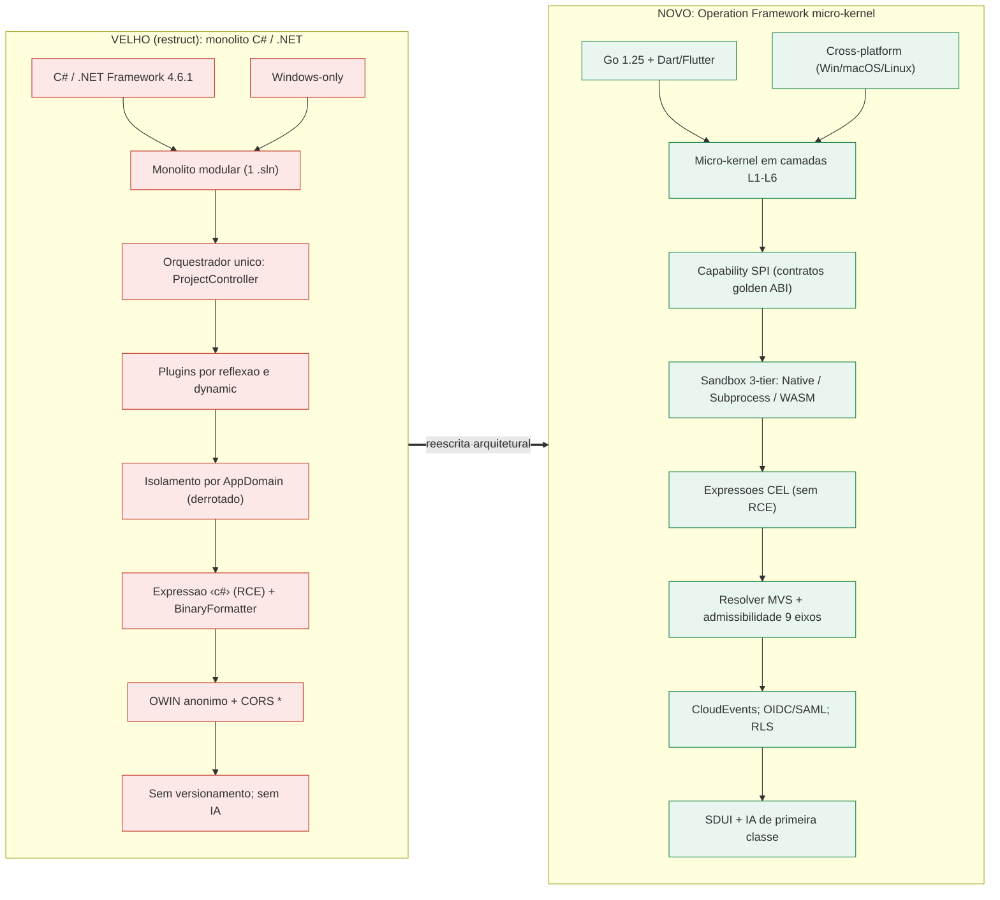
```mermaid
flowchart LR
  subgraph sgOld["VELHO (restruct): monolito C# / .NET"]
    direction TB
    O1["C# / .NET Framework 4.6.1"]
    O2["Windows-only"]
    O3["Monolito modular (1 .sln)"]
    O4["Orquestrador unico: ProjectController"]
    O5["Plugins por reflexao e dynamic"]
    O6["Isolamento por AppDomain (derrotado)"]
    O7["Expressao ‹c#› (RCE) + BinaryFormatter"]
    O8["OWIN anonimo + CORS *"]
    O9["Sem versionamento; sem IA"]
    O1 --> O3 --> O4 --> O5 --> O6 --> O7
    O2 --> O3
    O7 --> O8 --> O9
  end
  subgraph sgNew["NOVO: Operation Framework micro-kernel"]
    direction TB
    N1["Go 1.25 + Dart/Flutter"]
    N2["Cross-platform (Win/macOS/Linux)"]
    N3["Micro-kernel em camadas L1-L6"]
    N4["Capability SPI (contratos golden ABI)"]
    N5["Sandbox 3-tier: Native / Subprocess / WASM"]
    N6["Expressoes CEL (sem RCE)"]
    N7["Resolver MVS + admissibilidade 9 eixos"]
    N8["CloudEvents; OIDC/SAML; RLS"]
    N9["SDUI + IA de primeira classe"]
    N1 --> N3 --> N4 --> N5 --> N6 --> N7
    N2 --> N3
    N7 --> N8 --> N9
  end
  sgOld ==>|"reescrita arquitetural"| sgNew
  classDef velho fill:#fde8e8,stroke:#c0392b;
  classDef novo fill:#e8f6ef,stroke:#1e8449;
  class O1,O2,O3,O4,O5,O6,O7,O8,O9 velho;
  class N1,N2,N3,N4,N5,N6,N7,N8,N9 novo;
```

*Reescrita arquitetural: do motor monolitico .NET para um micro-kernel Go portavel e seguro.*

---

## 2. Stack Tecnológico e Métricas

### 2.1 Legado (`restruct/Framework`)

- **Linguagem:** C# (`<LangVersion>5</LangVersion>` em um projeto), `BinaryFormatter`, `CSharpCodeProvider` (compilação em runtime).
- **Target frameworks (heterogêneo, lido dos `.csproj`):** `v4.6.1` ×65 (dominante), `v4.5.2` ×3, `v4.5.1` ×2, `v3.5` ×2, `v4.7.1` ×2, `netstandard2.0` ×1, `netcoreapp2.2` ×1.
- **Formato de projeto:** `.csproj` clássico (não-SDK), `packages.config`, MSBuild ToolsVersion 12.0/14.0, ~150 `<Reference>` manuais em `Plugfy.Framework.csproj` (`Core/Plugfy.Framework/Plugfy.Framework.csproj:76-225`).
- **Métricas:** **72** `.csproj` (não-backup; `Plugfy.sln` lista 92 entradas), **351** `.cs` (não-obj/Properties/backup), ~**190** dependências NuGet distintas.
- **Dependências de peso:** Microsoft.CodeAnalysis.CSharp.Scripting 3.2.1, EntityFramework 6.2.0, Newtonsoft.Json 12.0.2, ASP.NET Web API 5.2.7 + OWIN self-host, ASP.NET Core 2.2, Microsoft.Graph, ADAL 5.2.1, ClosedXML + OpenXml + Office.Interop.Excel 15.0, Fasm.NET/MemorySharp (manipulação de memória), SharePoint PnP/CSOM, DeveloperForce.Force (Salesforce).
- **Libs externas via `HintPath`:** `Boleto.NET`, `DynamicsAX2012` (BusinessConnector.Net), `OpenPOP` (POP3), SalesForceFuelSDK, InstaSharp.
- **Pasta `MigrationBackup/`** com 4 snapshots — indício de migração de VS parcialmente concluída.

### 2.2 Atual (`plugfy.framework.*` + `plugfy.foundation.*`)

- **Linguagem núcleo:** Go 1.25 — **185** `.go` no framework, **191** `.go` no foundation. **UI:** Dart/Flutter — **151** `.dart`.
- **Topologia:** **polirepo** (cada módulo é um repositório git independente com seu próprio `go.mod`/`pubspec.yaml`, CI e `LICENSE`).
- **Módulos do Framework (4):** `contracts` (L1 ABI), `runtime` (L3 unit-loading), `pipeline` (L3 orquestração), `kernel` (L4 host-side).
- **Módulos do Foundation (16):** `foundation` (core), `sdk`, `examples`, 9 `provider.*` (connector, database, embedding, eventbus, identity, model, secret, storage, vectorstore), e 3 `ui.*` (designsystem, engine, sdk).
- **Métricas por módulo (`.go` de produção):** contracts 26, runtime 82, kernel 22, pipeline 30; foundation core 26, sdk 23, examples 8; 9 providers ≈ 45 no total; UI Dart ≈ 118 arquivos lib (~19.6k LOC).
- **Dependências externas (mínimas e auditáveis):** `wazero` (WASM), `fsnotify`, `cel-go`, `rrule-go`, `golang.org/x/sync`, `pgx`/`modernc.org/sqlite`, `go-redis`, OTel OTLP, `embedded-postgres`, MinIO client, `golang-jwt`, `goxmldsig`. A baseplate L1 (`contracts`) é **stdlib-only** (zero `require`).

### 2.3 Leitura comparativa

O legado acumulou ~190 dependências num grafo de referências frágil e específico de máquina (caminhos absolutos para `External libs`), com mistura de targets que vão de .NET 3.5 a .NET Core 2.2 no mesmo solution. O atual isola dependências pesadas atrás de SPIs e mantém a raiz da árvore (L1) **sem nenhuma dependência externa**, garantida por teste de golden ABI e gate de CI. Isso é a diferença entre "a base arrasta tudo" e "a base não arrasta nada".


### 📐 Diagrama da seção

**Comparativo — Stack tecnologico lado a lado**

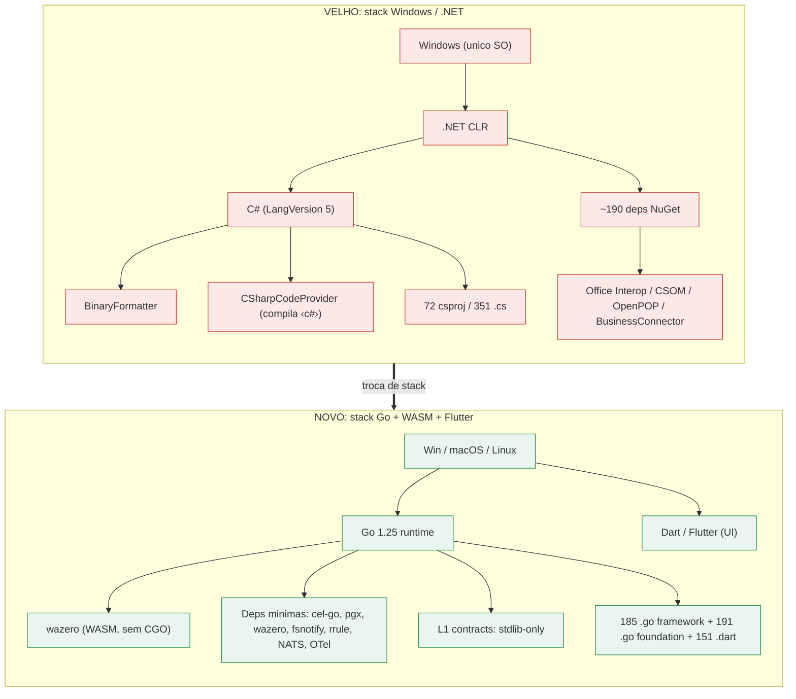
```mermaid
flowchart TB
  subgraph sgOld["VELHO: stack Windows / .NET"]
    direction TB
    OW["Windows (unico SO)"]
    OC[".NET CLR"]
    OL["C# (LangVersion 5)"]
    OB["BinaryFormatter"]
    OP["CSharpCodeProvider (compila ‹c#›)"]
    ON["~190 deps NuGet"]
    OI["Office Interop / CSOM / OpenPOP / BusinessConnector"]
    OF["72 csproj / 351 .cs"]
    OW --> OC --> OL
    OL --> OB
    OL --> OP
    OC --> ON --> OI
    OL --> OF
  end
  subgraph sgNew["NOVO: stack Go + WASM + Flutter"]
    direction TB
    NW["Win / macOS / Linux"]
    NR["Go 1.25 runtime"]
    NZ["wazero (WASM, sem CGO)"]
    ND["Dart / Flutter (UI)"]
    NM["Deps minimas: cel-go, pgx, wazero, fsnotify, rrule, NATS, OTel"]
    NS["L1 contracts: stdlib-only"]
    NF["185 .go framework + 191 .go foundation + 151 .dart"]
    NW --> NR
    NR --> NZ
    NW --> ND
    NR --> NM
    NR --> NS
    NR --> NF
  end
  sgOld ==>|"troca de stack"| sgNew
  classDef velho fill:#fde8e8,stroke:#c0392b;
  classDef novo fill:#e8f6ef,stroke:#1e8449;
  class OW,OC,OL,OB,OP,ON,OI,OF velho;
  class NW,NR,NZ,ND,NM,NS,NF novo;
```

*Stack: CLR/C# com ~190 deps NuGet e interops Office versus runtime Go enxuto + WASM + Flutter.*

---

## 3. Arquitetura

### 3.1 Legado — monólito modular Windows

O legado é **modular no nível de projeto, mas monolítico em runtime**: um orquestrador único em processo (`ProjectController`) carrega DLLs de plugin dinamicamente. Organização em pastas-camada:

```
Framework/
├── Core/         → Plugfy.Framework (domínio Project/Process + orquestrador), Core.Utils (Compiler, ProxyDomain, Cripto), Core.Data (stub vazio)
├── Common/       → modelos de parâmetro/saída, Progress (ExceptionFactory e ModuleParameterContext são STUBS VAZIOS)
├── SDK/          → contratos de plugin (Packagers/I*Packager), loaders por reflexão (Factories/*Controller), clientes REST da API
├── Extensions/   → plugins concretos: Node (IF/ForEach/Module), Modules (Excel/Email/DataBase/SharePoint/Salesforce/AX2012), Expression, Account
├── Connector/    → Windows Service (OWIN self-host), Job runner out-of-process, WMI provider, instaladores WiX
├── Helpers/      → contexto de avaliação de expressão
├── Solutions Factory/ → SpedFlow (exemplo real)
├── Tests/        → MSTest
└── Tools/        → Console (empacotador "Libfy")
```

O fluxo real de execução (`projectcontroller.cs:116` → `NodeController.Execute` em `SDK/.../NodeController.cs:243`) cria um `AppDomain` temporário por chamada, resolve o tipo do plugin por reflexão de string, instancia `INodePackager`, chama `.Run(...)` e recursa em `ParallelsNode`/`ContinuousNode`. **A "seta de dependência" não existe formalmente** — tudo se resolve por convenção de namespace em runtime.

### 3.2 Atual — micro-kernel em camadas (L1→L6)

O atual é um **micro-kernel** estrito: o núcleo conhece **apenas** os contratos L1; capacidades, drivers e apps são unidades auto-contidas que implementam interfaces e se auto-registram em runtime — **nunca são compiladas no núcleo**.

```
L1  contracts  (ABI baseplate — stdlib-only; importado por todos, importa ninguém)
        │ spi, api, installed, persistence, events, ids, errs, idempotency, resilience, abi, grpcstatus, agent
        ▼
L3  runtime    (micro-kernel unit-loading: manifest, registry, resolver/MVS, plugin Native+subprocess, wasm)
L3  pipeline   (motor de orquestração DAG: 14 node types, 7 edge kinds, CEL, resiliência, triggers, actions)
        ▼
L4  kernel     (host-side: config por edição, svcmgr, updater, depsupervisor, obs)
        ▼
        ⋯ foundation (core bricks, sdk, 9 provider drivers, UI engine) ⋯
        ▼
L5/L6  plugfy.platform  ← FORA DO ESCOPO (server, daemon plugfyd, escala, multi-tenant distribuído)
```

**A invariante central** (a "invariante tipo Windows"): nada é compilado no binário da plataforma; unidades são resolvidas em runtime por versão + compatibilidade, exatamente como o Windows resolve DLLs SxS do WinSxS (`runtime/loader/loader.go:7-15`). Esta é a ideia que substitui o modelo .NET de AppDomain/reflexão.

**Regras de fronteira aplicadas mecanicamente:**
- `contracts` (L1) importa **só a stdlib** e nenhum repo `PlugfyOS/*` — `scripts/decouple-check.sh` falha o CI em qualquer `require`.
- `runtime` (L3) depende só de `contracts` + libs de infra (wazero, fsnotify) — **não depende do kernel**; a seta nunca aponta para cima.
- `kernel` (L4) não importa nenhum `system-*`/`ui-*`/app.
- Um guard de CI separado falha se qualquer repo de Framework importar um módulo de Platform (`ui-shell`/`platform-api`/`app-*`/`system-*`) — a regra de camadas (Lx depende só de `<x`) é imposta no nível do código-fonte.

### 3.3 Leitura comparativa

| Aspecto | Legado | Atual |
|---|---|---|
| Núcleo | Orquestrador concreto que conhece os plugins por convenção | Micro-kernel que conhece **só contratos**; descobre tudo por capacidade em runtime |
| Fronteiras | Informais (referências de projeto, namespaces) | Formais e **verificadas em CI** (decouple-check, golden ABI, framework-standalone) |
| Composição | Hardwired no host | Composition root injeta drivers resolvidos do registry; o host nunca importa implementação concreta |
| Acoplamento de domínio | Domínio espalhado no núcleo (Process/Step no Core) | Núcleo **agnóstico de domínio**; domínio vive nas unidades acima |


### 📐 Diagramas da seção

**Velho — Arquitetura geral do legado**

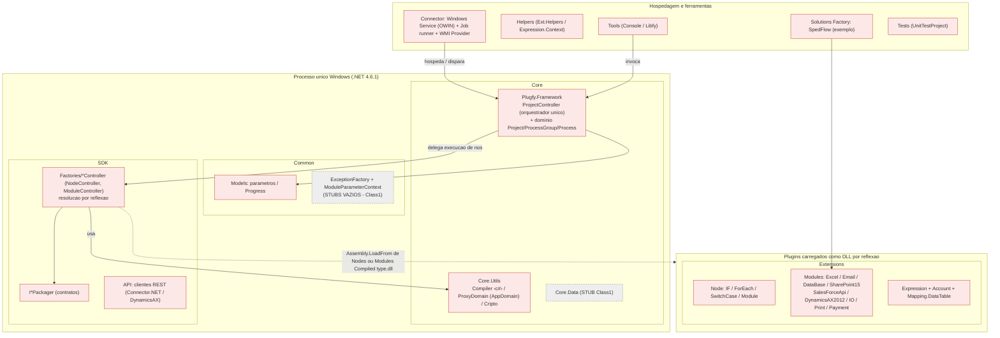
```mermaid
flowchart TB
  subgraph sgWin["Processo unico Windows (.NET 4.6.1)"]
    subgraph sgCore["Core"]
      PC["Plugfy.Framework<br/>ProjectController (orquestrador unico)<br/>+ dominio Project/ProcessGroup/Process"]
      UTILS["Core.Utils<br/>Compiler ‹c#› / ProxyDomain (AppDomain) / Cripto"]
      CDATA["Core.Data (STUB Class1)"]
    end
    subgraph sgCommon["Common"]
      CM["Models: parametros / Progress"]
      CSTUB["ExceptionFactory + ModuleParameterContext<br/>(STUBS VAZIOS - Class1)"]
    end
    subgraph sgSDK["SDK"]
      SDKP["I*Packager (contratos)"]
      SDKF["Factories/*Controller (NodeController, ModuleController)<br/>resolucao por reflexao"]
      SDKAPI["API: clientes REST (Connector.NET / DynamicsAX)"]
    end
  end
  subgraph sgPlug["Plugins carregados como DLL por reflexao"]
    subgraph sgExt["Extensions"]
      EXTN["Node: IF / ForEach / SwitchCase / Module"]
      EXTM["Modules: Excel / Email / DataBase / SharePoint15<br/>SalesForceApi / DynamicsAX2012 / IO / Print / Payment"]
      EXTE["Expression + Account + Mapping.DataTable"]
    end
  end
  subgraph sgHost["Hospedagem e ferramentas"]
    CONN["Connector: Windows Service (OWIN) + Job runner + WMI Provider"]
    HLP["Helpers (Ext.Helpers / Expression.Context)"]
    TOOLS["Tools (Console / Libfy)"]
    SOL["Solutions Factory: SpedFlow (exemplo)"]
    TST["Tests (UnitTestProject)"]
  end
  CONN -->|"hospeda / dispara"| PC
  TOOLS -->|"invoca"| PC
  PC -->|"delega execucao de nos"| SDKF
  SDKF -->|"usa"| UTILS
  SDKF -.->|"Assembly.LoadFrom de Nodes ou Modules Compiled type.dll"| sgPlug
  SDKF --> SDKP
  PC --> CM
  SOL --> EXTM
  classDef velho fill:#fde8e8,stroke:#c0392b;
  classDef escopo fill:#eeeeee,stroke:#888888,stroke-dasharray:4 3;
  class PC,UTILS,SDKF,SDKP,SDKAPI,CM,EXTN,EXTM,EXTE,CONN,HLP,TOOLS,SOL,TST velho;
  class CDATA,CSTUB escopo;
```

*Monolito modular Windows: orquestrador unico em processo carrega DLLs de plugin por reflexao de namespace.*

**Novo — Arquitetura em camadas L1 a L6**

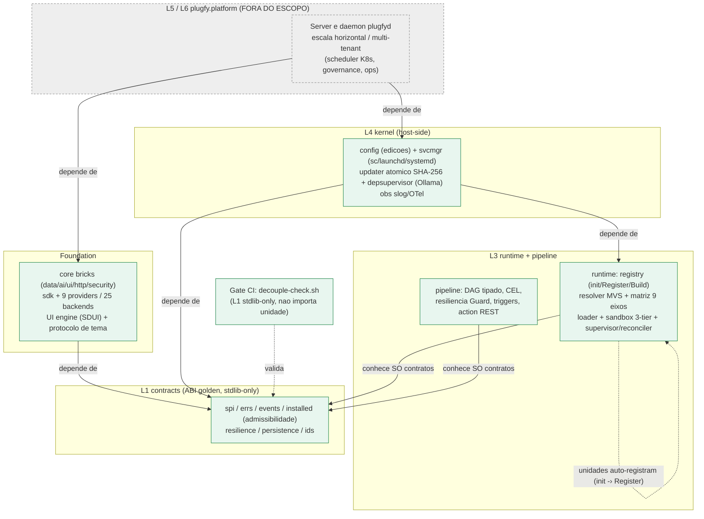
```mermaid
flowchart TB
  subgraph sgPlat["L5 / L6 plugfy.platform (FORA DO ESCOPO)"]
    L56["Server e daemon plugfyd<br/>escala horizontal / multi-tenant<br/>(scheduler K8s, governance, ops)"]
  end
  subgraph sgFound["Foundation"]
    FND["core bricks (data/ai/ui/http/security)<br/>sdk + 9 providers / 25 backends<br/>UI engine (SDUI) + protocolo de tema"]
  end
  subgraph sgKernel["L4 kernel (host-side)"]
    K4["config (edicoes) + svcmgr (sc/launchd/systemd)<br/>updater atomico SHA-256 + depsupervisor (Ollama)<br/>obs slog/OTel"]
  end
  subgraph sgRuntime["L3 runtime + pipeline"]
    RT["runtime: registry (init/Register/Build)<br/>resolver MVS + matriz 9 eixos<br/>loader + sandbox 3-tier + supervisor/reconciler"]
    PL["pipeline: DAG tipado, CEL,<br/>resiliencia Guard, triggers, action REST"]
  end
  subgraph sgL1["L1 contracts (ABI golden, stdlib-only)"]
    L1["spi / errs / events / installed (admissibilidade)<br/>resilience / persistence / ids"]
  end
  L56 -->|"depende de"| FND
  L56 -->|"depende de"| K4
  FND -->|"depende de"| L1
  K4 -->|"depende de"| RT
  K4 -->|"depende de"| L1
  RT -->|"conhece SO contratos"| L1
  PL -->|"conhece SO contratos"| L1
  RT -.->|"unidades auto-registram (init -› Register)"| RT
  GATE["Gate CI: decouple-check.sh<br/>(L1 stdlib-only, nao importa unidade)"]
  GATE -.->|"valida"| L1
  classDef escopo fill:#eeeeee,stroke:#888888,stroke-dasharray:4 3;
  classDef novo fill:#e8f6ef,stroke:#1e8449;
  class L56,sgPlat escopo;
  class L1,RT,PL,K4,FND novo;
  class GATE novo;
```

*Pilha L1->L6: o nucleo conhece apenas contratos L1, unidades auto-registram em runtime, e o gate de CI mantem a camada L1 stdlib-only; L5/L6 plugfy.platform fica fora do escopo.*

---

## 4. Modularidade e Organização

**Legado:** 72 projetos num único `.sln`, com forte acoplamento implícito. Vários módulos são **stubs vazios** que revelam um design incompletamente realizado: `Plugfy.Common.ExceptionFactory` (`ExceptionFactory/Class1.cs:9-11`), `Plugfy.Common.ModuleParameterContext`, `Plugfy.Core.Data`, `Plugfy.SDK.Ext.Fct.Mapping`, e o nó `SwitchCase` (`Extensions/Node/Plugfy.Ext.Node.SwitchCase/Class1.cs` — vazio). A modularidade é de **organização de código**, não de **deploy ou versionamento independente**.

**Atual:** modularidade real em três níveis:
1. **Polirepo** — cada módulo versiona, testa e libera independentemente (tag-only releases, SemVer).
2. **Capacidade** — unidades declaram `provides`/`requires` por capacidade nominal + range SemVer; o resolver casa em runtime.
3. **Edição** — a mesma porta SPI recebe backends diferentes por edição (local/cloud/enterprise) sem mudança no consumidor.

A diferença prática: no legado, adicionar um conector exigia novo projeto referenciado e recompilação do host; no atual, **adicionar um provider é criar um pacote que chama `registry.Register` no seu `init()` e importá-lo** — sem nenhuma alteração no wiring do núcleo (`runtime/registry/registry.go:1-11`).


### 📐 Diagrama da seção

**Comparativo — Estrutura de modulos: monolito .sln vs polirepo**

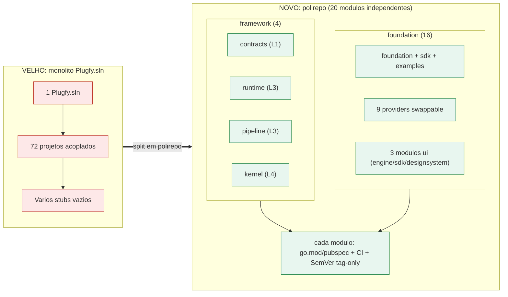
```mermaid
flowchart LR
  subgraph sgOld["VELHO: monolito Plugfy.sln"]
    direction TB
    OS["1 Plugfy.sln"]
    OP72["72 projetos acoplados"]
    OST["Varios stubs vazios"]
    OS --> OP72 --> OST
  end
  subgraph sgNew["NOVO: polirepo (20 modulos independentes)"]
    direction TB
    subgraph sgFw["framework (4)"]
      F1["contracts (L1)"]
      F2["runtime (L3)"]
      F3["pipeline (L3)"]
      F4["kernel (L4)"]
    end
    subgraph sgFo["foundation (16)"]
      G1["foundation + sdk + examples"]
      G2["9 providers swappable"]
      G3["3 modulos ui (engine/sdk/designsystem)"]
    end
    META["cada modulo: go.mod/pubspec + CI + SemVer tag-only"]
    sgFw --> META
    sgFo --> META
  end
  sgOld ==>|"split em polirepo"| sgNew
  classDef velho fill:#fde8e8,stroke:#c0392b;
  classDef novo fill:#e8f6ef,stroke:#1e8449;
  class OS,OP72,OST velho;
  class F1,F2,F3,F4,G1,G2,G3,META novo;
```

*De um Plugfy.sln com 72 projetos acoplados para 20 modulos independentes versionados por tag.*

---

## 5. Modelo de Execução — o coração da comparação

### 5.1 Legado: árvore de nós percorrida recursivamente

Existem **dois modelos paralelos**, e o documentado ("Step") é essencialmente **código morto**:

- O modelo vivo é `Project → ProcessGroup → Process`, onde `ProcessModel` aponta para um `FirstNode` (`NodeModel`), **não** uma lista de Steps (`ProcessModel.cs:19`).
- A árvore `StepModel` com `StepType{Default,ForEach,IF,Switch}` (`StepModel.cs:72`) e `StepTypeIF.cs` (classe **vazia**) **nunca é instanciada pelo runtime** — só é referenciada dentro de `Core` e em um teste unitário.

**Topologia do grafo (`NodeModel.cs`):** cada nó tem `ContinuousNode` (um sucessor), `ParallelsNode` (`List<NodeModel>` — ramos), `onErrorEventNode`, mais flags `Skip`/`Executed`. É uma **árvore/grafo dirigido percorrido recursivamente**, não um DAG verdadeiro (sem semântica de join/merge, sem detecção de ciclos).

**Características críticas:**
- **Execução síncrona e single-threaded por processo.** Apesar do nome, `ParallelsNode` executa **sequencialmente** num `foreach ... OrderBy(x => x.Order)` (`NodeController.cs:267`). Não há paralelismo real.
- **Cancelamento não funciona:** métodos recebem `CancellationToken` mas a recursão nunca o checa.
- **Controle de fluxo manipula o grafo, não a pilha:** IF seta `Skip=true/false` nos ramos then/else (`IF/Main.cs:106-119`); ForEach clona o nó-filho via `BinaryFormatter` por item da lista (`ForEach/Main.cs:115-127`); SwitchCase é stub.
- **Eventos/resultados são código morto:** `ProcessEventsModel`, `StepEventsModel`, `ProcessResultModel`, `enumStatusResultModel{Success,Error,Skiped}` existem mas **não estão ligados ao caminho de execução de Node**, que em vez disso escreve strings ad-hoc como `"StepStatus"="Error"` em `ListDefaultUIOutputModel` (`ModuleController.cs:399`).

### 5.2 Atual: motor de pipeline DAG (`plugfy.framework.pipeline`)

**Todo executável do framework** (tool, agent, app, service, automation, integration, vertical) **compila para um Pipeline rodando no `PipelineEngine`** (`pipeline/README.md:8-12`). O motor é stateless entre execuções e seguro para compartilhar concorrentemente (`engine.go:9-15`).

**Modelo de dados (`contracts/spi/pipeline.go`):**
- `Pipeline{ID, Version, Kind, Nodes[], Edges[], Triggers[], Metadata}`. **A ordem dos slices é irrelevante; as arestas dirigem o fluxo.** Sem arestas, há fallback para execução em ordem de declaração.
- `Node{ID, Type, Inputs, Config}` — valores `${...}` em `Inputs` são interpolados antes de rodar.
- `Edge{From, To, Kind, Guard, Label}` — `From` vazio = ponto de entrada; `To` vazio = término.

**Os 14 tipos de nó canônicos:**

| Nó | Semântica |
|---|---|
| **Module** | Um nó **É** uma referência a uma Unit; resolve a `core.Unit` e dirige o método nomeado pelo envelope do Runner (valida valores vs `MethodDef.Params`, retry/finalize, relay de progresso/eventos). |
| **LLM** | Ponte para o `ModelGateway`; prompts/messages interpolados; retorna `content`/`usage`/`toolCalls`. Loops de tool-call são responsabilidade do pipeline. |
| **UI** | Emite um componente Server-Driven UI; o motor é agnóstico de conteúdo, a renderização vive no cliente. |
| **Trigger** | Nó de ponto-de-entrada no grafo; expõe o payload do trigger como saídas para os downstream. |
| **If** | Avalia guard CEL → `{result: bool}`; a seleção de ramo acontece nas arestas conditional de saída. |
| **Switch** | Publica um discriminador → `{value}`; roteamento por arestas conditional guardando `ctx.<id>.value == "<case>"`. |
| **Try** | try/catch: captura erros em campos de saída em vez de propagar, para os downstream ramificarem no resultado. |
| **Parallel** | **Fan-out real**: uma goroutine por ramo via `WaitGroup` + canal; políticas `all`/`firstError`/`none`. |
| **ForEach** | `concurrency<=1` serial; senão **concorrência real limitada** via `semaphore.Weighted`; cada iteração tem escopo derivado; `failFast` cancela irmãos. |
| **Pipeline** | **Primitiva de recursão**: resolve um pipeline filho e o roda num `runState` fresco; limitado por profundidade. |
| **AwaitJob** | Faz polling da `JobsQueue` num ticker até status terminal ou deadline; honra `ctx.Done()`. |
| **AwaitEvent** | Assina o `EventBus`, bloqueia até evento casado por filtro CEL ou timeout. Modela human-in-the-loop. |
| **Delay** | Sleep declarativo via `select` em `ctx.Done()` vs `time.After` — **ciente de cancelamento**. |
| **Sequence** | No-op; grupo linear explícito dirigido por arestas. |

**Os 7 tipos de aresta tipados (`pipeline.go:118-130`):** `sequence`, `conditional`, `parallel`, `onError`, `onTimeout`, `onRetry`, `onCancel`. Em erro, a seleção segue uma cascata de prioridade: `onTimeout → onCancel → onRetry → onError`, cada um dos três primeiros gated por um classificador (`IsTimeout`/`IsCancel`/`IsTransient` em `errclass.go`); se nenhuma aresta de erro casa, o erro propaga.

**Detecção de ciclo é dinâmica** (em `walkFrom` via conjunto `visited`, `engine.go:244-247`); a validação estática (`graph.go`) é fail-fast estrutural (IDs únicos, tipos conhecidos, arestas referenciam nós declarados) mas **não** faz reachability ou type-check de arestas (por design).

### 5.3 Tabela comparativa do modelo de execução

| Característica | Legado (Process→Node) | Atual (Pipeline DAG) |
|---|---|---|
| Topologia | Árvore percorrida recursivamente | DAG real, dirigido por arestas |
| Paralelismo | "Fake" (sequencial com `OrderBy`) | Real (goroutines + semáforo ponderado) |
| Joins de DAG | Inexistentes | Suportados via arestas/Parallel |
| Detecção de ciclo | Inexistente | Dinâmica (visited set) |
| Cancelamento | `CancellationToken` ignorado | Honrado em todo limite de nó, Delay, awaits, goroutines |
| Branching/erro | Strings ad-hoc, checagens imperativas | 7 arestas tipadas + cascata por classificador |
| Recursão | Caso especial | Pipeline É uma `core.Unit`; envelope uniforme, profundidade limitada (`DefaultMaxDepth=64`) |
| Observabilidade por passo | Strings de status | `StepFrame` estruturado (status, timings, nº de tentativa, snapshots de I/O) |
| Threading de valores | `dynamic` + coerção JSON frágil | `Evaluator.Resolve` faz threading **tipado nativo** (`[]any`/`map`/`int64`), não stringificado |


### 📐 Diagramas da seção

**Velho — Modelo de execucao (arvore Project->Process->Node)**

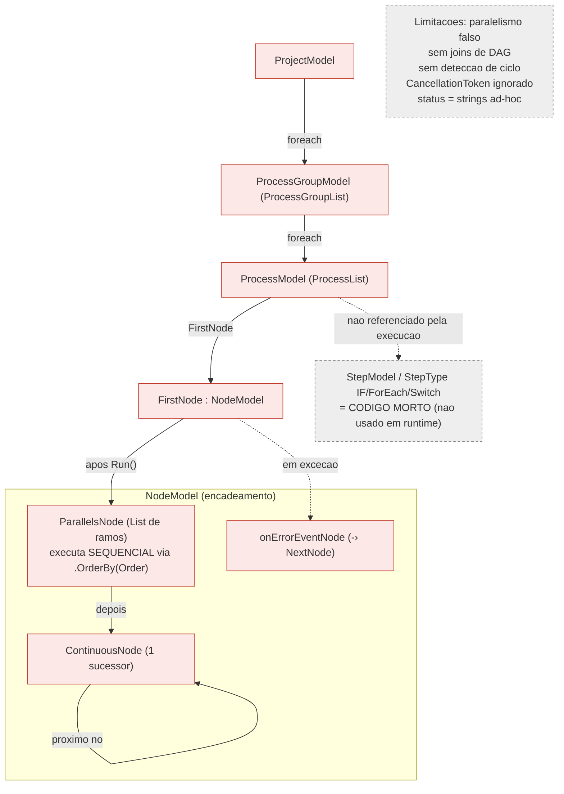
```mermaid
flowchart TB
  PRJ["ProjectModel"]
  PG["ProcessGroupModel (ProcessGroupList)"]
  PRC["ProcessModel (ProcessList)"]
  FN["FirstNode : NodeModel"]
  PRJ -->|"foreach"| PG
  PG -->|"foreach"| PRC
  PRC -->|"FirstNode"| FN
  subgraph sgNode["NodeModel (encadeamento)"]
    CN["ContinuousNode (1 sucessor)"]
    PN["ParallelsNode (List de ramos)<br/>executa SEQUENCIAL via .OrderBy(Order)"]
    OE["onErrorEventNode (-› NextNode)"]
  end
  FN -->|"apos Run()"| PN
  PN -->|"depois"| CN
  CN -->|"proximo no"| CN
  FN -.->|"em excecao"| OE
  STEP["StepModel / StepType IF/ForEach/Switch<br/>= CODIGO MORTO (nao usado em runtime)"]
  PRC -.->|"nao referenciado pela execucao"| STEP
  NOTE["Limitacoes: paralelismo falso<br/>sem joins de DAG<br/>sem deteccao de ciclo<br/>CancellationToken ignorado<br/>status = strings ad-hoc"]
  classDef velho fill:#fde8e8,stroke:#c0392b;
  classDef escopo fill:#eeeeee,stroke:#888888,stroke-dasharray:4 3;
  class PRJ,PG,PRC,FN,CN,PN,OE velho;
  class STEP,NOTE escopo;
```

*Arvore encadeada de nos com paralelismo falso (OrderBy sequencial), sem joins de DAG nem deteccao de ciclo.*

**Novo — Motor de pipeline DAG (PipelineEngine)**

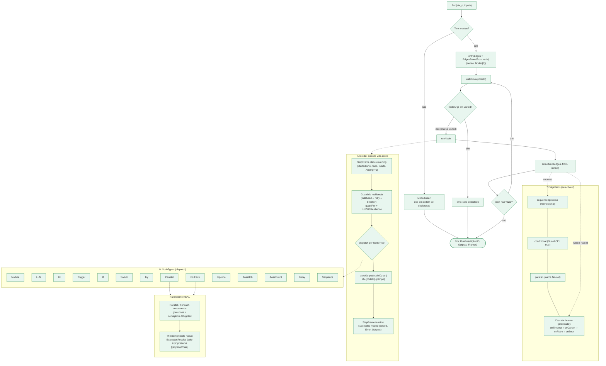
```mermaid
flowchart TB
  classDef novo fill:#e8f6ef,stroke:#1e8449;
  classDef escopo fill:#eeeeee,stroke:#888888,stroke-dasharray:4 3;

  IN["Run(ctx, p, inputs)"]:::novo
  ENTRY{"Tem arestas?"}:::novo
  LIN["Modo linear:<br/>nos em ordem de declaracao"]:::novo
  EE["entryEdges = EdgesFrom(From vazio)<br/>(senao: Nodes[0])"]:::novo
  WALK["walkFrom(nodeID)"]:::novo
  VIS{"nodeID ja em visited?"}:::novo
  CYC["erro: ciclo detectado"]:::novo
  RUN["runNode"]:::novo
  SEL["selectNext(edges, from, runErr)"]:::novo
  NEXT{"next nao vazio?"}:::novo
  DONE(["Fim: RunResult{RunID, Outputs, Frames}"]):::novo

  IN --> ENTRY
  ENTRY -->|"nao"| LIN --> DONE
  ENTRY -->|"sim"| EE --> WALK
  WALK --> VIS
  VIS -->|"sim"| CYC --> DONE
  VIS -->|"nao (marca visited)"| RUN
  RUN --> SEL --> NEXT
  NEXT -->|"sim"| WALK
  NEXT -->|"nao"| DONE

  subgraph sgRun["runNode: ciclo de vida do no"]
    direction TB
    RF1["StepFrame status=running<br/>(Started unix-nano, Inputs, Attempt=1)"]:::novo
    GUARD["Guard de resiliencia<br/>(bulkhead -› retry -› breaker)<br/>guardFor + runWithResilience"]:::novo
    DISP{"dispatch por NodeType"}:::novo
    STORE["storeOutput(nodeID, out)<br/>ctx.[nodeID].[campo]"]:::novo
    RFT["StepFrame terminal<br/>succeeded / failed (Ended, Error, Outputs)"]:::novo
    RF1 --> GUARD --> DISP --> STORE --> RFT
  end
  RUN -.-> sgRun

  subgraph sgNodes["14 NodeTypes (dispatch)"]
    direction LR
    NT1["Module"]:::novo
    NT2["LLM"]:::novo
    NT3["UI"]:::novo
    NT4["Trigger"]:::novo
    NT5["If"]:::novo
    NT6["Switch"]:::novo
    NT7["Try"]:::novo
    NT8["Parallel"]:::novo
    NT9["ForEach"]:::novo
    NT10["Pipeline"]:::novo
    NT11["AwaitJob"]:::novo
    NT12["AwaitEvent"]:::novo
    NT13["Delay"]:::novo
    NT14["Sequence"]:::novo
  end
  DISP -.-> sgNodes

  subgraph sgEdges["7 EdgeKinds (selectNext)"]
    direction TB
    EK_SEQ["sequence (proximo incondicional)"]:::novo
    EK_COND["conditional (Guard CEL true)"]:::novo
    EK_PAR["parallel (marca fan-out)"]:::novo
    ERRCAS["Cascata de erro (prioridade):<br/>onTimeout -› onCancel -› onRetry -› onError"]:::novo
    EK_SEQ --- EK_COND --- EK_PAR --- ERRCAS
  end
  SEL -.->|"sucesso"| EK_SEQ
  SEL -.->|"runErr nao nil"| ERRCAS

  subgraph sgPar["Paralelismo REAL"]
    direction TB
    PAR2["Parallel / ForEach concorrente:<br/>goroutines + semaphore.Weighted"]:::novo
    THREAD["Threading tipado nativo:<br/>Evaluator.Resolve (sole expr preserva []any/map/num)"]:::novo
    PAR2 --> THREAD
  end
  NT8 -.-> sgPar
  NT9 -.-> sgPar
```

*Fluxo do PipelineEngine: entrada por arestas ou ordem de declaracao, walkFrom com visited set (deteccao de ciclo), runNode (StepFrame running -> Guard -> dispatch -> StepFrame terminal) e selectNext com cascata de erro onTimeout->onCancel->onRetry->onError.*

**Novo — Exemplo concreto de pipeline DAG**

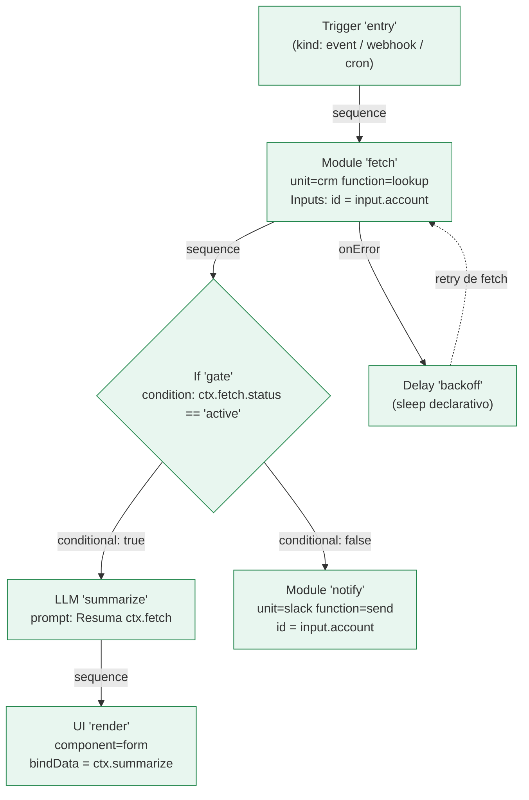
```mermaid
flowchart TB
  classDef novo fill:#e8f6ef,stroke:#1e8449;

  TRG["Trigger 'entry'<br/>(kind: event / webhook / cron)"]:::novo
  FETCH["Module 'fetch'<br/>unit=crm function=lookup<br/>Inputs: id = input.account"]:::novo
  GATE{"If 'gate'<br/>condition: ctx.fetch.status == 'active'"}:::novo
  SUM["LLM 'summarize'<br/>prompt: Resuma ctx.fetch"]:::novo
  RENDER["UI 'render'<br/>component=form<br/>bindData = ctx.summarize"]:::novo
  NOTIFY["Module 'notify'<br/>unit=slack function=send<br/>id = input.account"]:::novo
  DELAY["Delay 'backoff'<br/>(sleep declarativo)"]:::novo

  TRG -->|"sequence"| FETCH
  FETCH -->|"sequence"| GATE
  GATE -->|"conditional: true"| SUM
  SUM -->|"sequence"| RENDER
  GATE -->|"conditional: false"| NOTIFY
  FETCH -->|"onError"| DELAY
  DELAY -.->|"retry de fetch"| FETCH
```

*DAG realista (base: integration test com.acme.lookup): Trigger -> Module fetch (crm.lookup, id=${input.account}) -> If gate (ctx.fetch.status=='active'); true -> LLM summarize -> UI render; false -> Module notify; aresta onError de fetch -> Delay -> retry.*

---

## 6. Modelo de Contratos / ABI

**Legado:** não há "contratos" formais além das interfaces `I*Packager` resolvidas por reflexão. Tudo flui como `dynamic`, sem segurança de compilação, sem congelamento de ABI, sem versionamento. Uma mudança de assinatura quebraria consumidores **silenciosamente** em runtime.

**Atual:** a camada `contracts` (L1) é a **baseplate de ABI** que todo unit linka. Pontos-chave:

- **13 pacotes** publicam primitivas estáveis: `spi` (Provider/Lifecycle/EventBus + 14 `Kind*` + `CapabilityRequirement`), `spi/core` (o contrato universal "uma Unit"), `api` (route-contribution sem `net/http`), `installed` (matriz de compatibilidade de 9 eixos), `persistence` (plano de dados sobre `database/sql`), `events` (CloudEvents 1.0 + 18 `Type*`), `ids` (ULID), `errs` (9 classes de erro), `idempotency`, `resilience`, `grpcstatus`, `agent`.
- **Congelamento de ABI (golden test):** `abi.TestGoldenABI` faz snapshot de **toda a superfície pública exportada** — tipos, campos de struct (com JSON tags), method sets de interface, assinaturas de função e **valores de constantes tipadas** — em `abi/testdata/api.golden`, e falha o CI em qualquer drift. É type-checked (`go/types`), não textual, e stdlib-only.
- **Modelo de erro canônico (`errs`):** 9 classes (`validation`/`unauthorized`/`forbidden`/`not_found`/`conflict`/`rate_limit`/`upstream`/`timeout`/`internal`) → família HTTP, códigos reverse-DNS estáveis (`auth.token_expired`), `Wrap` ciente de unwrap. `grpcstatus` espelha isso para os 17 códigos gRPC canônicos, mantendo **uma fonte de verdade entre transportes**.
- **O contrato de ciclo de vida (`spi.Lifecycle`):** 4 fases ordenadas por execução — `OnInit` → `OnProcessParameters` → `OnExecute` → `OnFinalize` (sempre roda) — cada uma recebendo um `LifecycleContext` rico (RunID/NodeID/UnitID, tenant, logger slog, tracer OTel, state, credentials). Compare com o legado, onde o "ciclo de vida" era um `.Run(...)` único com 8 parâmetros `dynamic`.

> **Observação de estado atual:** o teste golden ABI está **vermelho** no momento da análise — `persistence.MigrationSet`/`ApplyMigrations` (commit `ef0aa5a`) foram adicionados sem regenerar o golden. O drift é **aditivo** (minor, não breaking), mas o passo "Golden ABI freeze" falha até `go test ./abi -run TestGoldenABI -update` ser rodado. A doc markdown (README/ROADMAP) também menciona v1.2–1.3 enquanto o git já está em v1.12.3 — drift de documentação. (vide §25)


### 📐 Diagrama da seção

**Novo — Contracts L1 (ABI stdlib-only) + golden freeze**

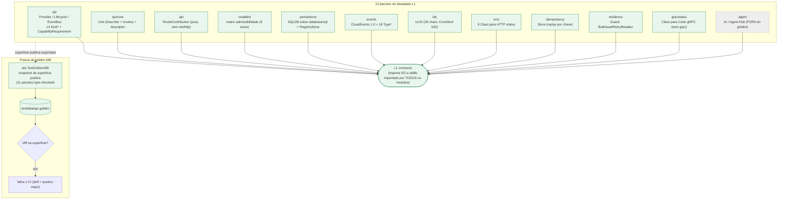
```mermaid
flowchart TB
  classDef novo fill:#e8f6ef,stroke:#1e8449;
  classDef escopo fill:#eeeeee,stroke:#888888,stroke-dasharray:4 3;

  center(["L1 contracts<br/>(importa SO a stdlib;<br/>importado por TODOS os modulos)"])

  subgraph sgPkgs["13 pacotes do baseplate L1"]
    spi["spi<br/>Provider / Lifecycle / EventBus<br/>14 Kind* + CapabilityRequirement"]
    spicore["spi/core<br/>Unit (Describe + Invoke) + descriptor"]
    api["api<br/>RouteContribution (pura, sem net/http)"]
    installed["installed<br/>matriz admissibilidade (9 eixos)"]
    persistence["persistence<br/>SQLDB sobre database/sql + RegistryStore"]
    events["events<br/>CloudEvents 1.0 + 18 Type*"]
    ids["ids<br/>ULID (26 chars, Crockford b32)"]
    errs["errs<br/>9 Class para HTTP status"]
    idem["idempotency<br/>Store (replay por chave)"]
    resil["resilience<br/>Guard: Bulkhead/Retry/Breaker"]
    grpc["grpcstatus<br/>Class para Code gRPC (sem grpc)"]
    agent["agent<br/>AI / Agent-Hub (FORA do golden)"]
  end

  spi --> center
  spicore --> center
  api --> center
  installed --> center
  persistence --> center
  events --> center
  ids --> center
  errs --> center
  idem --> center
  resil --> center
  grpc --> center
  agent --> center

  subgraph sgAbi["Freeze do golden ABI"]
    abitest["abi.TestGoldenABI<br/>snapshot da superficie publica<br/>(11 pacotes type-checked)"]
    golden[("testdata/api.golden")]
    ci{"diff na superficie?"}
    fail["falha o CI (drift = quebra major)"]
  end

  sgPkgs -.->|"superficie publica exportada"| abitest
  abitest --> golden
  golden --> ci
  ci -->|"sim"| fail

  class center,spi,spicore,api,installed,persistence,events,ids,errs,idem,resil,grpc,abitest,golden novo;
  class agent escopo;
```

*O baseplate L1 (importa so a stdlib) reune 13 pacotes ao redor do nucleo de contratos; abi.TestGoldenABI congela a superficie publica em api.golden e falha o CI a cada drift (agent fica fora do golden).*

---

## 7. Sistema de Extensões / Plugins — análise detalhada (old × new)

> Esta é a seção que o pedido enfatizou: *"veja inclusive as extensões do antigo vs novo... tudo"*.

### 7.1 Descoberta e carregamento

**Legado — reflexão + `Assembly.Load` + `AppDomain` por chamada.** Sem MEF, sem container DI, sem manifesto.
- Contrato: um plugin de nó implementa `INodePackager` (`getName/getDescription/getDefaultUiParameters/getDefaultUiOutputs/Run(...)`, todos os objetos de fluxo como `dynamic`).
- Resolução por **igualdade de string de namespace** (`NodeController.getNodeType`, `NodeController.cs:94`), buscando: assembly executando → `\Modules\Compiled\{type}.dll` → diretório base → `RelativeSearchPath`.
- Sub-hierarquia `Module → Component → Function` para nós do tipo Module (`ModuleController`).
- **Bugs reais:** `getAllNodeTypes` chama `Assembly.LoadFile` num caminho de **diretório** e `GetFiles(".dll")` sem wildcard (`NodeController.cs:54-56`), então **nunca enumera plugins** — só a busca por namespace funciona.

**Atual — `init()` + `Register` + descoberta por manifesto.**
- O **registry** (`runtime/registry/registry.go:42-63`) é um `map[Kind]map[name]Factory`. Providers chamam `registry.Register(kind, name, factory)` no `init()`; o composition root chama `registry.Build(kind, name, Options)` no startup. **Adicionar um provider = importar um pacote que se registra — zero alteração no núcleo.**
- A **descoberta** (`runtime/registry/discovery.go`) observa raízes do filesystem via `fsnotify` (debounce 200ms) e resolve manifestos por uma cadeia de tenant (project → org → platform) com filtragem de visibilidade/deprecação.
- O **manifesto universal** (`unit.plugfy.com/v1`) é validado por **dupla fonte de verdade**: um JSON Schema Draft 2020-12 embedado via `go:embed` + um validador Go manual que espelha as mesmas regras. Um unit declara `apiVersion`/`kind`/`metadata`(name reverse-DNS, version SemVer)/`spec`(profile, provides/requires/capabilities, config, signing, state, contributes, app).

### 7.2 Isolamento / Sandbox

**Legado:** `ProxyDomain<T> : MarshalByRefObject` cria um `AppDomain` por chamada e o descarrega num `finally` + `FlushMemory()` (que faz `GC.Collect` + P/Invoke `SetProcessWorkingSetSize`). **Porém o isolamento é largamente derrotado** porque `ProxyDomain.GetAssembly` faz fallback para `Assembly.LoadFrom`/`LoadFile` no domínio **atual** (`ProxyDomain.cs:40-64`). Não há CAS, permission sets, nem verificação de assinatura. O `<c#>` em parâmetros é **execução de código arbitrário com full trust**.

**Atual — sandbox de 3 tiers gradado por confiança:**

| Tier | Pacote | Isolamento | Confiança | Overhead |
|---|---|---|---|---|
| **1 — Native** | `plugin/native.go` | dispatch de função Go in-proc | built-ins confiáveis | zero |
| **2 — Subprocess** | `plugin/subprocess.go` (compatível go-plugin) | **processo OS** | confiável por assinatura | IPC (NDJSON/gRPC) |
| **3 — WASM** | `wasm/runtime.go` (wazero) | **sandbox + allow-list de capacidades** | **não-confiável** | WASM + syscalls brokered |

O Tier 3 é o salto qualitativo: WASI Preview 1 **sem filesystem e sem env-vars por padrão**; allow-lists declarativas (`NetworkOutbound`, `FilesystemRead/Write`, `EnvRead`, `SecretsRead`) consultadas por host functions **antes** de satisfazer qualquer requisição; negação → `ErrCapabilityDenied`; matching de host com wildcard de label único. O handshake de subprocess usa magic-cookie (compatível go-plugin) e o filho sai com código 64 em mismatch.

### 7.3 Versionamento e resolução de dependências

**Legado:** `NodeVersion`/`VersionModel` existem mas a resolução **ignora versão completamente** — sem binding, sem SemVer, sem compatibilidade.

**Atual — duas camadas de resolução:**
1. **MVS (Minimal Version Selection)** no resolver (`runtime/resolver/resolver.go:196-256`): BFS transitivo sobre `requires`, acumula todos os ranges por capacidade e escolhe a **menor versão que satisfaz TODOS os requerentes** ("max dos mínimos") — a mesma filosofia do Go modules. Matching = nome + containment de range SemVer + filtro de atributos OSGi `(k=v)`.
2. **Matriz de admissibilidade de 9 eixos** (`contracts/installed/admissibility.go`), curto-circuitando no primeiro eixo violado, em ordem canônica: **Platform → Engine → UISchema → ABI → HostOS → Edition → Infra → Requires → Channel**. Inclui um motor SemVer/calendário/range/hostOS/channel completo, puro (sem I/O), vivendo em L1 e compartilhado por ops-packaging e pelo updater.

Há ainda uma **máquina de estados de ciclo de vida** de 7 fases derivada de OSGi (`Installed → Resolved → Starting → Active ⇄ Idle → Stopping`, + `Uninstalled`), um **reconciler level-triggered** (estilo Kubernetes) com `RestartPolicy`/backoff/rollback, e uma **política de hot-swap** que respeita o lock `Replaceable:false` em apps load-bearing.

### 7.4 Catálogo de extensões — mapeamento old → new

Esta tabela mapeia cada extensão/módulo do legado ao seu equivalente conceitual atual:

| Extensão Legada | Localização legada | Equivalente Atual | Status atual |
|---|---|---|---|
| **Node.IF** | `Extensions/Node/Plugfy.Ext.Node.IF` | Nó **If** do pipeline (+ arestas conditional) | ✅ Completo |
| **Node.ForEach** | `Extensions/Node/Plugfy.Ext.Node.ForEach` | Nó **ForEach** (serial + concorrência real) | ✅ Completo, superior |
| **Node.SwitchCase** | `Extensions/Node/.SwitchCase` (**stub vazio**) | Nó **Switch** do pipeline | ✅ Completo (legado nunca implementou) |
| **Node.Module** | `Extensions/Node/Plugfy.Ext.Node.Module` | Nó **Module** (resolve `core.Unit` via Runner) | ✅ Completo, superior |
| (sem equivalente) | — | Nós **Parallel, Try, Pipeline, AwaitJob, AwaitEvent, Delay, Sequence, LLM, UI, Trigger** | ✅ **Novos** (10 tipos sem paralelo no legado) |
| **Expression.Logic / DataFilters** | `Extensions/Expression/*` | Motor **CEL** (`pipeline/application/expr`) | ✅ Superior (sandboxed) |
| **`<c#>` scripting** | `Core/Plugfy.Core.Utils/Compiler.cs` | **CEL** (substitui RCE por linguagem segura) | ✅ Substituído por design |
| **Mapping.DataTable** | `Extensions/Mapping/*` | Bricks `com.plugfy.data.template/extract/text` + `ResponseMap` (JSON-Pointer) na action | ✅ Coberto |
| **Process.Task** | `Extensions/Process/Plugfy.Ext.Process.Task` | Nós AwaitJob/AwaitEvent + JobsQueue port + framework/job | ✅ Coberto |
| **Account.Manager / Session** | `Extensions/Account/*` (`SessionBase` token caseiro) | **provider.identity** (OIDC/SAML/OAuth2) + **provider.secret** (env/file/vault) | ✅ Muito superior |
| **Module.Excel** (Interop) | `Extensions/.../Excel` | (roadmap — `KindConnector`/unit dedicada) | ⏳ Não portado ainda |
| **Module.Email** (OpenPOP) | `Extensions/.../Email` | (roadmap) + **provider.notification** (Kind existe) | ⏳ Não portado ainda |
| **Module.DataBase** (ADO.NET) | `Extensions/.../DataBase` | **provider.database** (postgres/sqlite/embedded) + `persistence.SQLDB` | ✅ Superior |
| **Module.SharePoint** (CSOM) | `Extensions/.../SharePoint` | **provider.connector** (`fs` hoje; M365 roadmap) | ⏳ Genérico `fs`; SharePoint roadmap |
| **Module.Salesforce** (DeveloperForce) | `Extensions/.../Salesforce` | **action** REST/OpenAPI (descoberta automática de ops) | ⚙️ Via action genérica |
| **Module.DynamicsAX2012** (BusinessConnector) | `Extensions/.../AX2012` | **action** REST/OpenAPI | ⚙️ Via action genérica |
| **Module.Instagram** (InstaSharp) | `Extensions/.../Instagram` | **action** REST/OpenAPI | ⚙️ Via action genérica |
| (sem equivalente) | — | Bricks **AI**: `ai.agent`, `ai.classify`; **model gateway**; **embeddings**; **vectorstore**; **Agent-Hub** | ✅ **Novos** (IA) |

**Leitura:** o atual **generaliza** as extensões legadas em torno de poucos conceitos potentes:
- Controle de fluxo → 14 node types (vs 4 nós, sendo 1 stub, no legado).
- Conectores ponto-a-ponto hardwired → **9 provider drivers com 25 backends** + **action REST/OpenAPI** genérica (qualquer API com spec OpenAPI vira conector sem código).
- Scripting RCE `<c#>` → expressões CEL seguras.
- Autenticação caseira → federação de identidade padrão + secret store com envelope.

O **trade-off honesto:** o legado entregava conectores concretos prontos (Excel, SharePoint CSOM, Salesforce, AX2012, Boleto), enquanto o atual entrega o **mecanismo generalizado** mas ainda tem os conectores concretos específicos em roadmap (vide §10 e §22). A action REST/OpenAPI cobre boa parte dos casos SaaS modernos sem código, mas integrações binárias legadas (Excel Interop, BusinessConnector) não têm porte direto.


### 📐 Diagramas da seção

**Velho — Carga e execucao de plugin**

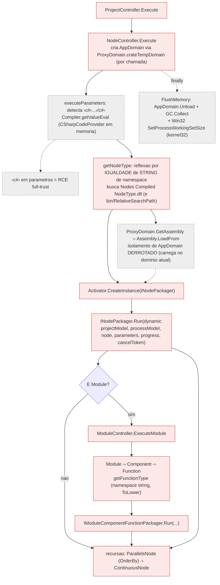
```mermaid
flowchart TB
  A["ProjectController.Execute"]
  B["NodeController.Execute<br/>cria AppDomain via ProxyDomain.crateTempDomain (por chamada)"]
  EP["executeParameters: detecta ‹c#›...‹/c#›<br/>Compiler.getValueEval (CSharpCodeProvider em memoria)"]
  RCE["‹c#› em parametros = RCE full-trust"]
  C["getNodeType: reflexao por IGUALDADE de STRING de namespace<br/>busca Nodes Compiled NodeType.dll (e bin/RelativeSearchPath)"]
  LF["ProxyDomain.GetAssembly -› Assembly.LoadFrom<br/>isolamento de AppDomain DERROTADO (carrega no dominio atual)"]
  D["Activator.CreateInstance(INodePackager)"]
  E["INodePackager.Run(dynamic projectModel, processModel, node, parameters, progress, cancelToken)"]
  F{"E Module?"}
  G["ModuleController.ExecuteModule"]
  H["Module -› Component -› Function<br/>getFunctionType (namespace string, ToLower)"]
  I["IModuleComponentFunctionPackager.Run(...)"]
  REC["recursao: ParallelsNode (OrderBy) -› ContinuousNode"]
  FM["FlushMemory: AppDomain.Unload + GC.Collect<br/>+ Win32 SetProcessWorkingSetSize (kernel32)"]
  A --> B --> EP --> C --> D --> E --> F
  EP -.-> RCE
  C --> LF
  LF -.-> D
  F -->|"sim"| G --> H --> I
  F -->|"nao"| REC
  I --> REC
  E --> REC
  B -.->|"finally"| FM
  classDef velho fill:#fde8e8,stroke:#c0392b;
  classDef escopo fill:#eeeeee,stroke:#888888,stroke-dasharray:4 3;
  class A,B,C,D,E,G,H,I,REC velho;
  class EP,RCE,LF,FM escopo;
```

*Resolucao por igualdade de string de namespace + AppDomain por chamada, isolamento derrotado por LoadFrom e RCE via <c#>.*

**Novo — Carregamento de unidades: registry, resolver (MVS) e sandbox 3-tier**

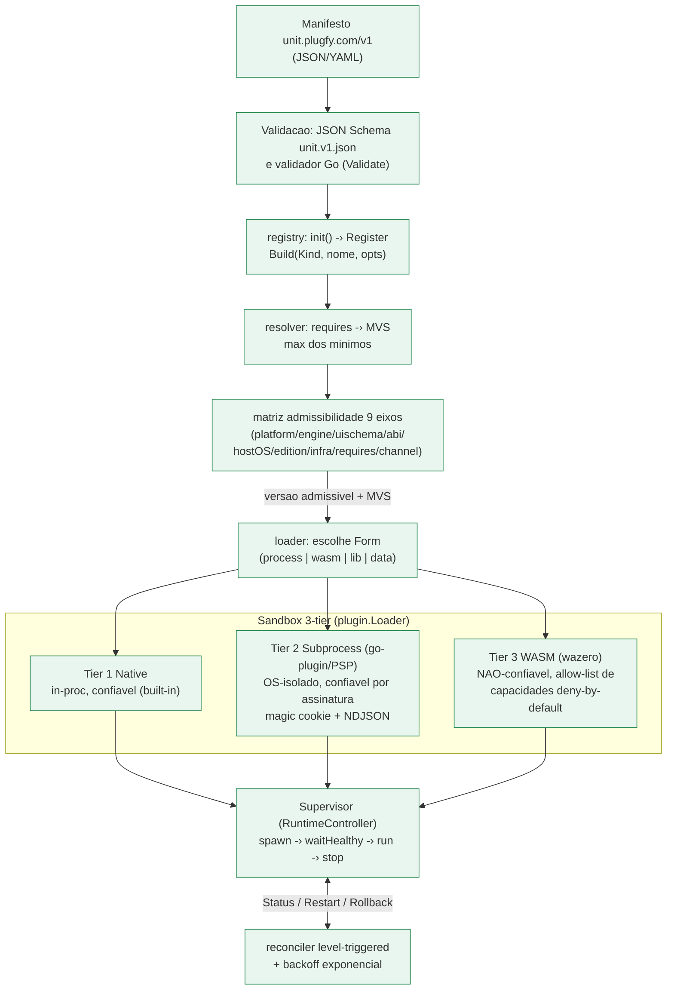
```mermaid
flowchart TB
  MAN["Manifesto unit.plugfy.com/v1<br/>(JSON/YAML)"]
  VAL["Validacao: JSON Schema unit.v1.json<br/>e validador Go (Validate)"]
  REG["registry: init() -› Register<br/>Build(Kind, nome, opts)"]
  RES["resolver: requires -› MVS<br/>max dos minimos"]
  ADM["matriz admissibilidade 9 eixos<br/>(platform/engine/uischema/abi/<br/>hostOS/edition/infra/requires/channel)"]
  LOAD["loader: escolhe Form<br/>(process | wasm | lib | data)"]
  subgraph sgTiers["Sandbox 3-tier (plugin.Loader)"]
    T1["Tier 1 Native<br/>in-proc, confiavel (built-in)"]
    T2["Tier 2 Subprocess (go-plugin/PSP)<br/>OS-isolado, confiavel por assinatura<br/>magic cookie + NDJSON"]
    T3["Tier 3 WASM (wazero)<br/>NAO-confiavel, allow-list de<br/>capacidades deny-by-default"]
  end
  SUP["Supervisor (RuntimeController)<br/>spawn -› waitHealthy -› run -› stop"]
  RCN["reconciler level-triggered<br/>+ backoff exponencial"]
  MAN --> VAL --> REG --> RES
  RES --> ADM
  ADM -->|"versao admissivel + MVS"| LOAD
  LOAD --> T1
  LOAD --> T2
  LOAD --> T3
  T1 --> SUP
  T2 --> SUP
  T3 --> SUP
  SUP <-->|"Status / Restart / Rollback"| RCN
  classDef novo fill:#e8f6ef,stroke:#1e8449;
  class MAN,VAL,REG,RES,ADM,LOAD,T1,T2,T3,SUP,RCN novo;
```

*Fluxo de carregamento: manifesto validado por schema -> registry -> resolver MVS com matriz de 9 eixos -> loader escolhe a Form -> um dos 3 tiers de sandbox, supervisionados por reconciler level-triggered com backoff.*

**Novo — Ciclo de vida da unidade (OSGi 7 fases)**

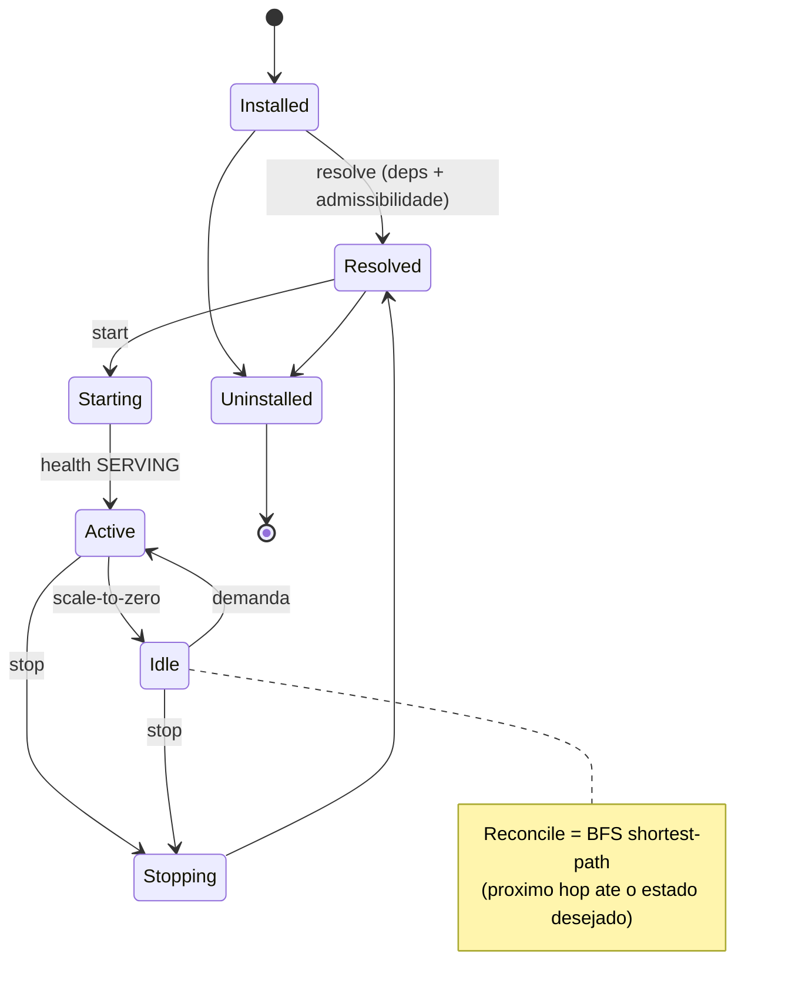
```mermaid
stateDiagram-v2
  [*] --> Installed
  Installed --> Resolved: resolve (deps + admissibilidade)
  Installed --> Uninstalled
  Resolved --> Starting: start
  Resolved --> Uninstalled
  Starting --> Active: health SERVING
  Active --> Idle: scale-to-zero
  Idle --> Active: demanda
  Active --> Stopping: stop
  Idle --> Stopping: stop
  Stopping --> Resolved
  Uninstalled --> [*]
  note right of Idle
    Reconcile = BFS shortest-path
    (proximo hop ate o estado desejado)
  end note
```

*Maquina de estados OSGi de 7 fases: Installed->Resolved->Starting->Active, com Active<->Idle (scale-to-zero) e Active->Stopping->Resolved; Uninstalled e terminal e o Reconcile escolhe o proximo hop por menor caminho (BFS).*

**Comparativo — Catalogo de extensoes: mapeamento old -> new**

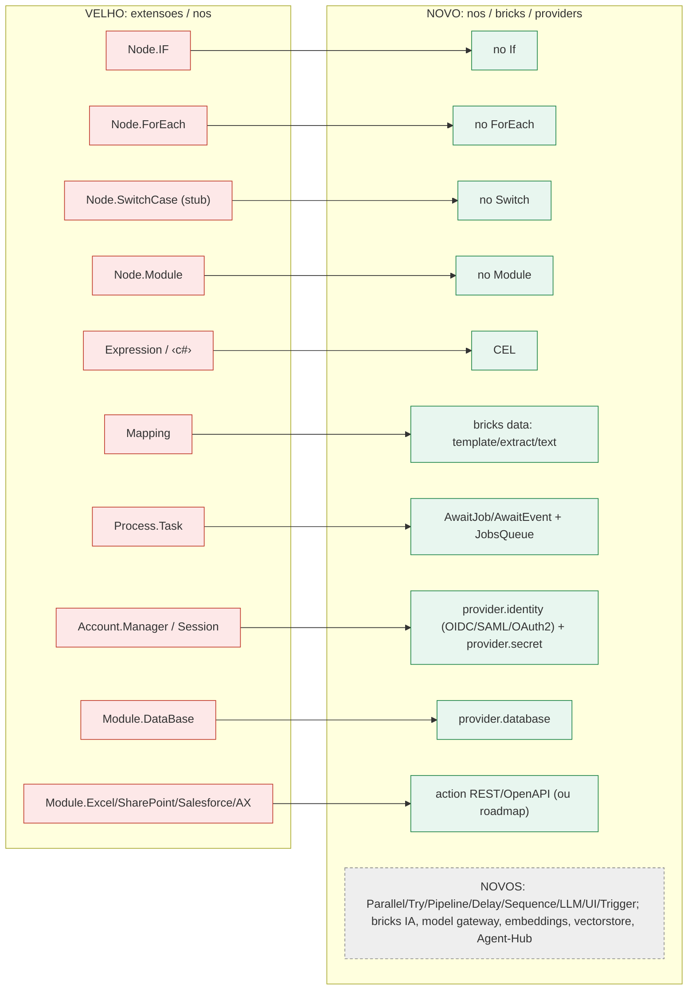
```mermaid
flowchart LR
  subgraph sgOld["VELHO: extensoes / nos"]
    direction TB
    EIF["Node.IF"]
    EFE["Node.ForEach"]
    ESW["Node.SwitchCase (stub)"]
    EMO["Node.Module"]
    EEX["Expression / ‹c#›"]
    EMA["Mapping"]
    ETK["Process.Task"]
    EAC["Account.Manager / Session"]
    EDB["Module.DataBase"]
    ECN["Module.Excel/SharePoint/Salesforce/AX"]
  end
  subgraph sgNew["NOVO: nos / bricks / providers"]
    direction TB
    NIF["no If"]
    NFE["no ForEach"]
    NSW["no Switch"]
    NMO["no Module"]
    NCEL["CEL"]
    NBR["bricks data: template/extract/text"]
    NAW["AwaitJob/AwaitEvent + JobsQueue"]
    NID["provider.identity (OIDC/SAML/OAuth2) + provider.secret"]
    NPD["provider.database"]
    NAR["action REST/OpenAPI (ou roadmap)"]
    NNEW["NOVOS: Parallel/Try/Pipeline/Delay/Sequence/LLM/UI/Trigger; bricks IA, model gateway, embeddings, vectorstore, Agent-Hub"]
  end
  EIF --> NIF
  EFE --> NFE
  ESW --> NSW
  EMO --> NMO
  EEX --> NCEL
  EMA --> NBR
  ETK --> NAW
  EAC --> NID
  EDB --> NPD
  ECN --> NAR
  classDef velho fill:#fde8e8,stroke:#c0392b;
  classDef novo fill:#e8f6ef,stroke:#1e8449;
  classDef escopo fill:#eeeeee,stroke:#888888,stroke-dasharray:4 3;
  class EIF,EFE,ESW,EMO,EEX,EMA,ETK,EAC,EDB,ECN velho;
  class NIF,NFE,NSW,NMO,NCEL,NBR,NAW,NID,NPD,NAR novo;
  class NNEW escopo;
```

*Mapeamento dos nos e extensoes legados para nos do pipeline, bricks e providers do novo framework.*

---

## 8. Providers / Connectors / Modules (drivers)

### 8.1 Legado — conectores hardwired

Cada conector era um projeto referenciado, compilado no host, acoplado a um SDK específico de fornecedor: Excel via Office Interop 15.0, Email via OpenPOP (POP3), SharePoint via CSOM/PnP, Salesforce via DeveloperForce, Dynamics via BusinessConnector.Net, pagamentos via Boleto.NET. Credenciais e connection-strings embutidas; tokens via `SessionBase` (concatenação de parâmetros com delimitadores `|`/`[`, AES, expiração de 30 dias).

### 8.2 Atual — 9 portas SPI, 25 backends, swappable por edição

Cada provider implementa uma porta SPI e se auto-registra; o consumidor depende **só da interface**, nunca da implementação concreta (verificado por `decouple-check.sh` em cada módulo).

| Provider | SPI Kind | Backends (nome no registry) | Mapeamento de edição | Completude |
|---|---|---|---|---|
| **connector** | `KindConnector` | `fs` (pasta local) | Local default; Drive/M365/Jira = roadmap | Funcional (1 backend) |
| **database** | `KindDatabase` | `external` (Postgres DSN), `embedded` (embedded-postgres V17), `sqlite` (modernc pure-Go) | external=Cloud/Ent; embedded+sqlite=Local | Forte |
| **embedding** | `KindEmbedding` | `offline` (FNV hashing), `ollama`, `openai` | offline=Local/CI/fallback | Completo |
| **eventbus** | `KindEventBus` | `inproc`, `nats` (JetStream + **DLQ**) | inproc=Local; nats=Cloud/Ent | **Production-grade** |
| **identity** | `KindIdentity` | `oidc` (JWKS/RS256 + RFC 8693), `saml` (XML-DSig), `oauth2-authcode` (PKCE S256) | dev=Local; demais=Cloud/Ent | Forte |
| **model** | `KindModel` | `echo` (offline), `ollama`, `openai`-compat | echo=Local | Forte + **Gateway** (fallback/cache/accounting) |
| **secret** | `KindSecret` | `env`, `file` (AES-256-GCM envelope), `vault` (KV v2) | env/file=Local; vault=Ent | Forte (envelope real) |
| **storage** | `KindStorage` | `fs`, `s3` (MinIO, presigned URLs) | fs=Local; s3=Cloud/Ent | Completo |
| **vectorstore** | `KindVectorStore` | `memory` (cosine), `pgvector` (HNSW + **RLS**) | memory=Local; pgvector=Cloud/Ent | Forte (RLS fail-closed) |

**O padrão swappable-per-edition, concretamente:** a edição Local chama `registry.Build(KindStorage, "fs", …)`; a edição Cloud chama `registry.Build(KindStorage, "s3", …)`. O consumidor (`system-*`, na Platform) só vê a porta. São **25 backends distintos** selecionados por configuração no composition root, com **zero** mudança de wiring — o inverso estrutural do legado, onde o tipo do conector era compilado no host.

**Defaults offline-first em toda capacidade:** connector `fs`, database `embedded`/`sqlite`, embedding `offline`, eventbus `inproc`, model `echo`, secret `env`/`file`, storage `fs`, vectorstore `memory`, identity `dev`. A edição Local/Desktop boota **sem nenhuma infraestrutura externa** — algo que o stack Interop/CSOM/BusinessConnector nunca conseguiu.


### 📐 Diagrama da seção

**Novo — 9 portas SPI e 25 backends swappaveis por edicao**

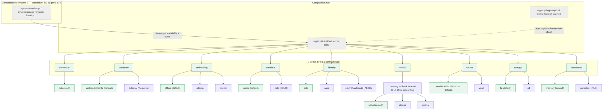
```mermaid
flowchart TB
  subgraph sgCons["Consumidores (system-*) — dependem SO da porta SPI"]
    C1["system-knowledge / system-storage / system-identity ..."]
  end
  subgraph sgRoot["Composition root"]
    R1["registry.Build(Kind, nome, opts)"]
    R2["registry.Register(Kind, nome, factory) via init()"]
  end
  C1 -->|"resolve por capability + nome"| R1
  R2 -.->|"auto-registro (import side-effect)"| R1

  subgraph sgKinds["9 portas SPI (L1 contracts/spi)"]
    K1["connector"]
    K2["database"]
    K3["embedding"]
    K4["eventbus"]
    K5["identity"]
    K6["model"]
    K7["secret"]
    K8["storage"]
    K9["vectorstore"]
  end
  R1 --> K1
  R1 --> K2
  R1 --> K3
  R1 --> K4
  R1 --> K5
  R1 --> K6
  R1 --> K7
  R1 --> K8
  R1 --> K9

  K1 --> B1a["fs (default)"]
  K2 --> B2a["embedded/sqlite (default)"]
  K2 --> B2b["external (Postgres)"]
  K3 --> B3a["offline (default)"]
  K3 --> B3b["ollama"]
  K3 --> B3c["openai"]
  K4 --> B4a["inproc (default)"]
  K4 --> B4b["nats (+DLQ)"]
  K5 --> B5a["oidc"]
  K5 --> B5b["saml"]
  K5 --> B5c["oauth2-authcode (PKCE)"]
  K6 --> B6g["Gateway: fallback / cache SHA-256 / accounting"]
  B6g --> B6a["echo (default)"]
  B6g --> B6b["ollama"]
  B6g --> B6c["openai"]
  K7 --> B7a["env/file AES-256-GCM (default)"]
  K7 --> B7b["vault"]
  K8 --> B8a["fs (default)"]
  K8 --> B8b["s3"]
  K9 --> B9a["memory (default)"]
  K9 --> B9b["pgvector (+RLS)"]

  classDef novo fill:#e8f6ef,stroke:#1e8449;
  classDef escopo fill:#eeeeee,stroke:#888888,stroke-dasharray:4 3;
  class K1,K2,K3,K4,K5,K6,K7,K8,K9 novo;
  class B1a,B2a,B3a,B4a,B5a,B6a,B7a,B8a,B9a novo;
  class C1,R1,R2 escopo;
```

*Consumidor depende so da porta SPI; o composition root chama registry.Build(Kind, nome) e drivers se auto-registram via init()->Register. Padroes offline-first em verde. Driver nunca importa o consumidor.*

---

## 9. Expressões: `<c#>` × CEL

| Aspecto | Legado (`<c#>`) | Atual (CEL) |
|---|---|---|
| Linguagem | C# completo compilado em runtime (`CSharpCodeProvider`) | Common Expression Language (Google) |
| Poder | Turing-completo | Não-Turing-completo (garantia de terminação) |
| Efeitos colaterais | Acesso total ao contexto (RCE) | Sem efeitos colaterais |
| Segurança | **Execução de código arbitrário com full trust** | Sandboxed por construção |
| Performance | Compilação por avaliação | Compilação cacheada (LRU 1024, chave = string da expressão) |
| Threading de valores | string | `Resolve` retorna valor **nativo** quando a expressão é um placeholder único |
| Uso | valores de parâmetro `<c#>...</c#>` | guards de aresta, If/Switch, filtros AwaitEvent, interpolação `${...}` |

A troca de `<c#>` por CEL fecha uma das vulnerabilidades mais graves do legado (RCE embutido em parâmetros) sem perder a expressividade necessária para guards e templates.


### 📐 Diagrama da seção

**Comparativo — Expressoes: CEL (novo) vs c-sharp (legado)**

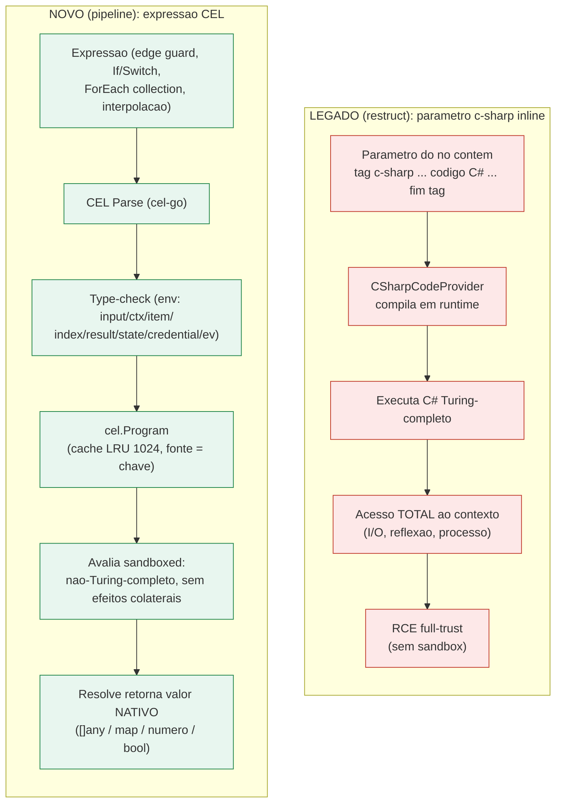
```mermaid
flowchart TB
  classDef velho fill:#fde8e8,stroke:#c0392b;
  classDef novo fill:#e8f6ef,stroke:#1e8449;

  subgraph sgOld["LEGADO (restruct): parametro c-sharp inline"]
    direction TB
    O1["Parametro do no contem<br/>tag c-sharp ... codigo C# ... fim tag"]:::velho
    O2["CSharpCodeProvider<br/>compila em runtime"]:::velho
    O3["Executa C# Turing-completo"]:::velho
    O4["Acesso TOTAL ao contexto<br/>(I/O, reflexao, processo)"]:::velho
    O5["RCE full-trust<br/>(sem sandbox)"]:::velho
    O1 --> O2 --> O3 --> O4 --> O5
  end

  subgraph sgNew["NOVO (pipeline): expressao CEL"]
    direction TB
    N1["Expressao (edge guard, If/Switch,<br/>ForEach collection, interpolacao)"]:::novo
    N2["CEL Parse (cel-go)"]:::novo
    N3["Type-check (env: input/ctx/item/<br/>index/result/state/credential/ev)"]:::novo
    N4["cel.Program<br/>(cache LRU 1024, fonte = chave)"]:::novo
    N5["Avalia sandboxed:<br/>nao-Turing-completo, sem efeitos colaterais"]:::novo
    N6["Resolve retorna valor NATIVO<br/>([]any / map / numero / bool)"]:::novo
    N1 --> N2 --> N3 --> N4 --> N5 --> N6
  end
```

*Comparativo de expressoes: legado compila e executa C# arbitrario em runtime (RCE full-trust com acesso total ao contexto) vs novo CEL (parse -> type-check -> program em cache LRU 1024 -> avaliacao sandboxed nao-Turing-completa, sem efeitos colaterais, Resolve devolve valor nativo).*

---

## 10. Resiliência

**Legado:** ad-hoc ou inexistente. Tratamento de erro inline com `try/catch(Exception ex)` que loga no Windows Event Log e ou engole (`continue`), ou faz `throw ex` (**destrói o stack trace**), ou escreve string de status. Há um `onErrorEventNode` por nó como catch-branch básico. Sem retry, sem circuit breaker, sem timeout, sem bulkhead.

**Atual:** resiliência **declarativa por nó**. O bloco `Config["resilience"]` de um nó materializa um `resilience.Guard` de `contracts/resilience`:
- **Retry:** backoff exponencial capado com jitter (banda full-jitter AWS), `Multiplier` honrado, `Retryable` por classe de erro.
- **Circuit Breaker:** 3 estados (Closed/Open/HalfOpen), defaults 5 falhas / 1 sucesso / 30s reset; **cacheado e compartilhado** por `"<pipelineID>:<nodeID>"` entre runs concorrentes (um upstream instável trips uma vez e protege todos).
- **Bulkhead:** concorrência limitada via semáforo de canal.
- **Composição:** ordem bulkhead (admissão) → retry → breaker por tentativa.

O `runner.Runner` do runtime dirige **toda** invocação por esse envelope (valida params, deriva deadline de `MethodDef.Timeout`, recupera panics classificando-os como transientes, **nunca derruba o host**). O eventbus NATS tem a história mais rica (consumers duráveis, redelivery budget, dead-letter plane completo com proveniência); o model gateway adiciona fallback primário→secundário + cache.


### 📐 Diagramas da seção

**Novo — Composicao de resiliencia (resilience.Guard)**

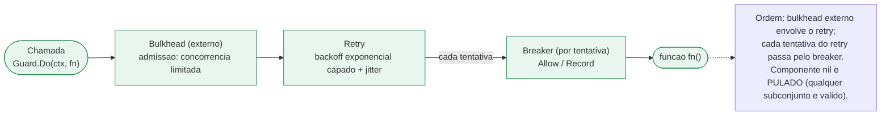
```mermaid
flowchart LR
  classDef novo fill:#e8f6ef,stroke:#1e8449;

  entrada(["Chamada<br/>Guard.Do(ctx, fn)"])
  bh["Bulkhead (externo)<br/>admissao: concorrencia limitada"]
  retry["Retry<br/>backoff exponencial capado + jitter"]
  br["Breaker (por tentativa)<br/>Allow / Record"]
  fn(["funcao fn()"])

  entrada --> bh
  bh --> retry
  retry -->|"cada tentativa"| br
  br --> fn

  note["Ordem: bulkhead externo envolve o retry;<br/>cada tentativa do retry passa pelo breaker.<br/>Componente nil e PULADO (qualquer subconjunto e valido)."]
  fn -.-> note

  class entrada,bh,retry,br,fn novo;
```

*Guard.Do compoe bulkhead (admissao externa) -> retry (backoff exponencial capado + jitter) -> breaker (por tentativa) -> fn; qualquer componente nil e pulado.*

**Novo — Maquina de estados do circuit breaker**

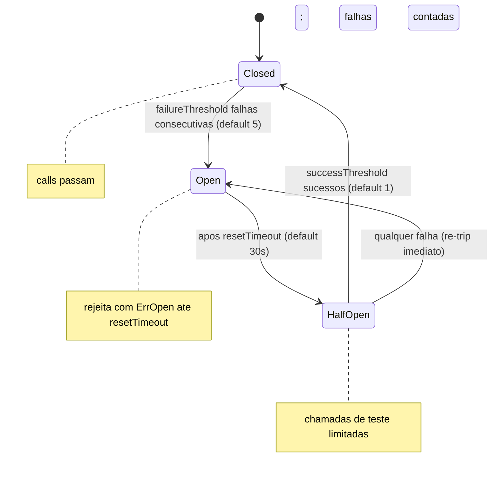
```mermaid
stateDiagram-v2
  [*] --> Closed
  Closed --> Open : failureThreshold falhas consecutivas (default 5)
  Open --> HalfOpen : apos resetTimeout (default 30s)
  HalfOpen --> Closed : successThreshold sucessos (default 1)
  HalfOpen --> Open : qualquer falha (re-trip imediato)
  note right of Closed : calls passam; falhas contadas
  note right of Open : rejeita com ErrOpen ate resetTimeout
  note right of HalfOpen : chamadas de teste limitadas
```

*Breaker: Closed abre apos 5 falhas consecutivas; Open vira HalfOpen apos 30s; HalfOpen fecha com 1 sucesso ou re-trip em qualquer falha; em Open as chamadas sao rejeitadas com ErrOpen.*

---

## 11. Observabilidade

| Aspecto | Legado | Atual |
|---|---|---|
| Progresso | `IProgress<ProgressModel>` (mensagens em português) — o único mecanismo cross-cutting consistente | `StepFrame` por execução de nó (status enum, timings unix-nano, nº de tentativa, snapshots de I/O) para um `FrameSink` plugável |
| Logging | Windows Event Log (`Event.WriteError`) | `slog` estruturado com **nível ajustável em runtime** (operador liga debug sem restart) + `Bridge` para sink (log explorer estilo Event-Viewer) |
| Tracing | Inexistente | OpenTelemetry OTLP/HTTP (`InitTracing`, no-op sem endpoint) |
| Eventos | In-proc, ad-hoc | **CloudEvents 1.0** com 18 tipos canônicos + reverse event channel module→host (outbox at-least-once) |
| Métricas | Inexistente | OTel (export pendente — KRN-08) |


### 📐 Diagrama da seção

**Novo — Observabilidade (novo)**

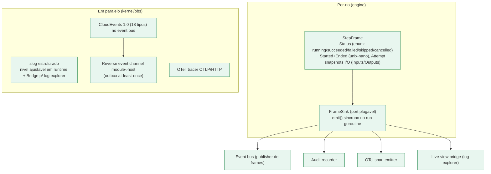
```mermaid
flowchart TB
  classDef novo fill:#e8f6ef,stroke:#1e8449;

  subgraph sgNode["Por-no (engine)"]
    direction TB
    SF["StepFrame<br/>Status (enum: running/succeeded/failed/skipped/cancelled)<br/>Started+Ended (unix-nano), Attempt<br/>snapshots I/O (Inputs/Outputs)"]:::novo
    SINK["FrameSink (port plugavel)<br/>emit() sincrono no run goroutine"]:::novo
    SF --> SINK
  end

  EB["Event bus (publisher de frames)"]:::novo
  AUD["Audit recorder"]:::novo
  OTELSPAN["OTel span emitter"]:::novo
  LV["Live-view bridge (log explorer)"]:::novo
  SINK --> EB
  SINK --> AUD
  SINK --> OTELSPAN
  SINK --> LV

  subgraph sgPar["Em paralelo (kernel/obs)"]
    direction TB
    SLOG["slog estruturado<br/>nivel ajustavel em runtime + Bridge p/ log explorer"]:::novo
    OTEL["OTel: tracer OTLP/HTTP"]:::novo
    CE["CloudEvents 1.0 (18 tipos) no event bus"]:::novo
    REV["Reverse event channel module-›host<br/>(outbox at-least-once)"]:::novo
  end
  CE --> REV
```

*Observabilidade do motor: por-no o StepFrame (status enum, timings unix-nano, Attempt, snapshots I/O) flui pelo FrameSink plugavel para event bus / audit / OTel / live-view; em paralelo slog estruturado com nivel runtime + bridge, tracer OTel OTLP/HTTP, CloudEvents 1.0 (18 tipos) e canal reverso module->host (outbox at-least-once).*

---

## 12. Segurança — comparação detalhada

### 12.1 Legado — efetivamente "confie em tudo"

- **Endpoint Connector:** OWIN host com `AuthenticationSchemes.Anonymous`, **CORS `*`**, e `IncludeErrorDetailPolicy.Always` (vaza stack traces). Sem autenticação/autorização no `ProcessController` (`WebServerStartup.cs:24-35`, `ProcessController.cs:50`).
- **Execução full-trust:** `<c#>` e DLLs de plugin rodam com confiança total no processo host; isolamento de AppDomain presente no nome mas derrotado por fallbacks `LoadFrom`.
- **Sem assinatura/verificação de assembly:** plugins carregados por namespace do filesystem sem strong-name ou Authenticode. O formato `.lib` ("Libfy") criptografa mas não autentica proveniência.
- **`BinaryFormatter` pervasivo** (clone de ForEach, MMF, Libfy, Storage) — vetor conhecido de RCE por desserialização.
- **Tokens caseiros:** `SessionBase` concatena parâmetros com delimitadores e criptografa via AES — sem JWT, sem claims padrão, parsing por delimitador sujeito a injeção.
- `throw ex` destrói stack traces.

### 12.2 Atual — defense-in-depth

- **Sandbox de 3 tiers** gradado por confiança (Native/Subprocess/WASM), com allow-lists declarativas de capacidade deny-by-default e syscalls brokered no Tier 3.
- **Assinatura de unidade** (`spec.signing`) com verify-before-install no manifesto.
- **Lock `Replaceable:false`** em apps load-bearing (resolver + supervisor honram).
- **Identidade federada real:** OIDC (JWKS/RS256 + RFC 8693 Token Exchange), SAML 2.0 (XML-DSig), OAuth2 authorization-code + PKCE S256.
- **Secret store com envelope encryption** AES-256-GCM (DEK por valor envolto por KEK; rotação de KEK re-envolve DEKs sem re-criptografar payloads), Vault KV v2 para Enterprise, contrato explícito *"MUST NOT log secret material"*.
- **Multi-tenancy enforced no nível de linha:** RLS fail-closed do pgvector keyed em `app.tenant` GUC (write tenant-less é rejeitado), hook `SET LOCAL app.tenant` do Postgres SQLDB, `Claims.Tenant` na identidade.
- **Caps anti-runaway:** linhas de subprocess truncadas em 1 MiB; binding loopback-only por padrão.
- **Updater:** binários verificados por SHA-256 contra `checksums.txt` do release; systemd com `NoNewPrivileges=true`/`PrivateTmp=true`.

### 12.3 Síntese

A segurança é talvez o eixo de maior salto. O legado expunha um endpoint anônimo que executava processos arbitrários e rodava código C# arbitrário embutido em parâmetros; o atual fecha o modelo de execução em três tiers de confiança, substitui scripting por CEL, adota federação de identidade padrão, secret store com envelope e multi-tenancy no nível de linha do banco. O detalhe importante de escopo: **a aplicação dessas políticas em produção (cotas, allowlists, daemon) é responsabilidade da `plugfy.platform`** — o Framework provê os mecanismos e os contratos.


### 📐 Diagrama da seção

**Comparativo — Seguranca: defense-in-depth (novo) vs confie-em-tudo (legado)**

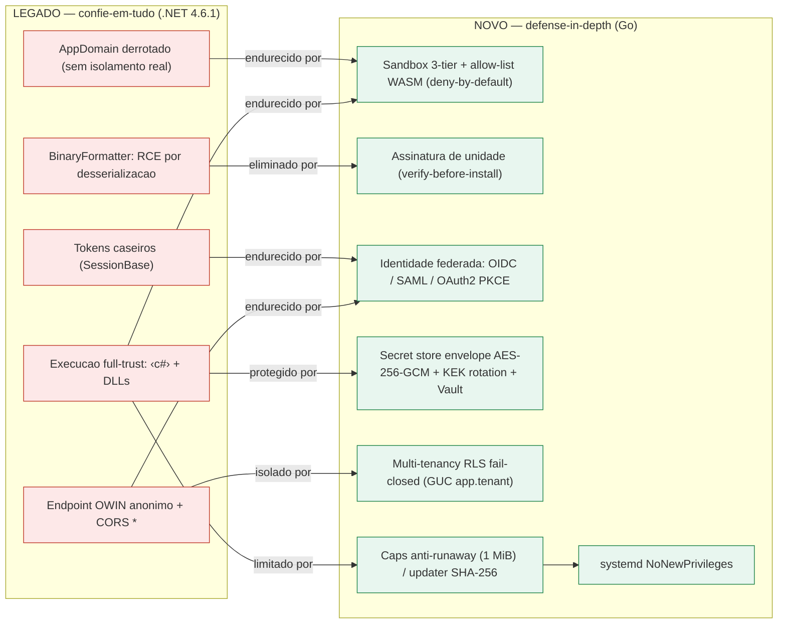
```mermaid
flowchart LR
  subgraph sgOld["LEGADO — confie-em-tudo (.NET 4.6.1)"]
    O1["Endpoint OWIN anonimo + CORS *"]
    O2["Execucao full-trust: ‹c#› + DLLs"]
    O3["AppDomain derrotado (sem isolamento real)"]
    O4["BinaryFormatter: RCE por desserializacao"]
    O5["Tokens caseiros (SessionBase)"]
  end
  subgraph sgNew["NOVO — defense-in-depth (Go)"]
    N1["Sandbox 3-tier + allow-list WASM (deny-by-default)"]
    N2["Assinatura de unidade (verify-before-install)"]
    N3["Identidade federada: OIDC / SAML / OAuth2 PKCE"]
    N4["Secret store envelope AES-256-GCM + KEK rotation + Vault"]
    N5["Multi-tenancy RLS fail-closed (GUC app.tenant)"]
    N6["Caps anti-runaway (1 MiB) / updater SHA-256"]
    N7["systemd NoNewPrivileges"]
  end
  O1 -->|"endurecido por"| N3
  O2 -->|"endurecido por"| N1
  O3 -->|"endurecido por"| N1
  O4 -->|"eliminado por"| N2
  O5 -->|"endurecido por"| N3
  O2 -->|"protegido por"| N4
  O1 -->|"isolado por"| N5
  O2 -->|"limitado por"| N6
  N6 --> N7

  classDef velho fill:#fde8e8,stroke:#c0392b;
  classDef novo fill:#e8f6ef,stroke:#1e8449;
  class O1,O2,O3,O4,O5 velho;
  class N1,N2,N3,N4,N5,N6,N7 novo;
```

*O legado expoe endpoint anonimo, full-trust, AppDomain derrotado, BinaryFormatter (RCE) e tokens caseiros; o novo aplica camadas: sandbox/allow-list, assinatura, identidade federada, envelope AES-256-GCM, RLS fail-closed e caps anti-runaway.*

---

## 13. Edições e Configuração / Deployment

**Legado:** configuração via `App.config` XML + **Registry do Windows** (protocolo/porta do Connector lidos do registro). Deploy via instaladores WiX e Windows Service. **Windows-only.**

**Atual:** configuração **edition-aware, env-first** (`kernel/config`), com 4 edições:

| Edição | Comportamento |
|---|---|
| **local** (default) | Offline-first: `OllamaAuto` on, `StrictBoot` off (fallback para shims in-memory), backends in-proc/in-memory (inproc eventbus, fs storage, embedded/sqlite DB) |
| **shared** | Tier de escala compartilhada (multi-tenant) — backends duráveis |
| **dedicated** | Tier dedicado |
| **enterprise** | NATS JetStream, Postgres, S3, OIDC, OPA, `StrictBoot` fail-fast |

Config agrupada em sub-structs tipadas por domínio (Auth, Model, Storage, Database, Runtime, K8s, Policy/OPA, Events, Credentials, Manifest, Notifications, Knowledge, Update), lidas de variáveis `PLUGFY_*`.

> **Escopo:** as edições shared/dedicated/enterprise descrevem **intenção de deploy** que a `plugfy.platform` materializa (k8s, escala). O Framework/Foundation só fornece os toggles e os backends swappable.


### 📐 Diagrama da seção

**Novo — Configuracao por edicao (backends por edicao)**

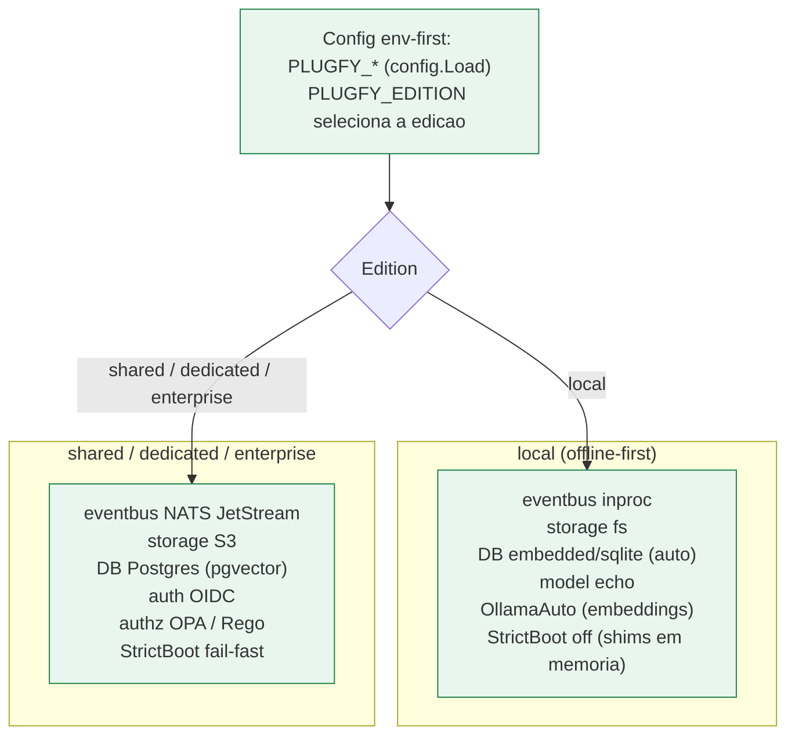
```mermaid
flowchart TB
  ENV["Config env-first: PLUGFY_* (config.Load)<br/>PLUGFY_EDITION seleciona a edicao"]
  ENV --> ED{"Edition"}
  ED -->|"local"| LOCAL
  ED -->|"shared / dedicated / enterprise"| CLOUD
  subgraph sgLocal["local (offline-first)"]
    LOCAL["eventbus inproc<br/>storage fs<br/>DB embedded/sqlite (auto)<br/>model echo<br/>OllamaAuto (embeddings)<br/>StrictBoot off (shims em memoria)"]
  end
  subgraph sgCloud["shared / dedicated / enterprise"]
    CLOUD["eventbus NATS JetStream<br/>storage S3<br/>DB Postgres (pgvector)<br/>auth OIDC<br/>authz OPA / Rego<br/>StrictBoot fail-fast"]
  end
  classDef novo fill:#e8f6ef,stroke:#1e8449;
  class ENV,LOCAL,CLOUD novo;
```

*A edicao (PLUGFY_EDITION, env-first) seleciona os backends: local e offline-first (inproc, fs, DB embarcado, echo, OllamaAuto, StrictBoot off) enquanto shared/dedicated/enterprise usam NATS, Postgres, S3, OIDC, OPA e StrictBoot fail-fast.*

---

## 14. UI — de hints vazados a Server-Driven UI

### 14.1 Legado — UI vazada no modelo de parâmetros

A UI era **vazada nos descritores de parâmetro**: `DefaultUIParameterModel` com hints de widget concretos (`enumDefaultUIValueType`: TextBox, FileDialog, Combobox). O vocabulário de UI estava entrelaçado com o contrato de parâmetros da unit, prescrevia widgets concretos no servidor, e exigia recompilação para mudar.

### 14.2 Atual — SDUI + protocolo de tema (Dart/Flutter)

A UI é uma inversão limpa: **Server-Driven UI como dados**. Quatro módulos:
- **`ui.engine`** — o runtime SDUI. Possui o contrato `UiComponent{type, id, props, layout, children, events, dataSource}` parseado de JSON; dados em massa viajam por **referência** (`UiDataSource`, anti-context-bloat), não inline. Roteia verbos de navegação para o `PlugfyHost` e ações de fetch para a API async do host. Registry de 3 tiers (org → platform → builtin). **Fronteira de segurança:** renderers recebem **só dados** (`node` + `ResolvedSkin`), nunca o `PlugfyHost` — um tema molda visuais mas não alcança estado da plataforma. Degradação graciosa (renderer faltante → placeholder + diagnóstico, nunca crash).
- **`ui.designsystem`** — biblioteca de componentes Material (**DEPRECATED**, sucedida por `theme-plugfy` na Platform).
- **`ui.sdk`** — surface de autoria de app. Dois caminhos: **declarativo** (`PlugfyDeclarativeApp` + documento `uischema`, atualiza como dados sem recompilar) e **custom** (`PlugfyCustomApp` com `build()` imperativo para canvases bespoke como flow/agent builders). `PlatformApi` tipada cobre o contrato de backend (143 métodos / 1604 LOC); rotas não-implementadas lançam `NotImplementedOnServer` (501) para apps compilarem hoje e acenderem quando o server entregar a rota.

### 14.3 Síntese

Onde o descritor legado dizia "renderize um Combobox", o schema novo diz `{type:"enum", options:[...]}` e o **tema** decide o widget. Atualizar UI = enviar novos dados (caminho declarativo), sem recompilação. O `dataSource` por referência evita context bloat; a fronteira data-only dos renderers é uma melhoria de segurança genuína. É a reversão arquitetural mais madura do conjunto (14 arquivos de teste no engine).


### 📐 Diagramas da seção

**Velho — UI vazada nos parametros**

```mermaid
flowchart TB
  subgraph sgBus["Barramento de parametros/dados do runtime"]
    LIST["ListDefaultUIParameterModel (lista usada na execucao)"]
    P["DefaultUIParameterModel"]
    V["Value : dynamic (dado em transito)"]
    PT["ParameterType : enumDefaultUIValueType<br/>(HINT de widget)"]
    EXTRA["ExtensionControleFormObject + ValueLabel<br/>+ checkVisible/checkEnable/validadeField (Action‹›)"]
  end
  HINTS["Hints de widget: TextBox / FileDialog / Combobox<br/>Password / DateTime / Checkbox / List ..."]
  RT["NodeController / ModuleController<br/>leem o MESMO modelo para executar"]
  LIST --> P
  P --> V
  P --> PT
  P --> EXTRA
  PT --> HINTS
  LIST -->|"mesmo objeto que o runtime consome"| RT
  NOTE["UI prescrita no servidor<br/>exige RECOMPILACAO para mudar a tela<br/>hints de widget ACOPLADOS ao contrato de parametros"]
  P -.-> NOTE
  classDef velho fill:#fde8e8,stroke:#c0392b;
  classDef escopo fill:#eeeeee,stroke:#888888,stroke-dasharray:4 3;
  class LIST,P,V,PT,EXTRA,RT velho;
  class HINTS,NOTE escopo;
```

*DefaultUIParameterModel carrega Value dynamic + hints de widget (enumDefaultUIValueType) acoplados ao mesmo barramento de parametros do runtime.*

**Novo — Server-Driven UI (SDUI) e protocolo de tema**

```mermaid
flowchart TB
  subgraph sgApp["App (comportamento)"]
    declApp["PlugfyDeclarativeApp<br/>renderPath=declarative<br/>(uischema JSON, atualiza como dados)"]
    custApp["PlugfyCustomApp<br/>renderPath=custom<br/>(build() imperativo)"]
    schema["uischema/ : arvore de<br/>UiComponent {type,id,props,events,dataSource}"]
    declApp -->|"ships"| schema
  end

  subgraph sgEngine["ui-engine (contrato + binding)"]
    uiComp["UiComponent : no recursivo<br/>dataSource por REFERENCIA<br/>(bulk NUNCA inline / anti-bloat)"]
    engine["UiEngine.renderPath()<br/>seleciona declarativo vs custom"]
    binding["SduiActionBinding / SduiView<br/>dispatch eventos + rebind de dados"]
    reg["SduiRegistry.resolve(type)<br/>3 tiers: org -› platform -› builtin"]
  end

  subgraph sgTheme["Tema ativo (renderers/layouts/skins)"]
    themeReg["PlugfyTheme.registerRenderers()<br/>semeia tier builtin"]
    renderer["ThemeRenderer(context, node, ResolvedSkin, sdui)<br/>theme.v1 / layout.v1 / skin.v1"]
    placeholder["Placeholder<br/>(renderer faltante -› degradacao graciosa)"]
  end

  subgraph sgShell["ui-shell (host)"]
    host["PlugfyHost : bridge da plataforma<br/>openApp / onAction / api.*"]
  end

  schema --> uiComp
  custApp -->|"build(context, host)"| engine
  uiComp --> engine
  engine --> binding
  binding --> reg
  themeReg --> reg
  reg -->|"match (org›platform›builtin)"| renderer
  reg -->|"sem renderer"| placeholder
  binding -.->|"acoes navigation/data -› host"| host
  host -.->|"activate(theme): clearBuiltin + seed"| themeReg

  sec["dados (props + tokens)"]
  renderer ==>|"FRONTEIRA DE SEGURANCA:<br/>SO node + ResolvedSkin, NUNCA o PlugfyHost"| sec

  classDef novo fill:#e8f6ef,stroke:#1e8449;
  classDef escopo fill:#eeeeee,stroke:#888888,stroke-dasharray:4 3;
  class declApp,custApp,schema,uiComp,engine,binding,reg,themeReg,renderer,placeholder,host novo;
  class sec escopo;
```

*Divisao em 4: App (uischema) -> ui-engine (UiComponent + binding) -> tema ativo (renderers) -> ui-shell (host); SduiRegistry resolve em 3 tiers; renderers recebem so dados.*

---

## 15. SDK e Experiência do Desenvolvedor

| Aspecto | Legado | Atual (`plugfy.foundation.sdk`) |
|---|---|---|
| Contrato | `I*Packager` resolvido por reflexão, objetos `dynamic` | Builder fluente `unit.New(...).Profile(...).Provides(...).Requires(...).MustBuild()` → `Unit` imutável validado |
| Resolução de dependência | namespace string | `capability.Resolve[Port]` (resolve + type-assert numa chamada) com porta consumer-owned |
| Empacotamento | DLL em `\Modules\Compiled\` ou formato `.lib` caseiro (BinaryFormatter→AES→GZip) | Manifesto + assinatura + assets embedados (migrations/i18n/UI schema via `go:embed`) |
| Teste de conformidade | Inexistente | **`conformance.Run(t, Unit, Options)`** — kit reutilizável que valida manifesto, assets embedados, round-trip de registro de capacidade, migrations, route contributions ("key differentiator" do SDK) |
| Marketplace | Inexistente | Contrato canônico de marketplace (catalog, sources, installs com herança de árvore org) |
| Exemplo de referência | SpedFlow (grande, mas heavy-lifting fora do framework) | `example/greeter` (completo, idiomático, é a própria fixture do conformance kit) |

O SDK atual re-exporta os contratos como **type aliases** (não wrappers — valores idênticos aos da plataforma, zero conversão), mantendo uma única surface ergonômica para o autor de app. O padrão consumer-owned-port (o autor declara a interface que precisa no seu próprio `contracts/spi`) é o que mantém o acoplamento invertido.


### 📐 Diagrama da seção

**Comparativo — Autoria de unidade: SDK novo vs I*Packager legado**

```mermaid
flowchart TB
  subgraph sgNovo["NOVO : SDK de unidade (Go, stdlib + SDK)"]
    direction TB
    nBuild["unit.New(name,ver)<br/>.Profile().Provides().Requires()<br/>.Migrations().I18n().UISchema()<br/>.OnRegister().Lifecycle().MustBuild()"]
    nUnit["Unit IMUTAVEL<br/>manifesto unit.plugfy.com/v1 validado<br/>+ assets embutidos (SQL/i18n/uischema)"]
    nProvide["capability.Provide(kind,name,factory)<br/>no init() do pacote adapters"]
    nResolve["capability.Resolve[Port](kind,name)<br/>porta CONSUMER-OWNED em contracts/spi"]
    nConf["conformance.Run(t, Unit)<br/>valida manifesto / assets / registro<br/>/ migrations / rotas"]
    nBuild --> nUnit
    nUnit --> nProvide
    nProvide --> nResolve
    nUnit --> nConf
  end

  subgraph sgLegado["LEGADO : I*Packager (C# / .NET 4.6.1)"]
    direction TB
    lImpl["implementa I*Packager (dynamic)"]
    lRefl["resolvido por REFLEXAO de namespace"]
    lDll["empacota DLL em<br/>Modules/Compiled/"]
    lLib["ou formato .lib :<br/>BinaryFormatter -› AES -› GZip"]
    lImpl --> lRefl
    lRefl --> lDll
    lRefl --> lLib
  end

  nUnit -.->|"substitui"| lImpl
  nResolve -.->|"capability tardia vs"| lRefl

  classDef novo fill:#e8f6ef,stroke:#1e8449;
  classDef velho fill:#fde8e8,stroke:#c0392b;
  class nBuild,nUnit,nProvide,nResolve,nConf novo;
  class lImpl,lRefl,lDll,lLib velho;
```

*Novo: builder fluente unit.New()...MustBuild() -> Unit imutavel, capability.Provide/Resolve, conformance.Run. Legado: I*Packager por reflexao, DLL/.lib via BinaryFormatter->AES->GZip.*

---

## 16. Capacidades de IA / Agentes (eixo inteiramente novo)

O legado **não tinha** capacidades de IA. O atual trata IA como cidadã de primeira classe, atravessando todas as camadas:

- **L1 contracts/agent:** os contratos canônicos de Assistant + 12 primitivas declarativas de Agent-Hub + resolver (registrados sob `KindAI`/`KindAgentHub`). É a maior superfície de contrato do módulo e sinaliza a direção AI-first (ainda fora do golden ABI — contrato em voo).
- **Pipeline:** nó **LLM** (ponte para `ModelGateway`), nós **AwaitJob/AwaitEvent** (orquestração de agentes multi-step, human-in-the-loop).
- **Foundation core:** bricks `com.plugfy.ai.agent` (run) e `com.plugfy.ai.classify` (label), atrás de uma porta `ModelProvider`.
- **Providers:** `model` (gateway com fallback/cache/accounting de tokens/custo), `embedding` (offline/ollama/openai), `vectorstore` (memory/pgvector HNSW) — o stack RAG completo, com **embedder offline determinístico** para RAG sem rede.
- **Kernel depsupervisor:** garante Ollama + modelo de embedding para RAG na edição Local, com fallback para o hashing embedder offline.


### 📐 Diagrama da seção

**Novo — Stack de IA/Agentes (novo eixo)**

```mermaid
flowchart TB
  subgraph sgL1["L1 contracts/agent"]
    A1["Assistant (KindAI)"]
    A2["Agent-Hub: 12 primitivas (KindAgentHub)"]
  end
  subgraph sgPipe["L3 Pipeline"]
    P1["No LLM -› ModelGateway"]
  end
  A1 --> P1
  A2 --> P1

  P1 --> G1["ModelGateway: primary + fallback / cache SHA-256 / accounting (custo e tokens)"]
  G1 --> M1["model: echo"]
  G1 --> M2["model: ollama"]
  G1 --> M3["model: openai"]

  subgraph sgRAG["RAG"]
    E1["provider.embedding (offline / ollama / openai)"]
    V1["provider.vectorstore (memory / pgvector HNSW)"]
    CN1["provider.connector (ingestao ACL-aware)"]
  end
  CN1 -->|"ingestao"| V1
  E1 -->|"vetores"| V1
  A1 -->|"retrieve grounding"| V1

  subgraph sgKernel["L4 kernel"]
    D1["depsupervisor: EnsureOllama + modelo de embedding (edicao Local)"]
  end
  D1 -.->|"garante / fallback offline"| M2
  D1 -.->|"garante / fallback offline"| E1

  classDef novo fill:#e8f6ef,stroke:#1e8449;
  class A1,A2,P1,G1,M1,M2,M3,E1,V1,CN1,D1 novo;
```

*Assistant + 12 primitivas Agent-Hub em L1; o no LLM do Pipeline roteia ao ModelGateway (primary+fallback, cache SHA-256, accounting) sobre echo/ollama/openai. RAG: embedding -> vectorstore <- connector ACL-aware; o depsupervisor garante Ollama e o modelo de embedding na edicao Local com fallback offline.*

---

## 17. Design Patterns — comparação

| Padrão | Legado | Atual |
|---|---|---|
| Plugin discovery | Service Locator por reflexão de string | **Registry/Factory via `init()`** (sem reflexão, checado em compilação) |
| Inversão de dependência | Ausente (núcleo conhece plugins) | **Ports & Adapters / Hexagonal** em cada seam; regra da seta de dependência |
| Strategy | `.Run` por `I*Packager` | dispatch por NodeType (14 handlers); backend por SPI Kind |
| Template Method | `SessionBase`, `ModulePackagerBase` | `spi.Lifecycle` (`DefaultLifecycle` embeddable) |
| Composite/Interpreter | grafo `NodeModel` + `<c#>` | DAG de pipeline + CEL |
| Observer | `IProgress<T>` (modelos de evento mortos) | CloudEvents + StepFrame + FrameSink |
| Proxy/Sandbox | `ProxyDomain` (AppDomain, derrotado) | 3-tier sandbox (wazero/subprocess) |
| Prototype | `BinaryFormatter` deep-clone | escopo derivado por iteração (ForEach) |
| Reconciliation | Ausente | **Level-triggered control loop** (estilo Kubernetes) |
| Build-tag platform split | Ausente (Windows-only) | `svcmgr_{windows,darwin,linux}.go`, `teardown_*.go` |


### 📐 Diagrama da seção

**Novo — Ports and Adapters (hexagonal): seta de dependencia**

```mermaid
flowchart TB
  subgraph sgRoot["Composition root (injeta no startup)"]
    root["foundation.ResolverWith(Deps)<br/>/ AllUnitsWith : injeta os adapters reais"]
  end

  subgraph sgDominio["Dominio / host (define a PORTA)"]
    engine["PipelineEngine (consumidor)"]
    portModel["PORT: ModelGateway<br/>(SPI em contracts/spi)"]
    portBus["PORT: EventBus"]
    portJobs["PORT: JobsQueue"]
    engine -->|"consome (port consumer-owned)"| portModel
    engine --> portBus
    engine --> portJobs
  end

  subgraph sgAdapters["Adapters (drivers / providers)"]
    aModel["ModelProvider adapter<br/>(SDK do modelo + credencial + retry)"]
    aBus["EventBus adapter"]
    aJobs["JobsQueue adapter"]
  end

  reg["registry / capability.Resolve[Port]<br/>(resolucao TARDIA por kind+name)"]

  aModel ==>|"implementa / depende do contrato"| portModel
  aBus ==>|"depende do contrato"| portBus
  aJobs ==>|"depende do contrato"| portJobs

  root -->|"capability.Provide no init()"| reg
  reg -.->|"yield provider tipado"| engine
  root -.-> aModel
  root -.-> aBus
  root -.-> aJobs

  gate["gate CI: decouple-check.sh<br/>host NUNCA importa impl concreta"]
  gate -.->|"garante seta -› contrato"| portModel

  classDef novo fill:#e8f6ef,stroke:#1e8449;
  classDef escopo fill:#eeeeee,stroke:#888888,stroke-dasharray:4 3;
  class engine,portModel,portBus,portJobs,aModel,aBus,aJobs,reg,root novo;
  class gate escopo;
```

*O host/dominio define a PORTA (SPI em contracts/spi); o adapter implementa e depende do contrato; consumidor resolve tarde via registry/capability. A seta sempre aponta para o contrato.*

---

## 18. Exemplos — completude e coerência

**Legado — SpedFlow** (`Solutions Factory/SpedFlow`, `Program.cs` com **1.548 linhas**): solução real de obrigação fiscal brasileira (SPED / e-Financeira). Demonstra bem a API programática (montar `ProjectModel` → `Process` → `FirstNode` Module → executar → ler `NodeOutputs`). **Porém**, a maioria das 1.548 linhas é código procedural **fora do framework** (parsing XLSX→DataTable, montagem de XML, validação XSD, assinatura X.509). Prova que o framework pode ser embutido, mas o trabalho pesado é hand-coded — sinal de que o modelo de nós não era expressivo o bastante para a carga real.

**Atual:**
- **`example/greeter`** (SDK) — completo e idiomático: declara unit, porta consumer-owned, provider auto-registrado, migrations, i18n (en + pt-BR), UI schema, Job runnable. É a fixture do conformance kit.
- **`apps/tasks`** (examples) — task tracker multi-tenant pequeno mas completo: profile plugin, provider sob KindStorage, porta `TaskStore`, migrations, i18n, UI schema, eventos publish/subscribe tipados.
- ⚠️ **Os diretórios `connectors/`, `extensions/`, `mcp/`, `verticals/`, `docs/` em `foundation.examples` estão VAZIOS** — reservados para trabalho futuro (roadmap EX-11). Não há ainda equivalente concreto a um conector Excel/SharePoint/Salesforce demonstrado. (vide §25)

**Leitura:** o legado tem **um exemplo grande e real** (mas com pouco do trabalho expresso como nós); o atual tem **dois exemplos pequenos, limpos e idiomáticos** que provam o modelo end-to-end através do Runner real, mas o catálogo de conectores concretos ainda está promissório.


### 📐 Diagrama da seção

**Comparativo — Exemplos: SpedFlow vs greeter/tasks**

```mermaid
flowchart LR
  subgraph sgOld["VELHO: exemplo SpedFlow"]
    direction TB
    SP["SpedFlow (1548 linhas)"]
    SPP["Maioria procedural hand-coded"]
    SPN["Pouco expresso como nos"]
    SPX["XLSX / XML / XSD / assinatura X.509"]
    SP --> SPP --> SPN
    SPP --> SPX
  end
  subgraph sgNew["NOVO: exemplos idiomaticos"]
    direction TB
    GR["greeter (SDK, fixture de conformance)"]
    TK["apps/tasks (task tracker multi-tenant)"]
    EMP["connectors / extensions / mcp / verticals: VAZIOS (roadmap)"]
    GR --> TK
    TK --> EMP
  end
  sgOld ==>|"novos exemplos"| sgNew
  classDef velho fill:#fde8e8,stroke:#c0392b;
  classDef novo fill:#e8f6ef,stroke:#1e8449;
  classDef escopo fill:#eeeeee,stroke:#888888,stroke-dasharray:4 3;
  class SP,SPP,SPN,SPX velho;
  class GR,TK novo;
  class EMP escopo;
```

*De um SpedFlow procedural de 1548 linhas para exemplos idiomaticos greeter (SDK) e tasks multi-tenant.*

---

## 19. Portabilidade Cross-Platform

| Concern | Legado | Atual |
|---|---|---|
| OS | **Windows-only** (Registry, WMI, Win32 P/Invoke, Excel Interop, Windows Service, WiX) | **Windows / macOS / Linux** |
| Serviço de host | Windows Service | Uma interface `Manager` sobre `sc.exe` / `launchd` / `systemd` |
| Self-update | MSI / ClickOnce | Swap atômico stdlib-only (download → SHA-256 → temp-write → `.bak` → rename → rollback) |
| Teardown de processo | — | `taskkill /F /T` (Win) vs SIGINT→SIGKILL (Unix) |
| Runtime de plugin | CLR .NET | Go nativo + WASM (wazero pure-Go) + subprocess (PSP plain `go build`) — roda em qualquer alvo Go |


### 📐 Diagrama da seção

**Novo — Portabilidade cross-platform (svcmgr e updater)**

```mermaid
flowchart TB
  MGR["svcmgr.Manager (ServiceName = plugfyd)<br/>Install / Start / Stop / Uninstall / Status"]
  MGR --> WIN["Windows: sc.exe<br/>(create/start/stop/delete)"]
  MGR --> MAC["macOS: launchd<br/>(plist + launchctl)"]
  MGR --> LIN["Linux: systemd<br/>(unit .service + systemctl)"]
  subgraph sgUpd["Updater atomico (stdlib-only)"]
    U1["download release"] --> U2["verify SHA-256 (checksums.txt)"]
    U2 --> U3["unpack: zip (Windows) / tar.gz (Unix)"]
    U3 --> U4["backup *.bak"]
    U4 --> U5["rename atomico (os.Rename)"]
    U5 --> U6["Rollback: restaura *.bak"]
  end
  subgraph sgTear["Teardown"]
    TW["Windows: interrupt -› taskkill /F /T"]
    TU["Unix: SIGINT -› grace -› SIGKILL"]
  end
  MGR -.->|"self-update do daemon"| U1
  WIN -.-> TW
  LIN -.-> TU
  MAC -.-> TU
  classDef novo fill:#e8f6ef,stroke:#1e8449;
  class MGR,WIN,MAC,LIN,U1,U2,U3,U4,U5,U6,TW,TU novo;
```

*Uma unica interface Manager (servico plugfyd) com tres implementacoes de SO (sc.exe / launchd / systemd), updater atomico (download -> SHA-256 -> unpack -> backup .bak -> rename -> Rollback) e teardown taskkill no Windows versus SIGINT/SIGKILL no Unix.*

---

## 20. Matriz de Recursos (resumo)

| Recurso | Legado | Atual |
|---|:---:|:---:|
| Modelo de plugin/extensão | ✅ (reflexão) | ✅ (registry + manifesto) |
| Versionamento SemVer + resolução | ❌ | ✅ (MVS + 9 eixos) |
| Isolamento real (OS/WASM) | ❌ (AppDomain derrotado) | ✅ (3 tiers) |
| DAG real + paralelismo | ❌ | ✅ |
| Cancelamento/timeout | ❌ (ignorado) | ✅ |
| Resiliência declarativa | ❌ | ✅ (retry/breaker/bulkhead) |
| Expressões seguras | ❌ (`<c#>` RCE) | ✅ (CEL) |
| Cross-platform | ❌ (Windows-only) | ✅ |
| Identidade federada (OIDC/SAML/OAuth2) | ❌ | ✅ |
| Secret store + envelope crypto | ❌ (tokens caseiros) | ✅ |
| Multi-tenancy (RLS) | ❌ | ✅ |
| CloudEvents + DLQ | ❌ (fila em disco) | ✅ |
| Server-Driven UI + temas | ❌ (hints vazados) | ✅ |
| IA: model gateway/embeddings/vectorstore/RAG/agentes | ❌ | ✅ |
| Congelamento de ABI (golden) | ❌ | ✅ (atualmente stale — vide §25) |
| Conformance kit / testes | parcial (MSTest) | ✅ (conformance.Run + `-race`) |
| Conectores concretos prontos (Excel/SharePoint/Salesforce/AX) | ✅ | ⏳ (mecanismo genérico; concretos em roadmap) |
| Exemplo vertical real grande (SpedFlow) | ✅ | ⏳ (verticals/ vazio) |


### 📐 Diagrama da seção

**Comparativo — Cobertura de recursos (ambos / so novo / legado tinha)**

```mermaid
flowchart TB
  subgraph sgAmbos["Presente em ambos"]
    A1["Modelo de plugin/extensao"]
    A2["Multiplas surfaces de integracao"]
  end
  subgraph sgNovo["Novo (ausente no legado)"]
    N1["Versionamento SemVer + MVS + admissibilidade 9 eixos"]
    N2["Isolamento real OS/WASM (3 tiers)"]
    N3["DAG real + paralelismo + cancelamento"]
    N4["Resiliencia declarativa (retry/breaker/bulkhead)"]
    N5["Expressoes seguras (CEL)"]
    N6["Cross-platform (Win/macOS/Linux)"]
    N7["Identidade federada + secret envelope + RLS"]
    N8["CloudEvents + dead-letter (DLQ)"]
    N9["Server-Driven UI + temas"]
    N10["IA: gateway/embeddings/vectorstore/RAG/agentes"]
    N11["Golden ABI + conformance kit"]
  end
  subgraph sgLegado["Legado tinha; novo em roadmap"]
    L1["Conectores concretos prontos (Excel/SharePoint/Salesforce/AX/Boleto)"]
    L2["Exemplo vertical grande (SpedFlow)"]
  end
  classDef velho fill:#fde8e8,stroke:#c0392b;
  classDef novo fill:#e8f6ef,stroke:#1e8449;
  classDef escopo fill:#eeeeee,stroke:#888888,stroke-dasharray:4 3;
  class A1,A2 escopo;
  class N1,N2,N3,N4,N5,N6,N7,N8,N9,N10,N11 novo;
  class L1,L2 velho;
```

*Mapa de cobertura: o que existe em ambos, o que e exclusivo do novo, e o que o legado tinha e o novo traz em roadmap.*

---

## 21. Forças e Limitações de cada versão

### 21.1 Legado — forças
- Modelo de plugin genuinamente extensível com taxonomia clara (Node → Module → Component → Function).
- Cobertura ampla de conectores reais (Excel, Email/POP3, SharePoint, Salesforce, Dynamics AX2012, DB, Boleto) e um exemplo SpedFlow funcional end-to-end.
- Múltiplas surfaces de integração (API in-proc, REST Connector, fila + job spawned, WMI).
- Scripting `<c#>` embutido dá flexibilidade enorme para transforms de campo.

### 21.2 Legado — limitações
- **Dois modelos competindo**, um (Step/eventos/resultados) efetivamente morto; status real é string ad-hoc.
- **`dynamic` + reflexão por namespace** pervasivos — sem segurança de compilação, sem versionamento, coerção frágil.
- **"Paralelo" é sequencial**; sem joins de DAG, sem detecção de ciclo, sem cancelamento real.
- **Segurança mínima:** endpoint anônimo + CORS `*`, execução full-trust, AppDomain derrotado, `BinaryFormatter`, tokens caseiros, `throw ex`.
- **Build frágil:** `.csproj` não-SDK com ~150 referências manuais, targets misturados (3.5→netcoreapp2.2), `External libs` por caminho de máquina, `MigrationBackup` residual.
- **Módulos vazios/stub** (ExceptionFactory, ModuleParameterContext, SwitchCase, Core.Data, Mapping factory).
- **Windows-only.**

### 21.3 Atual — forças
- Micro-kernel agnóstico de domínio, camadas com fronteiras verificadas em CI.
- 3-tier sandbox, versionamento MVS + admissibilidade de 9 eixos, ciclo de vida OSGi-like + reconciler.
- DAG real com 14 node types, 7 arestas tipadas, resiliência declarativa, CEL seguro, StepFrames.
- 9 providers / 25 backends swappable por edição, offline-first.
- Segurança de geração moderna (OIDC/SAML/OAuth2, envelope AES-256-GCM, RLS).
- IA como cidadã de primeira classe (gateway/embeddings/vectorstore/RAG/Agent-Hub).
- SDUI + protocolo de tema; SDK com conformance kit; cross-platform.
- L1 stdlib-only com congelamento de ABI.

### 21.4 Atual — limitações / estado em construção
- **Catálogo de conectores concretos ainda promissório:** `foundation.examples/{connectors,extensions,mcp,verticals}` vazios; sem porte direto de Excel Interop/SharePoint CSOM/BusinessConnector.
- **`framework/builtin` traz só bricks demo** (`upper`/`exclaim`); resolução de produção (install-root/registry) é follow-on documentado.
- **Golden ABI atualmente vermelho** (drift aditivo de `persistence.MigrationSet` não regenerado).
- **Drift de documentação** (README/ROADMAP mencionam v1.2–1.3 vs git v1.12.3).
- Alguns nós (Try/Parallel) hoje resolvem inputs CEL em vez de executar sub-grafos aninhados; persistência de run timeline (StepFrames) ainda in-memory (PIPE-10).
- Action só REST/OpenAPI hoje (gRPC/GraphQL planejados — PIPE-11).
- Export de métricas OTel pendente (KRN-08); rollback-on-failed-update do svcmgr (KRN-10).


### 📐 Diagrama da seção

**Comparativo — Forcas e limitacoes (velho x novo)**

```mermaid
flowchart TB
  subgraph sgVF["Velho - Forcas"]
    VF1["Modelo de plugin extensivel (Node/Module/Component/Function)"]
    VF2["Conectores reais (Excel/Email/SharePoint/Salesforce/AX/Boleto)"]
    VF3["Scripting c# embutido (flexivel)"]
    VF4["Multiplas surfaces (in-proc/REST/fila/WMI)"]
  end
  subgraph sgVL["Velho - Limitacoes"]
    VL1["Dois modelos; Step = codigo morto"]
    VL2["dynamic + reflexao por string; sem versionamento"]
    VL3["Paralelismo falso; sem cancelamento real"]
    VL4["Seguranca minima (anonimo/full-trust/BinaryFormatter)"]
    VL5["Build fragil; Windows-only; modulos stub"]
  end
  subgraph sgNF["Novo - Forcas"]
    NF1["Micro-kernel agnostico; fronteiras verificadas em CI"]
    NF2["Sandbox 3-tier; MVS + admissibilidade 9 eixos"]
    NF3["DAG real; resiliencia declarativa; CEL"]
    NF4["Seguranca moderna (OIDC/SAML; envelope; RLS)"]
    NF5["IA de primeira classe; SDUI; cross-platform"]
  end
  subgraph sgNL["Novo - Limitacoes / em construcao"]
    NL1["Catalogo de conectores concretos promissorio"]
    NL2["builtin so com bricks demo"]
    NL3["Golden ABI atualmente vermelho (drift aditivo)"]
    NL4["Drift de documentacao (v1.2 vs v1.12.3)"]
    NL5["Try/Parallel resolvem inputs; StepFrame in-memory"]
  end
  classDef velho fill:#fde8e8,stroke:#c0392b;
  classDef novo fill:#e8f6ef,stroke:#1e8449;
  class VF1,VF2,VF3,VF4,VL1,VL2,VL3,VL4,VL5 velho;
  class NF1,NF2,NF3,NF4,NF5,NL1,NL2,NL3,NL4,NL5 novo;
```

*Quadro de forcas e limitacoes de cada versao, lado a lado.*

---

## 22. Estado atual, gaps e dívidas técnicas (verificados em código)

Itens factuais observados na análise (úteis para planejamento):

1. **Golden ABI stale** — `go test ./abi -run TestGoldenABI -update` precisa ser rodado e commitado em `plugfy.framework.contracts` (drift aditivo: `persistence.MigrationSet` + `ApplyMigrations`).
2. **`foundation.examples`** — `connectors/`, `extensions/`, `mcp/`, `verticals/`, `docs/` vazios; só `apps/tasks` existe. Roadmap EX-11 prevê um connector app demonstrando `KindConnector`.
3. **`framework/builtin`** — apenas 2 bricks demo; o resolver de produção (install-root/registry) é o seguinte passo.
4. **Doc drift** — README/ROADMAP de `contracts` descrevem v1.2–1.3 vs git em v1.12.3.
5. **`plugin.GRPCLoader`** foi removido como órfão superseded (gateway disca `plugfy.supervisor.v1` direto).
6. **Backlog técnico** registrado: OTel metrics (KRN-08), updater multi-layer (RT-08/KRN-09), ingestão de compatibility-block no resolver (RT-10), limites de recurso WASM além de memória (fuel/walltime) e extração de artefato OCI.

> Nada disso invalida a arquitetura; são pontas de implementação em uma plataforma jovem mas com fundações sólidas. O contraste com o legado é que **os gaps do atual são "ainda não implementado" sobre uma base correta**, enquanto os gaps do legado eram **defeitos estruturais sobre uma base frágil** (segurança, versionamento, código morto).


### 📐 Diagrama da seção

**Novo — Estado atual e dividas tecnicas -> roadmap**

```mermaid
flowchart LR
  subgraph sgNow["Estado atual / dividas tecnicas"]
    G1["Golden ABI stale: rodar -update e commitar"]
    G2["foundation.examples: connectors/extensions/mcp/verticals VAZIOS"]
    G3["framework/builtin: so bricks demo (upper/exclaim)"]
    G4["Doc drift: README/ROADMAP v1.2 vs git v1.12.3"]
    G5["Backlog: OTel metrics, updater multi-layer, limites WASM"]
  end
  subgraph sgRoad["Direcao / roadmap"]
    R1["Regenerar golden + CI verde"]
    R2["Connector app (KindConnector) + verticais"]
    R3["Resolver de producao (install-root/registry)"]
    R4["Alinhar docs aos tags"]
    R5["Fechar itens de backlog"]
  end
  G1 --> R1
  G2 --> R2
  G3 --> R3
  G4 --> R4
  G5 --> R5
  NOTE["Gaps do novo = 'ainda nao implementado' sobre base correta;<br/>gaps do legado eram defeitos estruturais sobre base fragil."]
  sgRoad -.-> NOTE
  classDef novo fill:#e8f6ef,stroke:#1e8449;
  classDef escopo fill:#eeeeee,stroke:#888888,stroke-dasharray:4 3;
  class G1,G2,G3,G4,G5,R1,R2,R3,R4,R5 novo;
  class NOTE escopo;
```

*Itens em construcao mapeados a direcao de evolucao do novo framework.*

---

## 23. Conclusão

A comparação revela duas filosofias separadas por uma geração de engenharia:

- O **Plugfy legado** é um **motor de fluxo Windows** competente em conectores concretos e flexível via scripting, mas estruturalmente preso a reflexão não-tipada, isolamento ilusório, segurança permissiva, ausência de versionamento e partes inacabadas. Ele resolve o problema de "executar integrações de negócio numa máquina Windows".

- O **Plugfy atual** é um **Operation Framework micro-kernel, portável, seguro por padrão e orientado a IA**. Ele troca a flexibilidade perigosa (`<c#>`, full-trust, AppDomain) por uma arquitetura de contratos com fronteiras verificadas, sandbox real em três tiers, versionamento MVS + admissibilidade de 9 eixos, resiliência declarativa, federação de identidade, multi-tenancy no nível de linha, e um stack de IA de primeira classe. Ele resolve o problema de "operar um conjunto extensível de capacidades como guest em qualquer host (desktop/server/cloud), com segurança e governança".

O fio condutor: o legado **compilava e refletia** extensões num único processo .NET no Windows; o atual **resolve unidades em runtime por manifesto + versão + capacidade**, isola-as em três tiers de confiança em três sistemas operacionais, e mantém o núcleo agnóstico livre de todo domínio.

O custo real da nova geração é **maturidade de catálogo**: os conectores concretos e verticais que o legado já tinha (Excel, SharePoint, Salesforce, AX2012, SpedFlow) ainda estão majoritariamente em roadmap no atual — porém agora expressos sobre um **mecanismo generalizado** (9 providers / 25 backends, action REST/OpenAPI, SDUI, SDK + conformance) em vez de hardwired. E, reforçando o escopo desta análise: **escala, servidor e operação distribuída pertencem à `plugfy.platform`** — o Framework e o Foundation entregam as fundações corretas para que essa camada construa em cima.


### 📐 Diagrama da seção

**Comparativo — Sintese da evolucao old -> new**

```mermaid
flowchart LR
  V["Motor de fluxo Windows .NET<br/>flexivel mas inseguro<br/>sem versionamento<br/>partes inacabadas"]
  N["Operation Framework micro-kernel<br/>portavel, seguro por padrao<br/>orientado a IA<br/>mecanismo generalizado; catalogo concreto em construcao"]
  ESC["Escala / server = plugfy.platform (L5/L6) - FORA DO ESCOPO"]
  V ==>|"reescrita arquitetural"| N
  N -.->|"fora do escopo"| ESC
  classDef velho fill:#fde8e8,stroke:#c0392b;
  classDef novo fill:#e8f6ef,stroke:#1e8449;
  classDef escopo fill:#eeeeee,stroke:#888888,stroke-dasharray:4 3;
  class V velho;
  class N novo;
  class ESC escopo;
```

*Linha do tempo: motor de fluxo Windows .NET reescrito como micro-kernel portavel, seguro e orientado a IA.*

---

## Apêndice A — Arquivos-chave de evidência

**Legado:**
- `Core/Plugfy.Framework/Project/projectcontroller.cs` — orquestrador
- `SDK/Extensions/Factories/.../NodeController.cs` — motor de execução real (AppDomain, reflexão)
- `SDK/.../Node/.../ModuleController.cs` — sub-hierarquia Module/Component/Function
- `Core/Plugfy.Core.Utils/Compiler.cs` — `<c#>` compilado em runtime
- `Core/Plugfy.Core.Utils/ProxyDomain.cs` — isolamento de AppDomain (derrotado)
- `Connector/.../Service.cs`, `.../Controller/ProcessController.cs` — Windows Service + OWIN anônimo
- `Solutions Factory/SpedFlow/.../Program.cs` — exemplo real (1.548 linhas)

**Atual — Framework:**
- `contracts/spi/{provider,lifecycle,eventbus}.go`, `contracts/spi/core/*`, `contracts/installed/admissibility.go`, `contracts/resilience/resilience.go`, `contracts/abi/abi_test.go`
- `runtime/{manifest/unit.go, registry/registry.go, resolver/resolver.go, plugin/subprocess.go, wasm/runtime.go, loader/loader.go, runner/runner.go, supervisor/supervisor.go}`
- `pipeline/{contracts/spi/pipeline.go, application/engine/*.go, application/expr/*, application/trigger/*, application/action/*, application/pipelineunit/*}`
- `kernel/{config/config.go, svcmgr/svcmgr_*.go, updater/updater.go, depsupervisor/ollama.go, obs/*}`

**Atual — Foundation:**
- `foundation/{foundation.go, ai/provider.go, data/*, http/request.go, security/policy.go}`
- `foundation.sdk/{unit/unit.go, capability/capability.go, conformance/conformance.go, marketplace/marketplace.go, example/greeter/*}`
- `foundation.examples/apps/tasks/*` (+ dirs vazios `connectors`/`extensions`/`mcp`/`verticals`/`docs`)
- `foundation.provider.*/{contracts/spi/*, adapters/registry.go}` (9 providers, 25 backends)
- `foundation.ui.engine/lib/src/{sdui/ui_schema.dart, engine/ui_engine.dart}`, `foundation.ui.sdk/lib/src/{app/*, api/platform_api.dart}`

---

*Documento gerado a partir de leitura direta do código-fonte de ambas as soluções. Para detalhes de qualquer seção, os caminhos `arquivo:linha` citados são clicáveis no repositório correspondente.*
