<!-- markdownlint-disable MD013 MD033 MD041 -->

# Plugfy Framework — Documento de Arquitetura

> **Arquitetura de Referência do Plugfy Framework (L1).** O framework é **exatamente três conceitos — Unit + Pipeline + Execution**: um motor genérico, **domain-agnostic** e **stdlib-only** que **define** unidades, **compõe** essas unidades em pipelines (DAGs) e **executa** esses pipelines de forma **assíncrona**. Nada de domínio vive aqui.
> Documento estruturado segundo **arc42**, com diagramas no **C4 Model**, decisões em **ADR (formato Nygard)** e metas de qualidade segundo **ISO/IEC 25010:2023**.

| | |
|---|---|
| **Produto** | Plugfy Framework (L1) |
| **Conceitos** | **Unit + Pipeline + Execution** — e nada mais |
| **Building blocks** | `contracts` (contratos do unit + do pipeline + folhas puras) · `engine`/`runner` (o motor genérico) · `plugfy` CLI (job runner standalone) |
| **Linguagem** | Go 1.25 |
| **Versão da linha** | 1.x (golden ABI congelada sobre a superfície mínima) |
| **Status** | Baseline de arquitetura |
| **Padrões** | [arc42](https://arc42.org) · [C4 Model](https://c4model.com) · [ADR/Nygard](https://adr.github.io) · [ISO/IEC 25010:2023](https://www.iso.org/standard/78176.html) |
| **Público** | Arquitetos, tech leads, autores de unidades, autores de pipelines |

> **Régua canônica (uma frase).** **Três camadas, três verbos: o Framework DEFINE & RODA pipelines · as Foundations CONSTROEM apps/serviços/scripts · a Platform ESCALA tudo num ecossistema governado.** Este documento descreve **apenas o Framework (L1)** — a primeira cláusula. As outras duas camadas aparecem somente numa nota de fronteira ([§3.3](#33-o-que-não-é-o-framework-a-fronteira-l1l2l3)) que aponta para [`LAYERS.md`](LAYERS.md), a visão canônica completa das três camadas.

> **Escopo.** Este documento fala **só do framework**. O framework é deliberadamente **domain-agnostic** e **stdlib-only**: ele não conhece capacidades, providers, persistência, UI, hosts, edições, contas nem triggers — **não há webhooks, HTTP, gRPC, WebSockets, UI, persistência, contas ou triggers** nele. Tudo o que é concreto entra como uma **unidade** externa que pluga pelo contrato `Unit`. Os módulos de comunicação (gRPC/WebSockets/REST) são **Foundations (L2)**; a hospedagem de trigger/webhook é **Platform (L3)** — fora do escopo do framework.

---

## Como ler este documento

Adotamos o template **arc42** (12 seções) porque é otimizado para *comunicação*. Os diagramas seguem o **C4 Model** (Contexto → Contêineres → Componentes, mais diagramas dinâmicos de sequência).

> **Legenda dos diagramas.** Mermaid (renderiza no GitHub e no VS Code). Cores: **contracts** (azul), **engine/runner/CLI** (verde), **externos ao framework** — host, unidades, L2/L3 (cinza). A **seta de dependência aponta sempre para baixo**, em direção aos contratos. Diagramas validados por renderizador Mermaid.

### Índice

1. [Introdução e Metas](#1-introdução-e-metas) — *o que é e o que faz*
2. [Restrições de Arquitetura](#2-restrições-de-arquitetura)
3. [Contexto e Escopo](#3-contexto-e-escopo) — *inclui a fronteira "o que NÃO é o framework"*
4. [Estratégia de Solução](#4-estratégia-de-solução)
5. [Visão de Blocos de Construção](#5-visão-de-blocos-de-construção-building-block-view)
6. [Visão de Runtime e Exemplos Trabalhados](#6-visão-de-runtime-e-exemplos-trabalhados) — *como faz, com exemplos reais*
7. [Visão de Implantação](#7-visão-de-implantação-deployment-view)
8. [Conceitos Transversais](#8-conceitos-transversais-crosscutting-concepts)
9. [Decisões de Arquitetura (ADRs)](#9-decisões-de-arquitetura-adrs)
10. [Requisitos de Qualidade](#10-requisitos-de-qualidade)
11. [Riscos e Dívida Técnica](#11-riscos-e-dívida-técnica)
12. [Glossário](#12-glossário) · [Apêndices](#apêndices)

---

## 1. Introdução e Metas

### 1.1 O que é o Plugfy Framework

O **Plugfy Framework** é o **L1** do Plugfy: a base mínima e generativa sobre a qual tudo o mais é construído. Ele é **exatamente três conceitos**:

- **Unit** — o tijolo gerador mínimo: uma unidade executável universal com **dois métodos** (`Describe` + `Invoke`).
- **Pipeline** — a composição de unidades num **DAG**; e um Pipeline **é, ele mesmo, uma Unit** (recursão uniforme).
- **Execution** — rodar um pipeline, de forma **assíncrona**, ou como **biblioteca Go** que você importa, ou pela **CLI `plugfy`** passando parâmetros.

Com **unit + pipeline + execution sozinhos** já se **define e roda um pipeline completo e complexo** — assíncrono, com ramificação, paralelismo e espera. Não há mais nada no framework: ele não sabe carregar plugins, não isola sandbox, não supervisiona processos, não conhece versões nem admissibilidade, não fala HTTP nem persiste nada. Tudo isso é construído **acima** (Foundations) ou **ao redor** (Platform), nunca dentro.

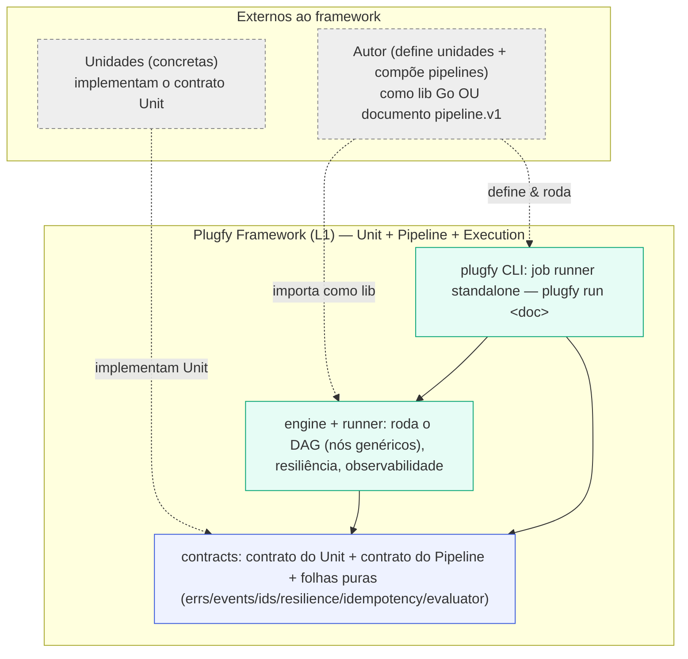

*O framework é só Unit + Pipeline + Execution. Os `contracts` definem o contrato do unit, o contrato do pipeline e as folhas puras; o `engine`/`runner` é o motor genérico; a CLI `plugfy` é o job runner standalone. Autores e unidades concretas são externos. A seta de dependência aponta sempre para baixo, até os contratos.*

### 1.2 Do que o framework é capaz (catálogo de capacidades)

O valor do framework está nestas capacidades genéricas, **todas dentro de unit + pipeline + execution**. A [§6](#6-visão-de-runtime-e-exemplos-trabalhados) mostra cada uma em ação, com exemplos reais.

| Capacidade | O que resolve (dor real) | Como faz |
|---|---|---|
| **Definir um tijolo executável** | "tenho uma lógica e quero torná-la um componente reutilizável e executável, sem amarrá-la ao resto." | O contrato **`Unit`** de **dois métodos** (`Describe`+`Invoke`); identidade e IO tipado vêm do descritor. |
| **Compor unidades num fluxo** | Substituir automação em "código-espaguete" por fluxos declarativos com ramificação, paralelismo e espera. | **PipelineEngine**: um DAG de nós **genéricos** (Module, If, Switch, Try, Parallel, ForEach, Pipeline, AwaitJob, AwaitEvent, Delay, Sequence) + arestas tipadas. |
| **Recursão uniforme** | Reusar um fluxo inteiro como se fosse uma unidade. | Um **Pipeline é uma Unit** (`pipelineunit`): o nó `Pipeline` roda um sub-pipeline. |
| **Encadear valores tipados** | Passar a saída de um nó para a entrada de outro **sem stringificar**. | *Threading* tipado via `Evaluator.Resolve` — uma expressão única preserva `[]any`/`map`/número nativos. |
| **Rodar de forma assíncrona, de dois jeitos** | Executar o mesmo pipeline de dentro de um programa Go **ou** pela linha de comando. | (a) **biblioteca Go** que você importa; (b) **CLI `plugfy run <doc>`** com parâmetros. |
| **Tornar cada passo resiliente** | Impedir que uma dependência instável derrube o fluxo todo. | **`resilience.Guard`** declarativo por nó: *bulkhead → retry (backoff+jitter) → circuit breaker*. |
| **Rotear erros declarativamente** | Tratar timeout/cancel/retry/erro sem `if` espalhado. | Arestas de erro tipadas com cascata de prioridade **`onTimeout → onCancel → onRetry → onError`**. |
| **Observar a execução** | Entender o que rodou, quanto demorou e o que falhou. | **`StepFrame`** por nó (status, *timings*, tentativa, *snapshots* de I/O) → *sink* plugável. |
| **Padronizar erros, IDs e eventos** | Interoperar de forma previsível entre as partes. | Erros canônicos (`errs`), **ULID** (`ids`), **CloudEvents 1.0** (`events`) — tudo stdlib-only. |
| **Avaliar predicados com segurança** | Guards, condições e templates sem scripting Turing-completo. | A **porta `Evaluator`** (impl CEL injetada na composição) — não-Turing-completa, sem efeitos colaterais. |
| **Provar a autossuficiência** | Demonstrar que os três conceitos bastam, sem nenhum host. | O **job runner standalone** `plugfy run <doc>` roda um pipeline complexo dependendo só do L1. |

### 1.3 Forças motrizes (requisitos essenciais)

- **R1 — Mínimo gerador:** o núcleo é o tijolo mais simples possível (`Describe`+`Invoke`); a riqueza vem da **composição**, não do núcleo.
- **R2 — Domain-agnostic absoluto:** o framework não conhece nenhum domínio, transporte, host ou capacidade — zero webhooks, HTTP, gRPC, WebSockets, UI, persistência, contas ou triggers.
- **R3 — Stdlib-only:** o framework não arrasta dependência externa; a golden ABI congela exatamente a superfície mínima.
- **R4 — Execução assíncrona em dois modos:** biblioteca Go **e** CLI, sobre o mesmo contrato e o mesmo motor.
- **R5 — Autossuficiência demonstrável:** `plugfy run <doc>` prova que unit + pipeline + execution bastam para um fluxo completo.

### 1.4 Metas de qualidade (Top-5)

| # | Meta | Característica ISO 25010 | Por quê |
|---|---|---|---|
| **Q1** | Minimalidade e Modularidade | Maintainability / Flexibility | Núcleo de dois métodos; riqueza por composição. |
| **Q2** | Agnosticismo de domínio | Modularity / Reusability | O framework não conhece domínio, transporte nem host. |
| **Q3** | Estabilidade de contrato | Compatibility / Maintainability | Golden ABI congela a superfície mínima; *drift* falha o CI. |
| **Q4** | Confiabilidade de execução | Reliability | `Guard` por nó + roteamento de erro tipado + observabilidade. |
| **Q5** | Composabilidade | Functional Suitability | Nós genéricos + recursão (Pipeline é Unit) + threading tipado. |

### 1.5 Stakeholders

| Stakeholder | Interesse |
|---|---|
| **Autor de unidade** | Um contrato de unidade mínimo e estável (`Describe`+`Invoke`); IO tipado; descritor puro. |
| **Autor de pipeline** | Compor unidades num DAG declarativo; ramificação/paralelismo/espera; resiliência por nó. |
| **Quem embute o framework** | Importar o engine como lib Go, ou rodar `plugfy run`, e injetar a porta `Evaluator`. |

---

## 2. Restrições de Arquitetura

### 2.1 Restrições técnicas

| Restrição | Descrição | Consequência |
|---|---|---|
| **Go 1.25** | Os building blocks são Go. | Binário único, cross-compile trivial, sem VM/runtime externo. |
| **Stdlib-only** | O framework não pode ter `require` externo no caminho do L1. | A raiz da árvore de dependências nunca arrasta peso. Imposto em CI. As folhas (`ids`/`resilience`/`idempotency`) são **implementações de referência stdlib-only**. |
| **Polirepo** | Os building blocks são repositórios independentes, com SemVer por tag. | Versionamento/release independentes. |
| **Domain-agnostic** | O núcleo não conhece domínio, transporte, host nem capacidade. | Tudo concreto entra como unidade externa; nenhum webhook/HTTP/gRPC/UI/persistência no framework. |
| **Dois conceitos compostos por execução** | Toda execução é um pipeline (mesmo que de um nó) de units. | Um modelo de execução único; recursão uniforme (Pipeline é Unit). |

### 2.2 Convenções

- **Identidade reverse-DNS** (`com.exemplo.algo`) e **SemVer** no descritor da unidade.
- **Eventos em CloudEvents 1.0**; **IDs em ULID**.
- **Porta de avaliação injetada:** o framework declara a porta `Evaluator`; a implementação CEL é injetada na composição (uma só CEL atrás de uma só porta).
- **Threading tipado:** valores entre nós são preservados em forma nativa (não stringificados).

### 2.3 Gates de CI que materializam as restrições

| Gate | Garante |
|---|---|
| `decouple-check.sh` | Stdlib-only; nenhum building block importa implementação de outro. |
| `abi.TestGoldenABI` | A superfície pública mínima (unit/pipeline/lifecycle/evaluator + folhas puras) é congelada; *drift* falha o CI. |
| *standalone build* (`GOWORK=off`) | Cada módulo compila como um clone novo, sem mascarar `go.mod` incompleto. |
| `plugfy run <doc>` (prova empírica) | O job runner standalone roda um pipeline complexo dependendo **só** do L1 — sem registry, persistência, host, loader ou capacidade no grafo. |

---

## 3. Contexto e Escopo

### 3.1 Contexto do sistema (C4 Nível 1)

Um **autor** define **unidades** (que implementam o contrato `Unit`) e as **compõe** num documento `pipeline.v1`. O framework **executa** esse pipeline de forma assíncrona — ou como **biblioteca Go** importada, ou pela **CLI `plugfy`**. Não há mais ninguém no contexto do framework: nenhum host obrigatório, nenhum sistema externo, nenhum SO. Tudo concreto é uma unidade; o framework é domain-agnostic.

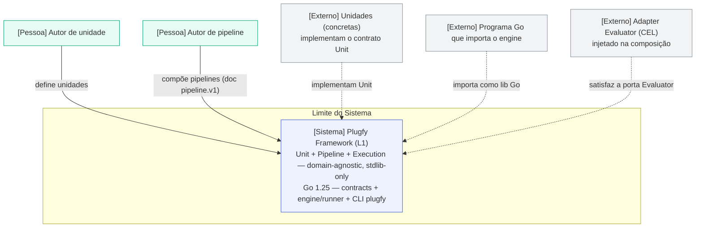

*Contexto do Plugfy Framework. Autores definem unidades e compõem pipelines; o framework os executa de forma assíncrona, como lib Go ou pela CLI `plugfy`. Tudo concreto é uma unidade externa; a porta `Evaluator` recebe um adapter CEL na composição. Não há host, sistema externo nem SO no contexto do framework — esses são L2/L3 (ver §3.3).*

### 3.2 Contexto técnico (interfaces)

O framework **define** poucos contratos; as implementações concretas são externas. As fronteiras do L1:

| Fronteira | Tipo | Contrato (definido pelo framework) |
|---|---|---|
| Unidade executável | contrato | `spi/core.Unit` — **exatamente** `Describe()` + `Invoke(ctx, method, in)` |
| Identidade e IO tipado | dados | `core.UnitDescriptor` (`ID`/`Version`/`Kind`/`MethodDef`/`ParamDef`) — puro |
| Pipeline (composição) | contrato | `Pipeline`/`Node`/`Edge`/`NodeType` (open-string) + `PipelineEngine`/`UnitResolver`/`NodeRunner` |
| Avaliação de expressões | porta | `spi.Evaluator` (impl CEL injetada na composição) |
| Eventos | dados | envelope `events.CloudEvent` (CloudEvents 1.0) |
| Idempotência | porta | `idempotency.Store` (proteção anti-replay) |
| Erros | dados | `errs` — modelo de erros canônico |
| Resiliência | impl de referência | `resilience.Guard` (bulkhead/retry/breaker) |

### 3.3 O que **não** é o framework (a fronteira L1↔L2↔L3)

> **Régua canônica.** **O Framework DEFINE & RODA pipelines · as Foundations CONSTROEM apps/serviços/scripts · a Platform ESCALA tudo num ecossistema governado.** O framework é a primeira cláusula, e **só** ela. Para colocar qualquer conceito, pergunte qual verbo ele serve. A visão completa das três camadas é canônica em [`LAYERS.md`](LAYERS.md); o sequenciamento das relocações em [`boundary-refactor-backlog.md`](boundary-refactor-backlog.md).

Os itens abaixo **não pertencem ao framework**. Cada um é uma capacidade de **Foundations (L2)** (algo que você usa para *construir* um app/serviço/script) ou de **Platform (L3)** (operação host-side que *escala* tudo num ecossistema governado). O framework **conhece nada** disso:

| Conceito | Camada | Por quê não é o framework |
|---|---|---|
| **Provider / Kind / registry / manifest** | **L2** | "Capacidade" é um conceito de Foundations; o framework só define o contrato `Unit` e a porta `UnitResolver`, e executa o que recebe. |
| **Módulos de comunicação** (gRPC, WebSockets, HTTP/REST) | **L2** | Comunicação é uma preocupação de construir-um-app; o framework não fala nenhum transporte. |
| **Persistência** (`SQLDB`/migrations) | **L2** | Um pipeline roda sem banco; persistência é um *seam*/adapter, não um contrato do L1. |
| **UI / SDUI**, **AI / agentes**, **conectores**, **progress reporter** | **L2** | São blocos para *construir* apps ricos; o framework não implementa modelo, UI nem conector. |
| **Triggers** (cron/webhook/HMAC), **Actions** (REST/OpenAPI) | **L3 / L2** | A hospedagem de trigger/webhook é Platform; os conectores que ela aciona são Foundations. *"O framework não tem nada de webhooks."* |
| **Loader micro-kernel, supervisor, resolver/reconciler, sandbox 3-tier (native/subprocess/WASM)** | **L3** | A composição host-side e o carregamento-por-versão (MVS + admissibilidade de 9 eixos) são uma capacidade da Platform que **usa** o framework; o framework só define a porta `UnitResolver` e executa o que recebe. |
| **`installed` / admissibilidade**, **edição/config**, **updater/auto-update**, **svcmgr/serviço do SO**, **observabilidade OTel**, **marketplace**, **contas/identidade**, **temas/skins** | **L3** | Operação host-side que escala apps num ecossistema governado. O *kernel* inteiro (config/edition, updater, svcmgr, obs) é L3. |
| **`api.RouteSet`**, **`grpcstatus`**, **`spi.Provider`/`Kind`**, **EventBus concreto** | **L2** | Contratos de domínio/transporte ou a máquina de providers — fora do contrato unit/pipeline. |

> O framework **não sabe** o que é um webhook, uma rota HTTP, um socket, uma UI, uma conta, um banco ou uma edição. Quando um pipeline precisa de algo concreto (chamar uma API, persistir, renderizar, isolar código de terceiros), isso entra como uma **unidade** referenciada por um nó `Module` — e a unidade é construída em L2 e hospedada/escalada em L3.

---

## 4. Estratégia de Solução

A arquitetura do framework é a composição de poucas estratégias de alto impacto, todas a serviço de manter o L1 em **exatamente** unit + pipeline + execution.

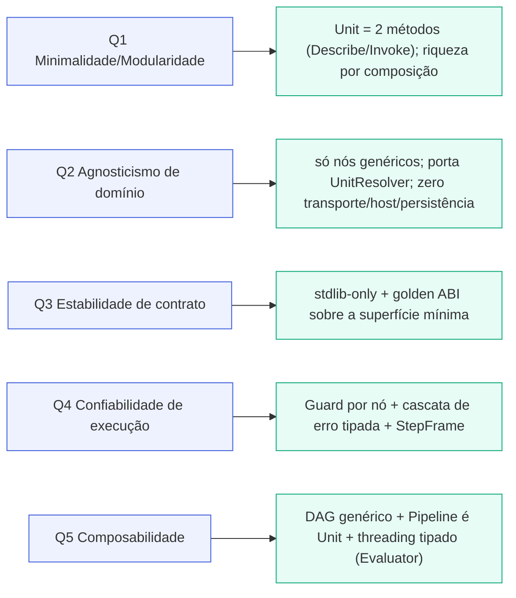

*Estratégia de solução: cada meta de qualidade mapeia para uma tática que mantém o framework mínimo, agnóstico e composável.*

### 4.1 Princípios estruturais

1. **O núcleo é o tijolo mais simples possível.** `Unit` tem **exatamente dois métodos**: `Describe()` (puro, sem ctx) e `Invoke(ctx, method, in)`. Identidade (`Name`/`Kind`) vem do **descritor**, não de um embed. A riqueza está na **composição**, não no núcleo.

2. **Cross-cutting é opcional, via capability interfaces — não um lifecycle obrigatório.** Aquisição de recurso, processamento de parâmetros e finalização são **interfaces opcionais** (`Resourceful`/`ParamProcessor`/`OnFinalizer`) que o wrapper detecta no descritor/`DefaultUnit` — não quatro hooks mandatórios. Quem precisa, implementa; a maioria dos tijolos só implementa os dois métodos.

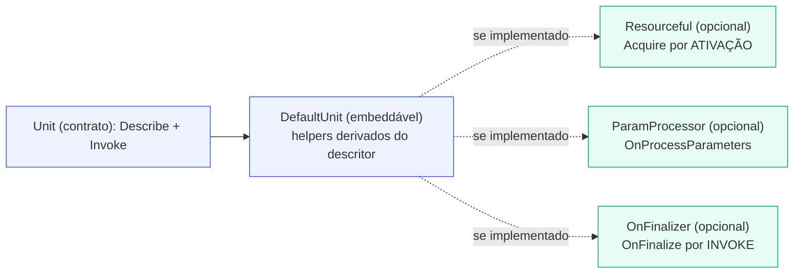

*O contrato `Unit` exige só `Describe`+`Invoke`. Cross-cutting é opcional via capability interfaces (`Resourceful` adquire recursos por ativação; `ParamProcessor` normaliza inputs; `OnFinalizer` limpa por invoke) — detectadas pelo wrapper, nunca um lifecycle de quatro fases obrigatório.*

3. **Tudo é uma Unit; um Pipeline é uma Unit.** O grafo de units é, ele mesmo, uma Unit (`pipelineunit`) — recursão uniforme. O nó `Pipeline` roda um sub-pipeline.

4. **Só nós genéricos.** O engine despacha **apenas** tipos de nó *domain-agnostic*. Não há nó nomeado por domínio (nenhum LLM/UI/HTTP). Um nó `Module` invoca uma unidade; a especialização de domínio mora **na unidade**, não no engine.

5. **A porta de avaliação é injetada.** O framework declara `Evaluator` (port); o adapter CEL é fornecido na composição. Uma só CEL atrás de uma só porta; o framework não embute interpretador.

6. **Execução assíncrona, dois modos, um motor.** Como biblioteca Go ou pela CLI `plugfy`, ambos dirigem o mesmo `core.Unit`, o mesmo `Pipeline` e o mesmo engine + runner.

---

## 5. Visão de Blocos de Construção (Building Block View)

### 5.1 Nível 1 — Contêineres (C4 Container)

Os building blocks do framework: os **contracts** (contrato do unit + contrato do pipeline + folhas puras), o **engine/runner** (o motor genérico) e a **CLI `plugfy`** (job runner standalone). Autores, unidades concretas e o adapter `Evaluator` são externos.

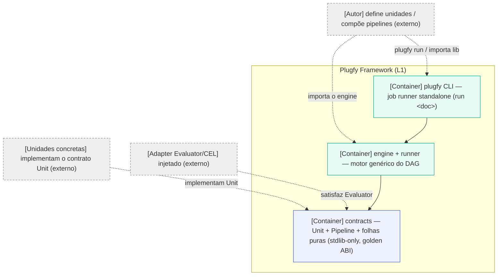

*Contêineres do framework: `contracts` (a base, stdlib-only, golden ABI), `engine`/`runner` (o motor) e a CLI `plugfy` (job runner standalone). Todas as setas apontam para os contratos. Autores, unidades e o adapter `Evaluator` ficam de fora.*

### 5.2 `contracts` — a base mínima

A superfície pública congelada pela golden ABI. É o vocabulário comum; nada depende de domínio, transporte ou host. Após as relocações de fronteira, o L1 contém **exatamente** isto:

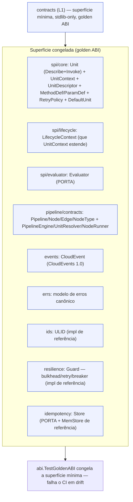

*A superfície mínima do L1: o contrato do unit (+ contexto, descritor, IO tipado), o `LifecycleContext`, a porta `Evaluator`, o contrato do pipeline, e as folhas puras (`events`/`errs`/`ids`/`resilience`/`idempotency`). As folhas são **contratos + implementações de referência stdlib-only** — `ids`/`resilience`/`idempotency` têm implementação real, mas zero dependência de terceiros, para que unit+pipeline rodem sozinhos. O teste golden congela exatamente isso e barra qualquer drift.*

A unidade executável universal — tudo é uma `Unit` com **exatamente dois métodos**:

```go
// contracts/spi/core
type Unit interface {
    // Describe é PURO e ctx-free: identidade, versão, role (Kind), os métodos
    // NOMEADOS e seus parâmetros tipados, e a política de execução padrão.
    Describe() UnitDescriptor

    // Invoke roda UM método nomeado de forma ASSÍNCRONA. ctx.Context() é
    // cancellation-aware; o engine o honra em cada fronteira.
    Invoke(ctx UnitContext, method string, in map[string]any) (map[string]any, error)
}
```

A `Unit` **não embute** nenhum `Provider`. Identidade (`Name`/`Kind`), saúde e flags de capacidade são **derivadas de `Describe()`** — o descritor é a única fonte de verdade. O `DefaultUnit` embeddável expõe esses helpers derivados do descritor por conveniência, mas o **contrato** exige só os dois métodos.

O cross-cutting é **opcional**, via *capability interfaces* (não um lifecycle de quatro fases obrigatório) — o wrapper as detecta e as executa quando presentes:

```go
// Aquisição de recurso UMA vez por ATIVAÇÃO (não por Invoke).
type Resourceful interface {
    Acquire(ctx UnitContext) (ActivationFinalizer, error)
}

// Normalização/resolução OPCIONAL de parâmetros (a maioria omite: o wrapper já
// valida e coage `in` contra MethodDef.Params com a porta Evaluator antes de Invoke).
type ParamProcessor interface {
    OnProcessParameters(ctx UnitContext, in map[string]any) (map[string]any, error)
}

// Finalize PER-INVOKE que o Runner chama em TODO caminho de saída de cada Invoke.
type OnFinalizer interface {
    OnFinalize(ctx UnitContext, out map[string]any, runErr error) map[string]any
}
```

### 5.3 `engine` / `runner` — o motor genérico

O motor que **roda** os pipelines. Ele percorre o DAG, despacha **apenas nós genéricos**, materializa o `Guard` de resiliência por nó, emite `StepFrame` e roteia erros por arestas tipadas. Consome a porta `UnitResolver` (materializa a `Unit` referida por um nó `Module`) e a porta `Evaluator` (threading tipado, guards, condições). Nunca importa um transporte, um host ou uma implementação concreta.

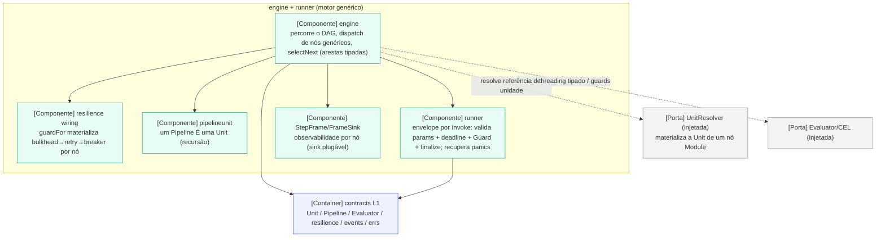

*Componentes do motor. O `engine` percorre o DAG e despacha só nós genéricos; o wiring de resiliência materializa o `Guard` por nó; `pipelineunit` realiza a recursão (Pipeline é Unit); o `runner` é o envelope por Invoke (valida params, aplica deadline e `Guard`, finaliza, recupera panics); `StepFrame`/`FrameSink` dão observabilidade. As portas `UnitResolver` e `Evaluator` são injetadas — o motor nunca importa implementação concreta.*

| Componente | Responsabilidade |
|---|---|
| `engine` | Percorre o DAG (`walkFrom` com `visited` contra ciclos); despacha por `NodeType` genérico; `selectNext` aplica as arestas tipadas. |
| `runner` | Envelope universal por `Invoke`: valida params contra `MethodDef.Params` (com a porta `Evaluator`), aplica o deadline, materializa o `Guard`, chama `OnFinalize`; recupera panics. |
| `pipelineunit` | Faz um `Pipeline` satisfazer o contrato `Unit` — recursão uniforme. |
| resilience wiring | `guardFor` materializa, do bloco `resilience` do nó, o `Guard` `bulkhead → retry → breaker`. |
| `StepFrame`/`FrameSink` | Registro de observabilidade por nó (status, *timings*, tentativa, *snapshots* de I/O) para um *sink* plugável. |

### 5.4 O contrato de Pipeline e seus colaboradores

O pipeline é descrito por dados puros e executado por portas estreitas. O `NodeType` é **open-string**: novos tipos genéricos não exigem mudar a ABI.

| Tipo (contrato `pipeline`) | Papel |
|---|---|
| `Pipeline` / `Node` / `Edge` | O DAG: nós, arestas tipadas, e o grafo declarativo. |
| `NodeType` (open-string) | A categoria do nó (genérica). |
| `PipelineEngine` | A porta que **roda** um pipeline (`Run(ctx, p, inputs) → RunResult`). |
| `UnitResolver` | A porta que materializa a `Unit` referida por um nó `Module`. |
| `NodeRunner` | A porta que dirige um `Invoke` (o envelope por chamada). |
| colaboradores genéricos | `ModuleDispatcher`, `JobsQueue` (portas genéricas do engine). |

### 5.5 A CLI `plugfy` — o job runner standalone

A prova empírica de que **unit + pipeline + execution sozinhos** bastam: um binário que roda um pipeline complexo dependendo de **nada além do L1** — sem registry, sem persistência, sem host, sem loader, sem capacidade no grafo de dependências.

```
plugfy run <pipeline.v1.json> [--input key=value ...]
```

- `cmd/plugfy/main.go` — o ponto de entrada do binário `plugfy`.
- `cli/cli.go` — o subcomando `run`: carrega um documento `pipeline.v1`, resolve as referências de unidade contra os bricks builtin, roda até o fim e imprime o resultado JSON.
- `job/runner.go` (+ `document.go`/`context.go`/`sink.go`) — o job: faz parse do documento, monta o grafo e executa pelo engine.
- `builtin/` — um `UnitResolver` autossuficiente sobre bricks demo (`upper`/`exclaim`), para que o runner rode com zero fiação externa.

Um documento `pipeline.v1` mais o contrato `Unit` de dois métodos é a entrada inteira; o engine faz o threading tipado nó→nó, honra os nós de controle, classifica erros e emite o resultado final.

---

## 6. Visão de Runtime e Exemplos Trabalhados

Esta seção mostra **como** o framework opera, com **exemplos do simples ao complexo** — todos dentro de unit + pipeline + execution.

### 6.1 As duas formas de usar o framework

O framework é consumido **assincronamente** de exatamente duas formas, ambas sobre o mesmo `core.Unit`, o mesmo `Pipeline` e o mesmo engine + runner:

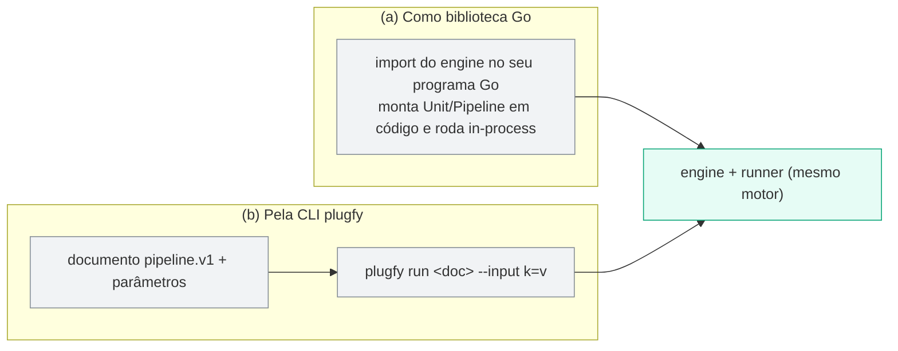

*As duas formas: (a) importar o engine como biblioteca Go e rodar in-process; (b) passar um documento `pipeline.v1` + parâmetros à CLI `plugfy run`. Ambas dirigem o mesmo motor.*

### 6.2 Como um pipeline executa

Todo trabalho é um DAG. O engine percorre o grafo; cada nó passa por `StepFrame` + `Guard` de resiliência + dispatch; arestas tipadas roteiam sucesso e erro (cascata `onTimeout → onCancel → onRetry → onError`).

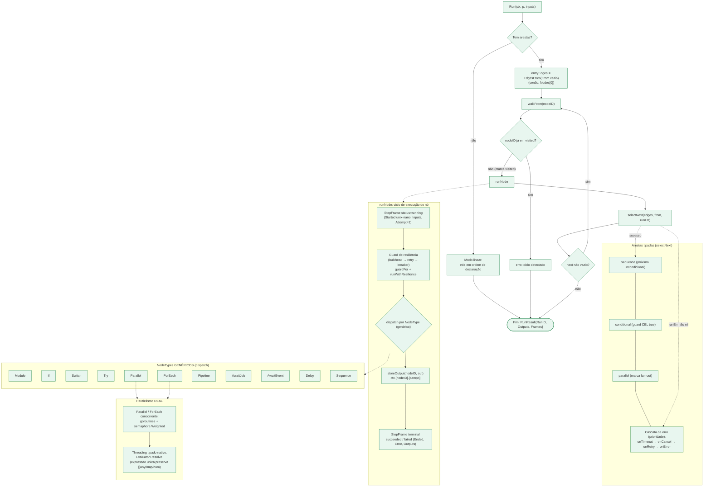

*O motor de pipeline é um DAG com tipos de nó **puramente genéricos** e arestas tipadas. Nenhum nó é nomeado por domínio: o nó `Module` invoca uma unidade; a especialização (chamar uma API, renderizar, um modelo) mora na unidade, não no engine. A cascata de erro (onTimeout → onCancel → onRetry → onError) roteia falhas de forma declarativa.*

| Nó (genérico) | Para que serve |
|---|---|
| **Module** | Invoca uma unidade (o tijolo de trabalho) — a única ponte para qualquer capacidade concreta. |
| **If / Switch** | Ramificação por guard/discriminador (porta `Evaluator`). |
| **Try** | Captura erro em campos de saída em vez de propagar. |
| **Parallel** | Fan-out real (goroutines). |
| **ForEach** | Iteração com concorrência limitada (semáforo). |
| **Pipeline** | Recursão: roda um sub-pipeline (Pipeline é Unit). |
| **AwaitJob / AwaitEvent** | Espera assíncrona (job ou evento) — *human-in-the-loop*. |
| **Delay** | Pausa ciente de cancelamento. |
| **Sequence** | Grupo linear. |

```mermaid
sequenceDiagram
  autonumber
  participant C as Caller (lib Go ou CLI)
  participant PE as PipelineEngine
  participant EV as Evaluator (porta CEL)
  participant UR as UnitResolver (porta)
  participant NR as NodeRunner
  participant U as Unit (core.Unit)
  participant FS as FrameSink
  C->>PE: Run(pipeline, inputs)
  PE->>PE: execute, walkFrom no inicial (visited)
  loop por nó do grafo
    PE->>FS: StepFrame status running (emit)
    PE->>PE: guardFor materializa Guard bulkhead→retry→breaker
    PE->>EV: Resolve inputs do nó (threading tipado)
    EV-->>PE: valores resolvidos (nativos)
    Note over PE,U: dispatch de nó Module (referência a Unit)
    PE->>UR: resolve(unitRef)
    UR-->>PE: Unit
    PE->>NR: Run(unit, ctx, method, inputs)
    NR->>NR: valida params (tipos, Required, Evaluator)
    NR->>U: OnProcessParameters (se ParamProcessor)
    NR->>U: Invoke (loop de retry sob Guard)
    U-->>NR: out ou *UnitError classificado
    NR->>U: OnFinalize (se OnFinalizer; todo caminho)
    NR-->>PE: Result (out, attempts)
    alt sucesso
      PE->>FS: StepFrame status succeeded (emit)
      PE->>PE: selectNext primeira aresta sequence/conditional ok
    else erro
      PE->>FS: StepFrame status failed (emit)
      PE->>PE: selectNext cascata onTimeout→onCancel→onRetry→onError
      Note over PE: sem aresta de erro casada, o erro propaga
    end
  end
  PE-->>C: RunResult (frames, outputs)
```

*Run → walkFrom (com visited contra ciclos) → por nó: emite StepFrame running, materializa o Guard e despacha. Um nó Module é uma REFERÊNCIA a `core.Unit`: o `UnitResolver` materializa a Unit e o `NodeRunner` dirige o Invoke (valida params via `Evaluator` → `OnProcessParameters` se presente → `Invoke` sob retry → `OnFinalize` se presente). StepFrame terminal, e então `selectNext` aplica a cascata de arestas; em sucesso vence a primeira aresta sequence/conditional satisfeita.*

### 6.3 Exemplos trabalhados

#### Exemplo 1 — Simples: definir um tijolo e encadeá-lo

**Dor:** "tenho uma lógica e quero torná-la um componente reutilizável e executável, sem amarrá-la ao resto."

Uma unidade mínima (transforma texto em maiúsculas) — embeda `DefaultUnit` e implementa só os **dois métodos**:

```go
type Upper struct{ core.DefaultUnit }

func (Upper) Describe() core.UnitDescriptor {
    return core.UnitDescriptor{
        ID: "com.acme.upper", Version: "1.0.0", Kind: core.KindModule,
        Methods: []core.MethodDef{{
            Name:   "run",
            Params: []core.ParamDef{{Key: "text", Type: core.ParamString, Required: true}},
        }},
    }
}

func (Upper) Invoke(_ core.UnitContext, _ string, in map[string]any) (map[string]any, error) {
    return map[string]any{"out": strings.ToUpper(in["text"].(string))}, nil
}
```

Um pipeline de duas etapas que encadeia duas unidades, com *threading* tipado de valores (`${ctx.A.out}`):

```json
{
  "id": "com.acme.hello", "version": "1.0.0", "kind": "automation",
  "nodes": [
    { "id": "A", "type": "Module",
      "config": { "unit": "com.acme.upper",   "function": "run" },
      "inputs": { "text": "${input.name}" } },
    { "id": "B", "type": "Module",
      "config": { "unit": "com.acme.exclaim", "function": "run" },
      "inputs": { "text": "${ctx.A.out}" } }
  ],
  "edges": [
    { "from": "", "to": "A", "kind": "sequence" },
    { "from": "A", "to": "B", "kind": "sequence" }
  ]
}
```

```bash
plugfy run hello.pipeline.v1.json --input name=ada
# → {"runID":"01J...","outputs":{"B":{"out":"ADA!"}}}
```

> **O que isto demonstra:** o contrato `Unit` de dois métodos, o engine de pipeline com encadeamento de valores tipados, e a execução standalone pela CLI — tudo sem o framework conhecer "upper" ou "exclaim", e sem nenhum host, registry ou capacidade no grafo.

#### Exemplo 2 — Médio: ramificação resiliente

**Dor:** "preciso chamar uma unidade que pode falhar, com *retries* e *circuit breaker*, e desviar para um caminho alternativo em erro."

A resiliência é **declarativa por nó** (sem código) e o roteamento de erro usa **arestas tipadas**. O nó `Module` chama a unidade; uma aresta `onRetry`/`onError` desvia para um `Delay`; uma aresta `conditional` (guard via `Evaluator`) escolhe o ramo de sucesso.

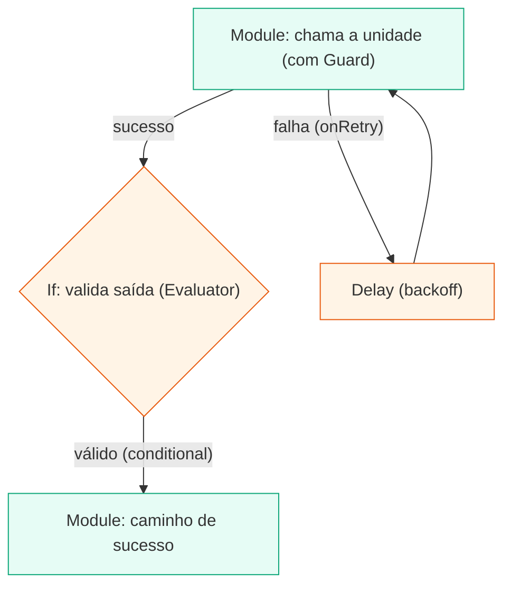

*Um nó Module chama a unidade sob um Guard (retry + circuit breaker); em sucesso um If ramifica por guard; em falha a aresta tipada onRetry segue para um Delay e tenta de novo.*

```yaml
# bloco de resiliência declarado no nó (sem código):
resilience:
  retry:    { maxAttempts: 4, base: 200ms, max: 5s }   # backoff exponencial + jitter
  breaker:  { failureThreshold: 5, resetTimeout: 30s } # abre após 5 falhas consecutivas
  bulkhead: { max: 8 }                                  # concorrência limitada
```

> **O que isto demonstra:** resiliência declarativa por nó (`Guard`), roteamento de erro por arestas tipadas e ramificação por guard — robustez expressa como **dados**, não código. Tudo genérico: chamar a "API externa" é responsabilidade da **unidade** referida pelo nó `Module`, não do framework.

#### Exemplo 3 — Médio: idempotência e erros canônicos

**Dor:** "uma fonte reenvia a mesma requisição; preciso processar **exatamente uma vez** e comunicar conflito de forma estável."

- O `idempotency.Store`, chaveado por `(subject, path, idempotency-key)`, garante *exactly-once* sob reenvio. A chave vive **no `UnitContext`** (`IdempotencyKey()`), não na assinatura do tijolo — o contrato de dois métodos fica intacto; o `Runner` faz o dedup quando `MethodDef.Idempotent` está setado.
- O modelo de erros canônico comunica conflito de forma estável:

```go
return errs.New(errs.ClassConflict, "order.duplicate", "pedido já processado").WithDetail("id", id)
// → HTTPStatus()==409 ; código estável "order.duplicate"
```

> **O que isto demonstra:** idempotência anti-replay (porta `Store`, chave no contexto) e o modelo de erros canônico — uma só fonte de verdade. Note que o mapeamento erro→gRPC (`grpcstatus`) é uma preocupação de **transporte** (Foundations/L2), fora do framework.

#### Exemplo 4 — Complexo: um processo composto, resiliente e recursivo

**Dor (real, difícil):** "orquestrar um processo que inclui enriquecimento **paralelo**, iteração **por item** com concorrência limitada, uma **aprovação humana** assíncrona, uma decisão e a reutilização de um **sub-pipeline** — tudo com resiliência por passo e roteamento de erro tipado."

Este é o cenário que combina quase todos os nós genéricos. A especialização concreta (consultar um sistema, aplicar uma transformação) mora **nas unidades** referidas por nós `Module`; o framework só compõe e roda.

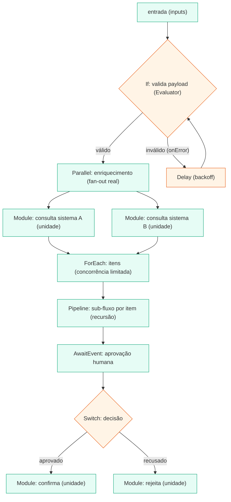

*Um processo composto e resiliente usando quase todos os nós genéricos: valida → enriquecimento em Parallel → ForEach por item → um sub-Pipeline (recursão) → espera aprovação humana (AwaitEvent) → Switch → confirma/rejeita. Cada passo com resiliência; o roteamento de erro é por aresta tipada. Toda capacidade concreta é uma unidade referida por um nó Module.*

Trecho do pipeline (mostrando o paralelo, a iteração e a recursão):

```json
{
  "id": "com.acme.order", "version": "1.0.0", "kind": "automation",
  "nodes": [
    { "id": "validate", "type": "If",       "config": { "condition": "input.total > 0" } },
    { "id": "enrich",   "type": "Parallel",  "config": { "branches": ["lookupA", "lookupB"], "await": "all" } },
    { "id": "items",    "type": "ForEach",   "config": { "collection": "${ctx.enrich.results[0].items}",
                                                         "concurrency": 4 } },
    { "id": "perItem",  "type": "Pipeline",  "config": { "ref": "com.acme.order.item" } },
    { "id": "approval", "type": "AwaitEvent","config": { "topic": "order.approval.v1", "timeout": "24h" } },
    { "id": "decide",   "type": "Switch",    "config": { "expression": "ctx.approval.decision" } }
  ],
  "edges": [
    { "from": "decide",  "to": "confirm", "kind": "conditional", "guard": "ctx.decide.value == 'approved'" },
    { "from": "decide",  "to": "reject",  "kind": "conditional", "guard": "ctx.decide.value == 'rejected'" },
    { "from": "perItem", "to": "retryDelay", "kind": "onError" }
  ]
}
```

> **O que isto demonstra:** quase todos os nós genéricos (`If`, `Parallel`, `ForEach`, `Pipeline`, `AwaitEvent`, `Switch`, `Module`), a **recursão uniforme** (um sub-pipeline `Pipeline` é uma Unit), resiliência por nó e roteamento de erro tipado — um processo de negócio inteiro expresso como **um pipeline de units genéricos**. O isolamento de código de terceiros, a chamada concreta a APIs e a hospedagem do gatilho **não** são do framework: o código não-confiável roda numa unidade isolada por um **tier de sandbox (Platform/L3)**; a chamada à API é uma **unidade conectora (Foundations/L2)**; um gatilho que iniciasse este fluxo é **hospedagem de trigger (Platform/L3)**.

### 6.4 Threading tipado e observabilidade

Entre nós, o engine faz *threading* de valores **nativos** (não stringificados) via a porta `Evaluator`: uma expressão única (`${ctx.A.out}`) preserva `[]any`/`map`/número. Por nó, um `StepFrame` (status, *timings* unix-nano, tentativa, *snapshots* de I/O) flui por um `FrameSink` plugável.

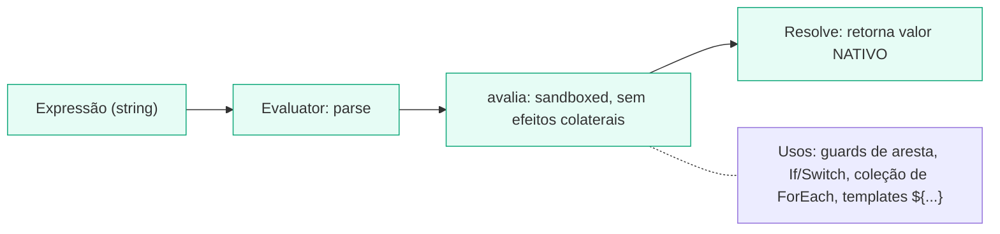

*A porta `Evaluator` (impl CEL injetada) avalia de forma sandboxed, não-Turing-completa e sem efeitos colaterais; `Resolve` devolve o valor nativo (sem stringificar). Usada em guards de aresta, If/Switch, coleção de ForEach e templates.*

---

## 7. Visão de Implantação (Deployment View)

O framework não se "implanta" como serviço — ele é **embutido** (biblioteca Go) ou **invocado** (CLI). As topologias host-side (serviço do SO, edições, supervisão) são **Platform (L3)**, fora do escopo do framework.

### 7.1 Como biblioteca Go (embedded)

Um programa Go importa o engine, monta `Unit`/`Pipeline` em código (ou carrega um documento), injeta o adapter `Evaluator` e roda in-process. Nenhuma rede, nenhum processo externo.

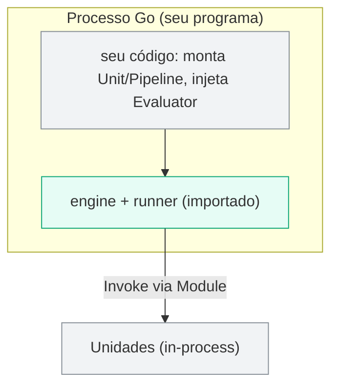

*Como lib Go: o engine roda in-process; as unidades referidas por nós Module também são in-process. Sem rede obrigatória, sem host.*

### 7.2 Pela CLI `plugfy` (standalone)

O binário `plugfy` é o caso autossuficiente: recebe um documento `pipeline.v1` + parâmetros, resolve as referências de unidade contra os bricks builtin e roda até o fim — dependendo de **nada além do L1**.

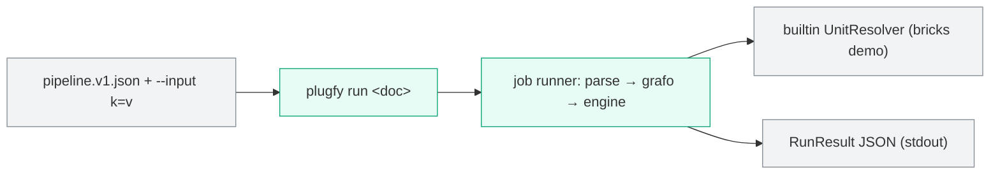

*Pela CLI: `plugfy run <doc>` faz parse, monta o grafo, resolve unidades pelo `UnitResolver` builtin e imprime o `RunResult` — a prova empírica de que unit + pipeline + execution bastam.*

---

## 8. Conceitos Transversais (Crosscutting Concepts)

### 8.1 A Unit (o tijolo gerador)

A unidade de extensibilidade é a **Unit**: `Describe()` (puro) + `Invoke(ctx, method, in)`. Identidade/role vêm do `UnitDescriptor`; a Unit **não embute Provider**. Cross-cutting é **opcional** via capability interfaces (`Resourceful`/`ParamProcessor`/`OnFinalizer`), nunca um lifecycle de quatro fases obrigatório.

### 8.2 Composição e recursão (Pipeline é Unit)

Um `Pipeline` é um DAG de nós; e ele **é, ele mesmo, uma Unit** (`pipelineunit`). Isso dá recursão uniforme: o nó `Pipeline` roda um sub-pipeline, e um pipeline inteiro pode ser exposto e referido como uma unidade.

### 8.3 Nós genéricos apenas

O engine despacha **só** tipos de nó *domain-agnostic* (Module, If, Switch, Try, Parallel, ForEach, Pipeline, AwaitJob, AwaitEvent, Delay, Sequence). Não há nó nomeado por domínio. Adicionar uma "capacidade de domínio" **não** exige editar o switch do engine: a especialização entra como uma **unidade** referida por um nó `Module`.

### 8.4 Resiliência

Resiliência **declarativa por nó**: o bloco `resilience` materializa um `Guard` que compõe **bulkhead (admissão) → retry (backoff + jitter) → breaker (por tentativa)**. Qualquer componente nil é pulado (qualquer subconjunto é válido).

```mermaid
stateDiagram-v2
  [*] --> Closed
  Closed --> Open : failureThreshold falhas consecutivas (default 5)
  Open --> HalfOpen : após resetTimeout (default 30s)
  HalfOpen --> Closed : successThreshold sucessos (default 1)
  HalfOpen --> Open : qualquer falha (re-trip imediato)
  note right of Closed : calls passam; falhas contadas
  note right of Open : rejeita com ErrOpen até resetTimeout
  note right of HalfOpen : chamadas de teste limitadas
```

*Breaker: Closed abre após 5 falhas consecutivas; Open vira HalfOpen após 30s; HalfOpen fecha com 1 sucesso ou re-trip em qualquer falha; em Open as chamadas são rejeitadas com ErrOpen.*

### 8.5 Roteamento de erro tipado

As arestas de erro têm cascata de prioridade **`onTimeout → onCancel → onRetry → onError`**: `selectNext` escolhe a primeira aresta de erro casada; sem nenhuma, o erro propaga. Em sucesso vence a primeira aresta `sequence`/`conditional` satisfeita.

### 8.6 Modelo de erros canônico

O `errs` define classes de erro mapeadas a famílias HTTP, com códigos reverse-DNS estáveis e `Wrap` ciente de *unwrap* — **uma fonte de verdade**. O binding a um transporte específico (ex.: código gRPC) é uma preocupação de **Foundations/L2**, não do framework.

### 8.7 Eventos

Todo evento é um **CloudEvent 1.0** (`events.CloudEvent`, envelope JSON). A Unit emite por `UnitContext.Emit(e)` — através do contexto, não de uma referência de bus capturada na construção. O *backend* de bus concreto é externo (L2); o framework só define o **envelope**.

### 8.8 Identificadores e idempotência

- **ULID** (`ids`): 26 chars Crockford base32, ordenável; `Prefixed("unit")` para IDs tagueados. Implementação de referência stdlib-only.
- **Idempotência** (`idempotency`): a porta `Store` (+ `MemStore` de referência) chaveada em `(subject, path, idempotency-key)`; a chave vive no `UnitContext`, deixando o contrato de dois métodos intacto.

### 8.9 Avaliação de expressões (porta `Evaluator`)

Guards de aresta, condições (`If`/`Switch`), coleções (`ForEach`) e templates `${...}` usam a porta **`Evaluator`** — declarada no L1, com a implementação CEL injetada na composição (uma só CEL atrás de uma só porta). É não-Turing-completa, sem efeitos colaterais. `Resolve` faz *threading* de valores **nativos** (não stringificados).

### 8.10 Observabilidade

`StepFrame` por nó (status, *timings* unix-nano, nº de tentativa, *snapshots* de I/O) → *sink* plugável (`FrameSink`). O framework mantém a fronteira de **zero-persistência**: o sink in-memory é o padrão; qualquer sink persistente é um adapter externo. Tracing/métricas OTel são **L3**, fora do framework.

---

## 9. Decisões de Arquitetura (ADRs)

Formato **Nygard** (Status · Contexto · Decisão · Consequências). Uma decisão por ADR.

### ADR-001 — O framework é exatamente Unit + Pipeline + Execution
- **Status:** Aceito.
- **Contexto:** A régua canônica das três camadas exige um L1 mínimo e positivamente definido — não "o mecanismo genérico" em abstrato, mas *quão pequeno* ele é.
- **Decisão:** O framework é **exatamente três conceitos** — definir uma `Unit`, compô-la num `Pipeline`, e **executar** esse pipeline de forma assíncrona (lib Go ou CLI). Nada de domínio, transporte, host ou capacidade.
- **Consequências:** (+) Núcleo mínimo, agnóstico, autossuficiente (`plugfy run` prova). (−) Todo o resto (providers, comunicação, persistência, loader, supervisão) vive em L2/L3.

### ADR-002 — A Unit é o tijolo de dois métodos (sem embed de Provider)
- **Status:** Aceito.
- **Contexto:** Um tijolo gerador deve ser a coisa mais simples possível; embutir `Provider` tornava toda Unit um Provider sem necessidade.
- **Decisão:** `core.Unit` é **exatamente** `{ Describe() UnitDescriptor; Invoke(ctx, method, in) (out, error) }`. Identidade/role/saúde são **derivadas de `Describe()`**. Cross-cutting é opcional via capability interfaces.
- **Consequências:** (+) O menor tijolo possível; `Provider`/`Kind`/registry saem para Foundations. (−) Um host que queira uma visão Provider-shaped usa os helpers do `DefaultUnit`.

### ADR-003 — Stdlib-only com golden ABI sobre a superfície mínima
- **Status:** Aceito.
- **Decisão:** O framework importa **apenas a stdlib**; um teste golden congela exatamente a superfície mínima (unit/pipeline/lifecycle/evaluator + folhas puras) e falha o CI em *drift*. As folhas (`ids`/`resilience`/`idempotency`) são **implementações de referência stdlib-only**.
- **Consequências:** (+) Estabilidade garantida; raiz de dependências leve. (−) Adicionar à ABI é um ato revisado.

### ADR-004 — Pipeline DAG com nós puramente genéricos; um Pipeline é uma Unit
- **Status:** Aceito.
- **Decisão:** **DAG** com tipos de nó **genéricos** (Module, If, Switch, Try, Parallel, ForEach, Pipeline, AwaitJob, AwaitEvent, Delay, Sequence), `NodeType` open-string, arestas tipadas; recursão uniforme (`pipelineunit`).
- **Consequências:** (+) Paralelismo real, roteamento de erro tipado, observabilidade por `StepFrame`, recursão. (−) Especialização de domínio sempre via nó `Module` + unidade, nunca um nó nomeado.

### ADR-005 — A avaliação de expressões é uma porta injetada
- **Status:** Aceito.
- **Decisão:** O L1 declara a porta `Evaluator`; o adapter CEL é injetado na composição (uma só CEL). O framework não embute interpretador.
- **Consequências:** (+) Threading tipado nativo, sandboxed, sem efeitos colaterais; uma CEL atrás de uma porta. (−) O consumidor injeta o adapter.

### ADR-006 — Resiliência declarativa por nó
- **Status:** Aceito.
- **Decisão:** Cada nó pode declarar `retry`+`breaker`+`bulkhead`, materializados num `Guard` (`bulkhead → retry → breaker`).
- **Consequências:** (+) Resiliência sem código; breaker compartilhado protege upstreams instáveis. (−) Autores precisam entender a configuração.

### ADR-007 — Roteamento de erro por arestas tipadas
- **Status:** Aceito.
- **Decisão:** Arestas de erro com cascata de prioridade `onTimeout → onCancel → onRetry → onError`; em sucesso vence a primeira aresta `sequence`/`conditional` satisfeita.
- **Consequências:** (+) Tratamento de falha 100% declarativo. (−) Classificação de erro deve ser robusta (via `errors.Is`/classe, não substring).

### ADR-008 — CloudEvents 1.0 como envelope; backend de bus externo
- **Status:** Aceito.
- **Decisão:** O L1 define o **envelope** `events.CloudEvent`; a Unit emite via `UnitContext.Emit`. O *backend* de bus concreto é Foundations/L2.
- **Consequências:** (+) Eventos interoperáveis sem acoplar o framework a um bus. (−) Sem bus, eventos só fluem ao sink local.

### ADR-009 — Execução assíncrona em dois modos sobre um motor
- **Status:** Aceito.
- **Decisão:** O framework é consumido de duas formas — **biblioteca Go** importada e **CLI `plugfy run <doc>`** — ambas sobre o mesmo `core.Unit`, o mesmo `Pipeline` e o mesmo engine + runner.
- **Consequências:** (+) O `plugfy run` standalone prova a autossuficiência do L1. (−) Dois pontos de entrada para manter coerentes.

### ADR-010 — Tudo o que é host-side / domínio sai do framework
- **Status:** Aceito.
- **Contexto:** Carregar plugins, isolar sandbox, supervisionar, versionar/admitir, falar HTTP/gRPC/WebSockets, persistir, renderizar UI, hospedar webhooks — todos eram tratados como "do framework" no modelo antigo.
- **Decisão:** Nada disso é o framework. Comunicação, persistência, UI, AI/agentes e conectores são **Foundations (L2)**; loader/supervisor/resolver/sandbox, edição/config, updater, svcmgr, observabilidade, marketplace e hospedagem de trigger/webhook são **Platform (L3)**. O framework só define a porta `UnitResolver` e **executa o que recebe**.
- **Consequências:** (+) O framework fica mínimo, agnóstico e portável; o ecossistema cresce nas camadas certas. (−) Um sistema completo exige L2/L3 — ver [`LAYERS.md`](LAYERS.md).

---

## 10. Requisitos de Qualidade

### 10.1 Árvore de qualidade (ISO/IEC 25010:2023)

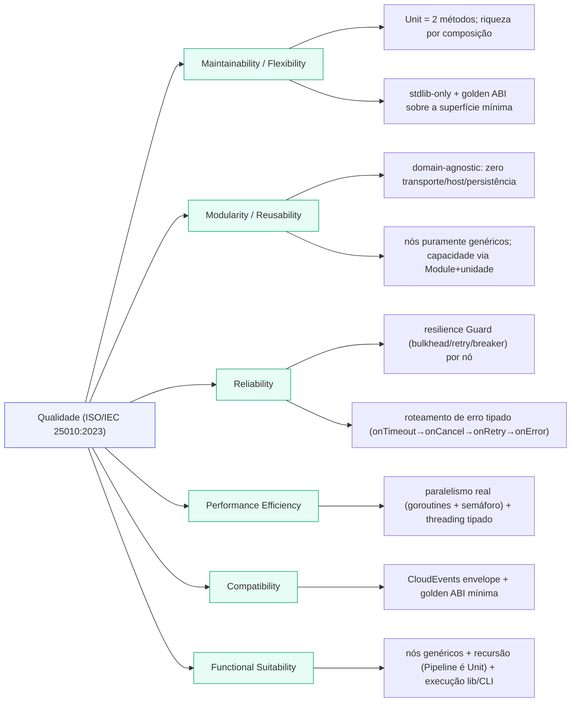

*Árvore de qualidade do framework mapeada a ISO/IEC 25010:2023; as folhas são mecanismos do próprio framework — todos dentro de unit + pipeline + execution.*

### 10.2 Cenários de qualidade

Formato **estímulo → resposta → métrica**.

| # | ISO 25010 | Cenário | Resposta arquitetural | Métrica |
|---|---|---|---|---|
| QS-1 | Maintainability | Definir um novo tijolo executável | Implementar `Describe`+`Invoke`; embedar `DefaultUnit` | 2 métodos; build verde |
| QS-2 | Modularity | Adicionar uma "capacidade de domínio" ao fluxo | Entra como unidade referida por um nó `Module`; engine intacto | 0 edições no switch de nós |
| QS-3 | Reliability | Uma unidade chamada começa a falhar | `Guard` por nó: breaker abre, retry com jitter | Falhas isoladas; sem cascata |
| QS-4 | Functional Suitability | Modelar fluxo com branch, paralelo, await e sub-fluxo | Nós genéricos + recursão (Pipeline é Unit) | Fluxo 100% declarativo |
| QS-5 | Performance | 10k itens em paralelo num `ForEach` | Semáforo ponderado; concorrência real | Throughput escala com `concurrency` |
| QS-6 | Compatibility | Evoluir a superfície pública sem querer | Golden ABI barra *drift* | CI vermelho se a ABI mínima mudar sem bump |
| QS-7 | Reliability | Erro de timeout vs cancel vs upstream | Cascata de arestas `onTimeout→onCancel→onRetry→onError` | Roteamento determinístico por classe de erro |
| QS-8 | Modularity | Provar que o L1 basta sozinho | `plugfy run <doc>` roda um pipeline complexo | Zero registry/host/persistência/loader no grafo |
| QS-9 | Maintainability | Encadear saída tipada entre nós | `Evaluator.Resolve` preserva `[]any`/`map`/número | Sem stringificação; valores nativos |

---

## 11. Riscos e Dívida Técnica

| # | Item | Severidade | Direção |
|---|---|---|---|
| RT-1 | **Golden ABI a re-escopar** para a superfície mínima pós-relocação. | Média | Re-escopar `surfacePackages` para unit/pipeline/lifecycle/evaluator + folhas puras; `GOWORK=off go test ./abi -run TestGoldenABI -update`. |
| RT-2 | **`framework/builtin` só com bricks demo.** | Média | É exatamente o que a prova `plugfy run` precisa; um resolver de produção (install-root/registry) satisfaz o mesmo `UnitResolver`, mas é **L3** (não-framework). |
| RT-3 | **`Try`/`Parallel`/`ForEach` resolvem inputs**, não sub-grafos aninhados. | Média | Evoluir os handlers para corpo aninhado, ou documentar claramente que são "resolução de expressões"; só `Pipeline` recursa hoje. |
| RT-4 | **`StepFrame` apenas in-memory.** | Média | *Sink* persistente opcional preservando a fronteira de zero-persistência (o sink durável é externo). |
| RT-5 | **Classificação de erro por substring** em `errclass`. | Média | Classificar por `errors.Is`/`ErrorClass()`; remover o fallback por texto. |
| RT-6 | **Legacy `spi.Lifecycle`/`DefaultLifecycle` (4 hooks)** paralelo ao `core.Unit`. | Baixa | Verificar uso e remover; manter só `LifecycleContext` (que `UnitContext` estende). |
| RT-7 | **`AwaitJob`/`JobsQueue` sem adapter de produção.** | Baixa | A porta fica no L1; qualquer adapter de fila é externo — sinalizar o nó como não-suportado até existir. |

---

## 12. Glossário

| Termo | Definição |
|---|---|
| **Unit** | O tijolo executável universal (`spi/core.Unit`): **exatamente** `Describe()` + `Invoke()`. Não embute Provider. |
| **UnitDescriptor** | A auto-descrição pura de uma Unit: identidade, versão, role (`Kind`), métodos nomeados e IO tipado. |
| **Capability interface** | Hook opcional de cross-cutting na Unit (`Resourceful`/`ParamProcessor`/`OnFinalizer`) — detectado pelo wrapper, nunca mandatório. |
| **Pipeline** | DAG de nós; o modelo de execução; **é, ele mesmo, uma Unit** (`pipelineunit`). |
| **Node / Edge** | Os nós **genéricos** e as arestas tipadas do DAG; `NodeType` é open-string. |
| **PipelineEngine** | A porta que **roda** um pipeline (`Run(ctx, p, inputs) → RunResult`). |
| **UnitResolver** | A porta que materializa a `Unit` referida por um nó `Module` (a impl de produção é L3). |
| **NodeRunner / Runner** | O envelope por `Invoke`: valida params, aplica deadline + `Guard`, finaliza, recupera panics. |
| **Evaluator** | A **porta** de avaliação de expressões (impl CEL injetada); threading tipado de valores nativos. |
| **Guard** | Composição de resiliência por nó: bulkhead → retry → breaker. |
| **StepFrame** | Registro de observabilidade por execução de nó (sink plugável). |
| **CloudEvent** | Envelope de evento (CloudEvents 1.0); o backend de bus é externo. |
| **ULID** | Identificador ordenável (26 chars Crockford base32). |
| **Execution** | Rodar um pipeline assíncronamente, como **biblioteca Go** ou pela **CLI `plugfy run <doc>`**. |
| **`plugfy run`** | O job runner standalone que prova que unit + pipeline + execution bastam, sem nenhum host. |

---

## Apêndices

### Apêndice A — Referências de padrões

- **arc42** — <https://arc42.org/overview>
- **C4 Model** (Simon Brown) — <https://c4model.com>
- **ADR** (Michael Nygard) — <https://adr.github.io>
- **ISO/IEC 25010:2023** — <https://www.iso.org/standard/78176.html>
- **CloudEvents 1.0** — <https://cloudevents.io>
- **Semantic Versioning** — <https://semver.org>

### Apêndice B — Stack tecnológico (framework)

| Domínio | Tecnologia |
|---|---|
| Linguagem | Go 1.25 |
| Avaliação de expressões | CEL (`cel-go`) — adapter injetado atrás da porta `Evaluator` |
| Eventos (envelope) | CloudEvents 1.0 (JSON) |
| Caminho crítico do L1 | `stdlib`-only (folhas `ids`/`resilience`/`idempotency` são implementações de referência sem deps de terceiros) |

> Nota: tudo o que é transporte (gRPC/WebSockets/REST), persistência (`database/sql` + drivers), sandbox (wazero), recorrência (`rrule-go`), watching (`fsnotify`), observabilidade (OTel) **não é do framework** — vive em Foundations (L2) ou Platform (L3).

### Apêndice C — Building blocks do framework

`github.com/PlugfyOS/`:

- **`plugfy.framework.contracts`** — o contrato do `Unit` (+ contexto, descritor, IO tipado), o `LifecycleContext`, a porta `Evaluator`, e as folhas puras (`events`/`errs`/`ids`/`resilience`/`idempotency`); a golden ABI vive aqui.
- **`plugfy.framework.pipeline`** — o contrato do pipeline (`Pipeline`/`Node`/`Edge`/`NodeType`/`PipelineEngine`/`UnitResolver`/`NodeRunner`), o `engine` de nós genéricos, o `pipelineunit` e o `Runner`.
- **`plugfy.framework.runtime`** (módulo flat na raiz do repo, após #117 achatar o antigo módulo aninhado `framework/`) — o job runner standalone + a CLI `plugfy` + o `builtin` demo (`cmd/plugfy`, `cli`, `job`, `builtin`).

> Para a visão canônica das três camadas e por que tudo o mais (provider/registry, loader/supervisor, persistência, kernel, triggers, comunicação) **não** é o framework, ver [`LAYERS.md`](LAYERS.md) e [`boundary-refactor-backlog.md`](boundary-refactor-backlog.md).

### Apêndice D — Métricas (ordem de grandeza)

| Métrica | Valor |
|---|---|
| Conceitos do framework | **3** (Unit + Pipeline + Execution) |
| Métodos do contrato `Unit` | **2** (`Describe` + `Invoke`) |
| Tipos de nó genéricos | 11 (Module, If, Switch, Try, Parallel, ForEach, Pipeline, AwaitJob, AwaitEvent, Delay, Sequence) |
| Modos de execução | 2 (biblioteca Go · CLI `plugfy`) |
| Dependências externas no caminho do L1 | 0 (stdlib-only) |

---

*Documento de arquitetura do Plugfy Framework (L1 — Unit + Pipeline + Execution) — arc42 + C4 + ADR (Nygard) + ISO/IEC 25010:2023. Escopo: apenas o framework. A visão canônica das três camadas vive em [`LAYERS.md`](LAYERS.md).*
