<!-- markdownlint-disable MD013 MD033 MD041 -->

# Plugfy Framework — Documento de Arquitetura

> **Arquitetura de Referência do Plugfy Framework** — um *Operation Framework* micro-kernel: um motor genérico, **domain-agnostic**, para construir sistemas operacionais **modulares, extensíveis, isolados e resilientes**, que roda como *guest* dentro de uma aplicação hospedeira.
> Documento estruturado segundo **arc42**, com diagramas no **C4 Model**, decisões em **ADR (formato Nygard)** e metas de qualidade segundo **ISO/IEC 25010:2023**.

| | |
|---|---|
| **Produto** | Plugfy Framework |
| **Módulos cobertos** | `contracts` (L1) · `runtime` (L3) · `pipeline` (L3) · `kernel` (L4) |
| **Linguagem** | Go 1.25 |
| **Versão da linha** | 1.x (ABI congelada) |
| **Status** | Baseline de arquitetura (apresentação) |
| **Data** | 2026-06 |
| **Padrões** | [arc42](https://arc42.org) · [C4 Model](https://c4model.com) · [ADR/Nygard](https://adr.github.io) · [ISO/IEC 25010:2023](https://www.iso.org/standard/78176.html) |
| **Público** | Arquitetos, tech leads, autores de unidades, desenvolvedores de aplicações host, operadores |

> **Escopo.** Este documento descreve **apenas o Plugfy Framework** — o que ele é capaz de fazer e como faz. O framework é deliberadamente **domain-agnostic**: ele não conhece nenhum domínio de negócio nem nenhuma capacidade concreta. Tudo o que é específico (um banco, uma API, uma transformação) entra como uma **unidade** externa que pluga por contrato. Onde o texto cita "a aplicação host", trata-se do programa genérico que embute o framework.

---

## Como ler este documento

Adotamos o template **arc42** (12 seções) porque é otimizado para *comunicação*. Os diagramas seguem o **C4 Model** (Contexto → Contêineres → Componentes, mais diagramas dinâmicos de sequência e de implantação).

> **Legenda dos diagramas.** Mermaid (renderiza no GitHub e no VS Code). Cores: **L1 contracts** (azul), **L3 runtime/pipeline** (verde), **L4 kernel** (laranja), **externos ao framework** (cinza). A **seta de dependência aponta sempre para baixo**, em direção aos contratos (L1). Diagramas validados por renderizador Mermaid.

### Índice

1. [Introdução e Metas](#1-introdução-e-metas) — *o que é e o que faz*
2. [Restrições de Arquitetura](#2-restrições-de-arquitetura)
3. [Contexto e Escopo](#3-contexto-e-escopo)
4. [Estratégia de Solução](#4-estratégia-de-solução)
5. [Visão de Blocos de Construção](#5-visão-de-blocos-de-construção-building-block-view)
6. [Visão de Runtime e Exemplos Trabalhados](#6-visão-de-runtime-e-exemplos-trabalhados) — *como faz, com exemplos reais*
7. [Visão de Implantação](#7-visão-de-implantação-deployment-view)
8. [Conceitos Transversais](#8-conceitos-transversais-crosscutting-concepts)
9. [Decisões de Arquitetura (ADRs)](#9-decisões-de-arquitetura-adrs)
10. [Requisitos de Qualidade](#10-requisitos-de-qualidade)
11. [Riscos e Dívida Técnica](#11-riscos-e-dívida-técnica)
12. [Glossário](#12-glossário) · [Apêndices](#apêndices)

---

## 1. Introdução e Metas

### 1.1 O que é o Plugfy Framework

O **Plugfy Framework** é um **micro-kernel** de propósito geral para construir sistemas operacionais extensíveis. Ele resolve um problema recorrente e difícil: *como montar um sistema grande a partir de partes independentes — algumas confiáveis, outras de terceiros — que possam ser **carregadas, isoladas, versionadas, orquestradas e operadas** com segurança, sem que o núcleo precise conhecer nenhuma delas de antemão?*

A resposta do framework tem quatro módulos, em camadas, onde a seta de dependência aponta sempre para baixo:

| Camada | Módulo | Papel |
|---|---|---|
| **L1** | `contracts` | A *baseplate* (ABI): os contratos normativos (SPI, lifecycle, eventos, erros, IDs, idempotência, resiliência, persistência, admissibilidade). Stdlib-only; importada por todos. |
| **L3** | `runtime` | O micro-kernel de carregamento: manifesto, registry, resolver de versões, e o sandbox de três tiers (in-process, subprocess, WASM). |
| **L3** | `pipeline` | O motor de orquestração: todo trabalho é descrito como um DAG e executado aqui. |
| **L4** | `kernel` | O suporte do lado do host: configuração por edição, instalação como serviço do SO, auto-atualização, supervisão e observabilidade. |

O framework é **domain-agnostic** por construção: o núcleo conhece **apenas** os contratos L1. Toda capacidade concreta é uma **unidade** auto-contida que implementa um contrato e se **auto-registra em runtime** — e nunca é compilada dentro do núcleo. Uma aplicação host embute o framework, escolhe a edição e injeta o que precisa.

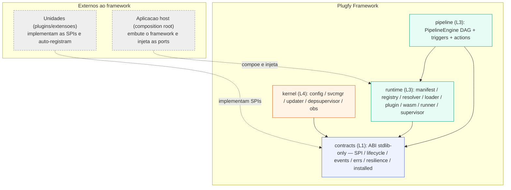
```mermaid
flowchart TB
  classDef l1 fill:#eef2ff,stroke:#3b5bdb;
  classDef l3 fill:#e6fcf5,stroke:#0ca678;
  classDef l4 fill:#fff4e6,stroke:#e8590c;
  classDef ext fill:#eeeeee,stroke:#888888,stroke-dasharray:4 3;
  subgraph extb["Externos ao framework"]
    HOST["Aplicacao host (composition root)<br/>embute o framework e injeta as ports"]
    UNITS["Unidades (plugins/extensoes)<br/>implementam as SPIs e auto-registram"]
  end
  subgraph fw["Plugfy Framework"]
    KER["kernel (L4): config / svcmgr / updater / depsupervisor / obs"]
    RUN["runtime (L3): manifest / registry / resolver / loader / plugin / wasm / runner / supervisor"]
    PIPE["pipeline (L3): PipelineEngine DAG + triggers + actions"]
    CON["contracts (L1): ABI stdlib-only — SPI / lifecycle / events / errs / resilience / installed"]
  end
  HOST -.->|"compoe e injeta"| RUN
  UNITS -.->|"implementam SPIs"| CON
  KER --> CON
  RUN --> CON
  PIPE --> CON
  PIPE --> RUN
  class CON l1; class RUN,PIPE l3; class KER l4; class HOST,UNITS ext;
```

*Camadas do Framework (L1 contracts, L3 runtime e pipeline, L4 kernel). A seta de dependencia aponta sempre para baixo, ate contracts. Uma aplicacao host (que embute o framework) e as unidades (plugins/extensoes que implementam as SPIs) sao externas ao framework.*

### 1.2 Do que o framework é capaz (catálogo de capacidades)

O valor do framework é o conjunto de capacidades genéricas abaixo. A [§6](#6-visão-de-runtime-e-exemplos-trabalhados) mostra cada uma em ação, com exemplos reais.

| Capacidade | O que resolve (dor real) | Como faz |
|---|---|---|
| **Carregar e isolar código** | Rodar plugins/extensões — inclusive de **terceiros não-confiáveis** — sem que um deles derrube ou comprometa o host. | Sandbox de **3 tiers** (Native / Subprocess / WASM) com **allow-list deny-by-default** no WASM. |
| **Resolver dependências por versão** | Evitar "DLL hell" e conflitos entre extensões; permitir várias versões coexistindo. | **MVS** (Minimal Version Selection) + **matriz de admissibilidade de 9 eixos**; instalação **side-by-side**. |
| **Orquestrar trabalho como DAG** | Substituir automação em "código-espaguete" por fluxos declarativos com ramificação, paralelismo e espera. | **PipelineEngine**: 14 tipos de nó, 7 arestas tipadas, guards **CEL**. |
| **Disparar fluxos** | Agendamento, integração via webhook e reação a eventos. | **Triggers**: cron/RRULE, webhook validado por **HMAC**, assinatura de event bus. |
| **Chamar sistemas externos** | Integrar APIs externas sem escrever um cliente para cada uma. | **Actions**: conectores REST/OpenAPI (operações auto-descobertas), com resiliência. |
| **Tornar tudo resiliente** | Impedir que uma dependência instável derrube o fluxo todo. | **`resilience.Guard`** declarativo por nó: *bulkhead → retry (backoff+jitter) → circuit breaker*. |
| **Operar como cidadão do host** | Instalar, atualizar e manter vivo um serviço multiplataforma. | **svcmgr** (sc.exe/launchd/systemd), **updater** atômico, **supervisor + reconciler** com restart/backoff. |
| **Garantir contratos estáveis** | Não quebrar o ecossistema de extensões ao evoluir a API. | **Golden ABI freeze**: o CI falha em qualquer mudança não-intencional da superfície pública. |
| **Padronizar erros, IDs e eventos** | Interoperar de forma previsível entre partes e transportes. | Erros canônicos (HTTP+gRPC), **ULID**, **CloudEvents 1.0**, **idempotência** anti-replay. |
| **Observar a execução** | Entender o que rodou, quanto demorou e o que falhou. | **StepFrame** por nó, `slog` com nível ajustável em runtime, tracer **OTel**. |

### 1.3 Forças motrizes (requisitos essenciais)

- **R1 — Extensibilidade aberta:** adicionar uma capacidade **sem alterar o núcleo** e sem recompilar.
- **R2 — Isolamento e confiança graduada:** do built-in confiável ao código de terceiros não-confiável.
- **R3 — Evolução segura:** versionar e resolver dependências de forma determinística; congelar a ABI.
- **R4 — Portabilidade:** Windows, macOS e Linux; do binário único offline ao processo supervisionado.
- **R5 — Operabilidade:** resiliência, observabilidade, auto-atualização e supervisão de primeira classe.

### 1.4 Metas de qualidade (Top-5)

| # | Meta | Característica ISO 25010 | Por quê |
|---|---|---|---|
| **Q1** | Modularidade e Extensibilidade | Maintainability / Flexibility | Razão de existir do micro-kernel. |
| **Q2** | Segurança e Isolamento | Security | Executa código de terceiros. |
| **Q3** | Portabilidade | Portability | Mesmo artefato em Win/macOS/Linux. |
| **Q4** | Confiabilidade/Operabilidade | Reliability | Resiliência, supervisão, updates atômicos. |
| **Q5** | Evolutibilidade segura | Compatibility / Maintainability | SemVer + MVS + admissibilidade + ABI congelada. |

### 1.5 Stakeholders

| Stakeholder | Interesse |
|---|---|
| **Autor de unidade** | Contrato de unidade simples e estável; manifesto; versionamento. |
| **Desenvolvedor da aplicação host** | Embutir o framework, escolher a edição, injetar as ports, montar o sistema. |
| **Operador / SRE** | Instalação como serviço, updates atômicos, supervisão, observabilidade. |

---

## 2. Restrições de Arquitetura

### 2.1 Restrições técnicas

| Restrição | Descrição | Consequência |
|---|---|---|
| **Go 1.25** | Os quatro módulos são Go. | Binário único, cross-compile trivial, sem VM/runtime externo. |
| **L1 é stdlib-only** | `contracts` não pode ter `require` externo. | A raiz da árvore de dependências nunca arrasta peso. Imposto em CI. |
| **Polirepo** | Cada módulo é um repositório independente, com SemVer por tag. | Versionamento/release independentes. |
| **Guest-in-host** | O framework não possui o host; é embutido por uma aplicação host. | Portável; o que é específico do host fica fora, atrás de ports. |
| **Domain-agnostic** | O núcleo não conhece domínio, schema nem backend concreto. | Tudo concreto entra como unidade externa; descoberta por capacidade. |

### 2.2 Convenções

- **Identificadores reverse-DNS** (`com.exemplo.algo`) para unidades e capacidades.
- **Eventos em CloudEvents 1.0**; **IDs em ULID**; **SemVer + ranges OSGi** em `requires`.
- **Portas *consumer-owned*:** quem precisa de uma capacidade define a interface; quem a fornece implementa e depende do contrato — nunca o contrário.

### 2.3 Gates de CI que materializam as restrições

| Gate | Garante |
|---|---|
| `decouple-check.sh` | L1 stdlib-only; nenhum módulo importa implementação de outro. |
| `abi.TestGoldenABI` | A superfície pública de L1 é congelada; *drift* falha o CI. |
| *standalone build* (`GOWORK=off`) | Cada módulo compila como um clone novo, sem mascarar `go.mod` incompleto. |

---

## 3. Contexto e Escopo

### 3.1 Contexto do sistema (C4 Nível 1)

O framework é embutido por uma **aplicação host**, carrega **unidades** que implementam suas SPIs, chama **sistemas externos** (uma API via *action*, um banco/storage/event bus via *SPI*) e instala-se no **Host OS**. Tudo o que está fora é genérico — o framework não conhece nenhum sistema concreto.

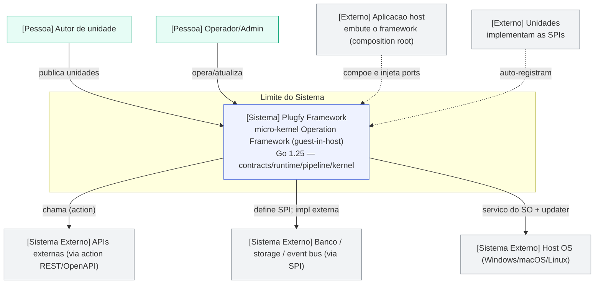
```mermaid
flowchart TB
  classDef sys fill:#eef2ff,stroke:#3b5bdb;
  classDef actor fill:#e6fcf5,stroke:#0ca678;
  classDef ext fill:#f1f3f5,stroke:#868e96;
  A1["[Pessoa] Autor de unidade"]
  A2["[Pessoa] Operador/Admin"]
  subgraph boundary["Limite do Sistema"]
    SYS["[Sistema] Plugfy Framework<br/>micro-kernel Operation Framework (guest-in-host)<br/>Go 1.25 — contracts/runtime/pipeline/kernel"]
  end
  HOSTA["[Externo] Aplicacao host<br/>embute o framework (composition root)"]
  UNI["[Externo] Unidades<br/>implementam as SPIs"]
  EXTAPI["[Sistema Externo] APIs externas (via action REST/OpenAPI)"]
  EXTSPI["[Sistema Externo] Banco / storage / event bus (via SPI)"]
  EXTOS["[Sistema Externo] Host OS (Windows/macOS/Linux)"]
  A1 -->|"publica unidades"| SYS
  A2 -->|"opera/atualiza"| SYS
  HOSTA -.->|"compoe e injeta ports"| SYS
  UNI -.->|"auto-registram"| SYS
  SYS -->|"chama (action)"| EXTAPI
  SYS -->|"define SPI; impl externa"| EXTSPI
  SYS -->|"servico do SO + updater"| EXTOS
  class SYS sys; class A1,A2 actor; class HOSTA,UNI,EXTAPI,EXTSPI,EXTOS ext;
```

*Contexto do Plugfy Framework. Autores publicam unidades; operadores instalam/atualizam. Uma aplicacao host embute o framework. O framework define SPIs que unidades implementam, chama APIs externas via action e instala-se no Host OS. Tudo externo e generico — o framework e domain-agnostico.*

### 3.2 Contexto técnico (interfaces)

O framework **define** contratos; as implementações são externas. As principais fronteiras:

| Fronteira | Tipo | Contrato (definido pelo framework) |
|---|---|---|
| Capacidades plugáveis | SPI | `spi.Provider` + `Kind` + `CapabilityRequirement` (o host registra/instancia) |
| Unidade executável | contrato | `spi/core.Unit` (`Describe` + `Invoke`) |
| Persistência | SPI | `persistence.SQLDB` (dialect-aware, sobre `database/sql`) |
| Eventos | SPI | `spi.EventBus` + envelope `events.CloudEvent` |
| Chamadas a APIs externas | action | conector REST/OpenAPI (no `pipeline`) |
| Contribuição de rotas | contrato | `api.RouteSet` (dados puros, sem `net/http`) |
| Serviço do SO | port | `svcmgr.Manager` (sc.exe / launchd / systemd) |

---

## 4. Estratégia de Solução

A arquitetura é a composição de poucas estratégias de alto impacto.

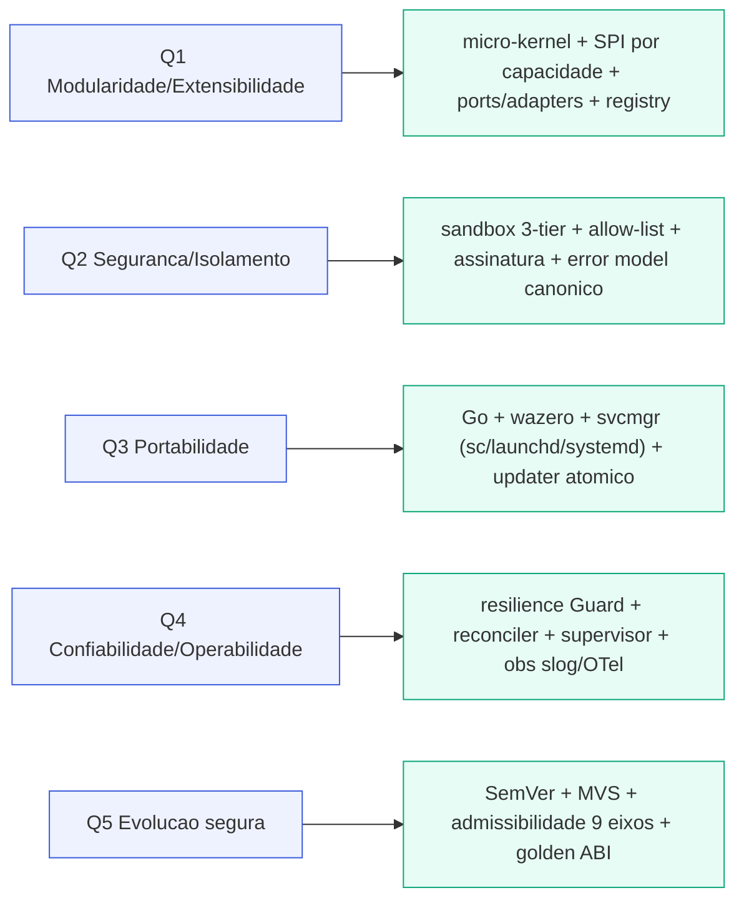
```mermaid
flowchart LR
  classDef g fill:#eef2ff,stroke:#3b5bdb;
  classDef t fill:#e6fcf5,stroke:#0ca678;
  G1["Q1 Modularidade/Extensibilidade"] --> T1["micro-kernel + SPI por capacidade + ports/adapters + registry"]
  G2["Q2 Seguranca/Isolamento"] --> T2["sandbox 3-tier + allow-list + assinatura + error model canonico"]
  G3["Q3 Portabilidade"] --> T3["Go + wazero + svcmgr (sc/launchd/systemd) + updater atomico"]
  G4["Q4 Confiabilidade/Operabilidade"] --> T4["resilience Guard + reconciler + supervisor + obs slog/OTel"]
  G5["Q5 Evolucao segura"] --> T5["SemVer + MVS + admissibilidade 9 eixos + golden ABI"]
  class G1,G2,G3,G4,G5 g; class T1,T2,T3,T4,T5 t;
```

*Estrategia de solucao: cada meta de qualidade mapeia para taticas e mecanismos do proprio framework.*

| Meta | Tática | Mecanismo |
|---|---|---|
| **Q1** | Micro-kernel + SPI por capacidade; ports & adapters | `registry.Register/Build`, `CapabilityRequirement`, regra da seta de dependência |
| **Q2** | Sandbox de confiança graduada | 3 tiers (Native/Subprocess/WASM + allow-list), assinatura, error model |
| **Q3** | Runtime portável; serviço por SO | Go + wazero (pure-Go), `svcmgr`, updater atômico |
| **Q4** | Resiliência + supervisão | `resilience.Guard`, reconciler level-triggered, obs slog/OTel |
| **Q5** | Versionamento determinístico + ABI congelada | SemVer + MVS + admissibilidade de 9 eixos + golden ABI |

### 4.1 Princípios estruturais

1. **O núcleo conhece apenas contratos.** Domínio, schema e backend vivem *fora*, como unidades. A baseplate L1 é stdlib-only e tem a ABI congelada.
2. **Ports & Adapters em cada costura.** Quem precisa define a porta; quem fornece implementa e depende do contrato — a seta nunca aponta de volta.

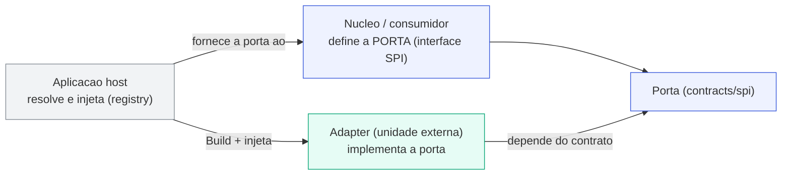
```mermaid
flowchart LR
  classDef core fill:#eef2ff,stroke:#3b5bdb;
  classDef adp fill:#e6fcf5,stroke:#0ca678;
  classDef host fill:#f1f3f5,stroke:#868e96;
  DOM["Nucleo / consumidor<br/>define a PORTA (interface SPI)"]
  PORT["Porta (contracts/spi)"]
  ADAP["Adapter (unidade externa)<br/>implementa a porta"]
  HOST["Aplicacao host<br/>resolve e injeta (registry)"]
  DOM --> PORT
  ADAP -->|"depende do contrato"| PORT
  HOST -->|"Build + injeta"| ADAP
  HOST -->|"fornece a porta ao"| DOM
  class DOM,PORT core; class ADAP adp; class HOST host;
```

*Ports and Adapters (hexagonal). O nucleo/consumidor define a porta (interface SPI); um adapter externo a implementa e depende do contrato; a aplicacao host resolve e injeta. A seta sempre aponta para o contrato — o nucleo nunca importa a implementacao.*

3. **Tudo é uma Unit; um Pipeline é uma Unit.** A unidade executável universal tem dois métodos (`Describe`/`Invoke`). Um Pipeline (grafo de Units) é, ele mesmo, uma Unit — recursão uniforme.
4. **Resolução em runtime, nada compilado no núcleo.** Unidades são resolvidas por manifesto + versão + capacidade; versões coexistem *side-by-side*.
5. **Confiança graduada por padrão.** Built-ins confiáveis (Native) → confiáveis por assinatura (Subprocess) → não-confiáveis com allow-list (WASM).

---

## 5. Visão de Blocos de Construção (Building Block View)

### 5.1 Nível 1 — Contêineres (C4 Container)

Os quatro módulos do framework. A aplicação host e as unidades são externas.

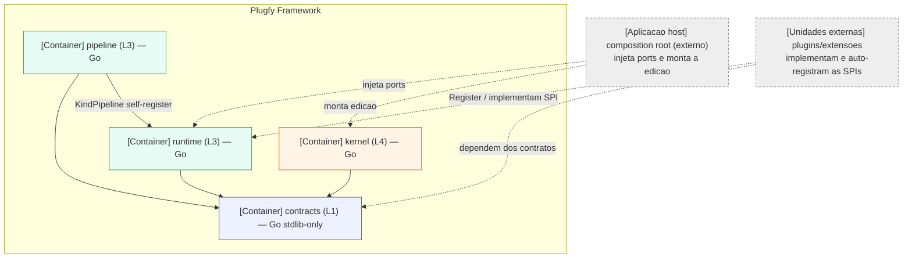
```mermaid
flowchart TB
  classDef l1 fill:#eef2ff,stroke:#3b5bdb;
  classDef l3 fill:#e6fcf5,stroke:#0ca678;
  classDef l4 fill:#fff4e6,stroke:#e8590c;
  classDef ext fill:#eeeeee,stroke:#888888,stroke-dasharray:4 3;
  HOSTA["[Aplicacao host] composition root (externo)<br/>injeta ports e monta a edicao"]
  UNI["[Unidades externas] plugins/extensoes<br/>implementam e auto-registram as SPIs"]
  subgraph fw["Plugfy Framework"]
    KER["[Container] kernel (L4) — Go"]
    RUN["[Container] runtime (L3) — Go"]
    PIPE["[Container] pipeline (L3) — Go"]
    CON["[Container] contracts (L1) — Go stdlib-only"]
  end
  HOSTA -.->|"injeta ports"| RUN
  HOSTA -.->|"monta edicao"| KER
  UNI -.->|"Register / implementam SPI"| RUN
  UNI -.->|"dependem dos contratos"| CON
  KER --> CON
  RUN --> CON
  PIPE --> CON
  PIPE -->|"KindPipeline self-register"| RUN
  class CON l1; class RUN,PIPE l3; class KER l4; class HOSTA,UNI ext;
```

*Conteineres do Framework: contracts (L1, stdlib-only, ABI golden) e a base; runtime e pipeline sao L3; kernel e L4. Todas as setas apontam para contracts. A aplicacao host e as unidades externas ficam de fora.*

### 5.2 `contracts` (L1) — a baseplate

Onze pacotes congelados pela ABI. É o vocabulário comum; nada depende de domínio.

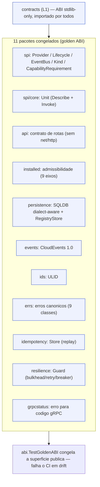
```mermaid
flowchart TB
  classDef l1 fill:#eef2ff,stroke:#3b5bdb;
  CON["contracts (L1) — ABI stdlib-only, importado por todos"]
  subgraph p["11 pacotes congelados (golden ABI)"]
    P1["spi: Provider / Lifecycle / EventBus / Kind / CapabilityRequirement"]
    P2["spi/core: Unit (Describe + Invoke)"]
    P3["api: contrato de rotas (sem net/http)"]
    P4["installed: admissibilidade (9 eixos)"]
    P5["persistence: SQLDB dialect-aware + RegistryStore"]
    P6["events: CloudEvents 1.0"]
    P7["ids: ULID"]
    P8["errs: erros canonicos (9 classes)"]
    P9["idempotency: Store (replay)"]
    P10["resilience: Guard (bulkhead/retry/breaker)"]
    P11["grpcstatus: erro para codigo gRPC"]
  end
  ABI["abi.TestGoldenABI congela a superficie publica — falha o CI em drift"]
  CON --> p
  p --> ABI
  class CON,P1,P2,P3,P4,P5,P6,P7,P8,P9,P10,P11 l1;
```

*Os 11 pacotes congelados (golden ABI) da baseplate L1. Sao infraestrutura generica: contratos, lifecycle, eventos, erros, IDs, idempotencia, resiliencia, persistencia e admissibilidade. O teste golden congela a superficie publica e barra qualquer drift no CI.*

A unidade executável universal — tudo é uma `Unit` com dois métodos:

```go
// contracts/spi/core
type Unit interface {
    spi.Provider                                   // Name/Kind/Capabilities/HealthCheck
    Describe() UnitDescriptor                       // puro, sem ctx — o que a unidade oferece
    Invoke(ctx UnitContext, method string, in map[string]any) (map[string]any, error)
}
```

E o contrato de ciclo de vida — quatro fases por execução (embeda `DefaultLifecycle`, sobrescreve só o necessário):

```go
type Lifecycle interface {
    OnInit(ctx LifecycleContext) error                                                   // adquire recursos
    OnProcessParameters(ctx LifecycleContext, in map[string]any) (map[string]any, error) // valida/normaliza
    OnExecute(ctx LifecycleContext, in map[string]any) (map[string]any, error)           // o trabalho
    OnFinalize(ctx LifecycleContext, out map[string]any, runErr error)                   // limpeza — SEMPRE roda
}
```

### 5.3 `runtime` (L3) — o micro-kernel de carregamento

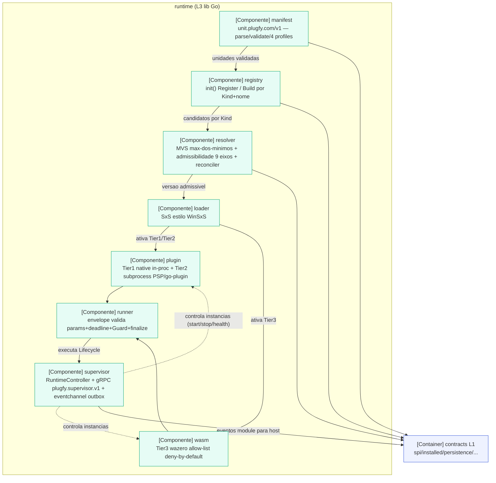
```mermaid
flowchart TB
  classDef l3 fill:#e6fcf5,stroke:#0ca678;
  classDef l1 fill:#eef2ff,stroke:#3b5bdb;

  subgraph rt["runtime (L3 lib Go)"]
    MAN["[Componente] manifest<br/>unit.plugfy.com/v1 — parse/validate/4 profiles"]
    REG["[Componente] registry<br/>init() Register / Build por Kind+nome"]
    RES["[Componente] resolver<br/>MVS max-dos-minimos + admissibilidade 9 eixos + reconciler"]
    LOAD["[Componente] loader<br/>SxS estilo WinSxS"]
    PLG["[Componente] plugin<br/>Tier1 native in-proc + Tier2 subprocess PSP/go-plugin"]
    WASM["[Componente] wasm<br/>Tier3 wazero allow-list deny-by-default"]
    RUNR["[Componente] runner<br/>envelope valida params+deadline+Guard+finalize"]
    SUP["[Componente] supervisor<br/>RuntimeController + gRPC plugfy.supervisor.v1 + eventchannel outbox"]
  end

  CON["[Container] contracts L1<br/>spi/installed/persistence/..."]

  MAN -->|"unidades validadas"| REG
  REG -->|"candidatos por Kind"| RES
  RES -->|"versao admissivel"| LOAD
  LOAD -->|"ativa Tier1/Tier2"| PLG
  LOAD -->|"ativa Tier3"| WASM
  PLG --> RUNR
  WASM --> RUNR
  RUNR -->|"executa Lifecycle"| SUP
  SUP -.->|"controla instancias (start/stop/health)"| PLG
  SUP -.->|"controla instancias"| WASM
  SUP -->|"eventos module para host"| CON
  MAN --> CON
  REG --> CON
  RES --> CON

  class MAN,REG,RES,LOAD,PLG,WASM,RUNR,SUP l3;
  class CON l1;
```

*Componentes do runtime. Fluxo manifest -> registry -> resolver (MVS + matriz de admissibilidade 9 eixos + reconciler level-triggered) -> loader SxS -> tiers de execucao (plugin Tier1 native/Tier2 subprocess; wasm Tier3 wazero). O runner valida o envelope (params, deadline, Guard, finalize) e o supervisor (RuntimeController + gRPC plugfy.supervisor.v1 + eventchannel outbox at-least-once) controla o ciclo de vida das instancias.*

| Componente | Responsabilidade |
|---|---|
| `manifest` | Valida o manifesto `unit.plugfy.com/v1` (JSON Schema embedado + validador Go). |
| `registry` | O ponto de extensão: providers se registram por `Kind`+nome em `init()`; o host instancia por configuração. |
| `resolver` | Resolve `requires` por capacidade usando **MVS**; estados de ciclo de vida; reconciler; hot-swap. |
| `loader` | Enumera versões instaladas *side-by-side*, filtra por admissibilidade, MVS-seleciona, decide o tier. |
| `plugin` | `Invoker` agnóstico de transporte: Tier 1 Native e Tier 2 Subprocess. |
| `wasm` | Tier 3 (wazero) com allow-lists declarativas. |
| `runner` | Envelope universal por `Invoke`: valida + deadline + `Guard` + finalize; recupera panics. |
| `supervisor` | Tabela de processos, health, restart com backoff; contrato gRPC genérico; canal de eventos reverso. |

**Toda a extensibilidade em duas chamadas** — registrar e instanciar uma capacidade, sem tocar no núcleo:

```go
// no init() do pacote da unidade:
func init() {
    registry.Register(spi.KindStorage, "memory",
        func(o registry.Options) (spi.Provider, error) { return newMem(o.Get("root")), nil })
}
// na aplicação host, por configuração/edição:
prov, _ := registry.Build(spi.KindStorage, "memory", nil)
```

### 5.4 `pipeline` (L3) — o motor de orquestração

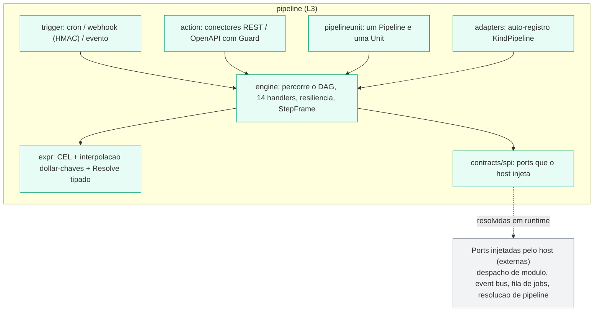
```mermaid
flowchart TB
  classDef l3 fill:#e6fcf5,stroke:#0ca678;
  classDef ext fill:#f1f3f5,stroke:#868e96;
  subgraph pp["pipeline (L3)"]
    ENG["engine: percorre o DAG, 14 handlers, resiliencia, StepFrame"]
    EXP["expr: CEL + interpolacao dollar-chaves + Resolve tipado"]
    TRG["trigger: cron / webhook (HMAC) / evento"]
    ACT["action: conectores REST / OpenAPI com Guard"]
    PU["pipelineunit: um Pipeline e uma Unit"]
    SPI["contracts/spi: ports que o host injeta"]
    ADP["adapters: auto-registro KindPipeline"]
  end
  PORTS["Ports injetadas pelo host (externas)<br/>despacho de modulo, event bus, fila de jobs, resolucao de pipeline"]
  ENG --> EXP
  ENG --> SPI
  SPI -.->|"resolvidas em runtime"| PORTS
  TRG --> ENG
  ACT --> ENG
  PU --> ENG
  ADP --> ENG
  class ENG,EXP,TRG,ACT,PU,SPI,ADP l3; class PORTS ext;
```

*Componentes do pipeline. O engine percorre o DAG e despacha por tipo de no; expr avalia CEL; trigger e action sao os pontos de entrada e saida. As ports que o engine consome sao injetadas pelo host em runtime — o pipeline nunca importa uma implementacao concreta.*

O engine consome *ports* estreitas, injetadas pelo host; nunca importa uma implementação concreta. Os nós são **domain-agnostic**: o nó `Module` invoca uma unidade; nós como `LLM` e `UI` apenas **delegam a uma porta injetada pelo host** (o framework não implementa nenhum modelo nem nenhuma UI).

### 5.5 `kernel` (L4) — o suporte do host

| Pacote | Responsabilidade |
|---|---|
| `config` | Config *edition-aware* (`local`/`shared`/`dedicated`/`enterprise`) lida de `PLUGFY_*`. |
| `svcmgr` | Instala/gerencia o serviço do SO: `sc.exe` / `launchd` / `systemd` atrás de uma interface `Manager`. |
| `updater` | Update binário atômico (download → SHA-256 → unpack → backup `.bak` → rename → rollback). |
| `depsupervisor` | Processos de dependência locais opcionais (com fallback). |
| `obs` | `slog` com nível ajustável em runtime + tracer OTel OTLP/HTTP. |

---

## 6. Visão de Runtime e Exemplos Trabalhados

Esta seção mostra **como** o framework opera, com **exemplos do simples ao complexo** que resolvem dores reais.

### 6.1 Como uma unidade é carregada

Do manifesto em disco à instância saudável, atravessando registry, resolver (MVS + admissibilidade) e o tier de isolamento.

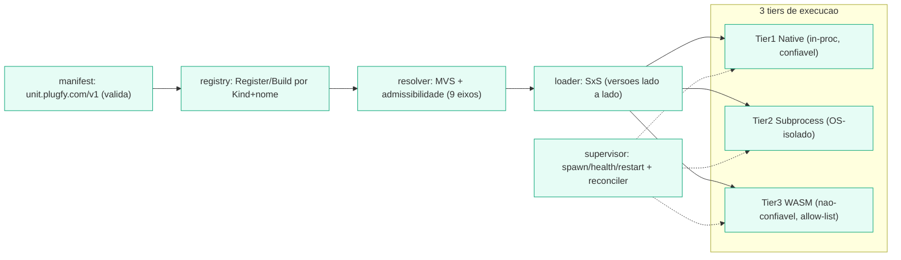
```mermaid
flowchart LR
  classDef l3 fill:#e6fcf5,stroke:#0ca678;
  M["manifest: unit.plugfy.com/v1 (valida)"]
  R["registry: Register/Build por Kind+nome"]
  RS["resolver: MVS + admissibilidade (9 eixos)"]
  L["loader: SxS (versoes lado a lado)"]
  subgraph tiers["3 tiers de execucao"]
    T1["Tier1 Native (in-proc, confiavel)"]
    T2["Tier2 Subprocess (OS-isolado)"]
    T3["Tier3 WASM (nao-confiavel, allow-list)"]
  end
  SUP["supervisor: spawn/health/restart + reconciler"]
  M --> R --> RS --> L
  L --> T1
  L --> T2
  L --> T3
  SUP -.-> T1
  SUP -.-> T2
  SUP -.-> T3
  class M,R,RS,L,T1,T2,T3,SUP l3;
```

*Pipeline de carregamento do runtime: manifest -> registry -> resolver (MVS + admissibilidade de 9 eixos) -> loader (versoes side-by-side) -> tier de execucao (Native/Subprocess/WASM). O supervisor cuida de spawn/health/restart e reconciliacao.*

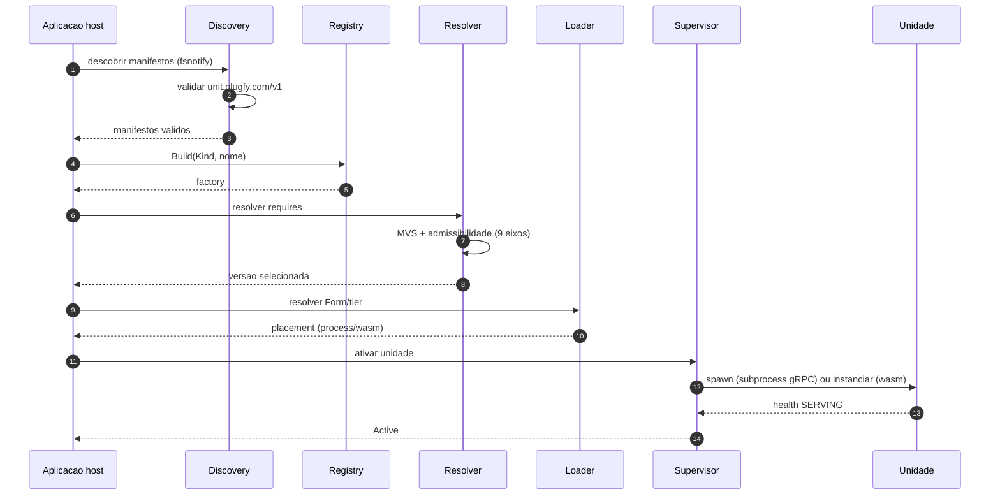
```mermaid
sequenceDiagram
  autonumber
  participant H as Aplicacao host
  participant D as Discovery
  participant RG as Registry
  participant RS as Resolver
  participant LO as Loader
  participant SU as Supervisor
  participant U as Unidade
  H->>D: descobrir manifestos (fsnotify)
  D->>D: validar unit.plugfy.com/v1
  D-->>H: manifestos validos
  H->>RG: Build(Kind, nome)
  RG-->>H: factory
  H->>RS: resolver requires
  RS->>RS: MVS + admissibilidade (9 eixos)
  RS-->>H: versao selecionada
  H->>LO: resolver Form/tier
  LO-->>H: placement (process/wasm)
  H->>SU: ativar unidade
  SU->>U: spawn (subprocess gRPC) ou instanciar (wasm)
  U-->>SU: health SERVING
  SU-->>H: Active
```

*Carga e resolucao de uma unidade: a aplicacao host descobre o manifesto, resolve por MVS + admissibilidade, escolhe o tier e o supervisor ativa a instancia ate ela ficar saudavel.*

### 6.2 Como um pipeline executa

Todo trabalho é um DAG. O engine percorre o grafo; cada nó passa por `StepFrame` + `Guard` de resiliência + dispatch; arestas tipadas roteiam sucesso e erro (cascata `onTimeout → onCancel → onRetry → onError`).

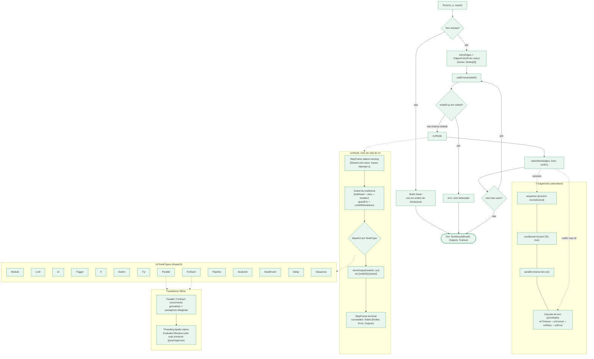
```mermaid
flowchart TB
  classDef novo fill:#e8f6ef,stroke:#1e8449;
  classDef escopo fill:#eeeeee,stroke:#888888,stroke-dasharray:4 3;

  IN["Run(ctx, p, inputs)"]:::novo
  ENTRY{"Tem arestas?"}:::novo
  LIN["Modo linear:<br/>nos em ordem de declaracao"]:::novo
  EE["entryEdges = EdgesFrom(From vazio)<br/>(senao: Nodes[0])"]:::novo
  WALK["walkFrom(nodeID)"]:::novo
  VIS{"nodeID ja em visited?"}:::novo
  CYC["erro: ciclo detectado"]:::novo
  RUN["runNode"]:::novo
  SEL["selectNext(edges, from, runErr)"]:::novo
  NEXT{"next nao vazio?"}:::novo
  DONE(["Fim: RunResult{RunID, Outputs, Frames}"]):::novo

  IN --> ENTRY
  ENTRY -->|"nao"| LIN --> DONE
  ENTRY -->|"sim"| EE --> WALK
  WALK --> VIS
  VIS -->|"sim"| CYC --> DONE
  VIS -->|"nao (marca visited)"| RUN
  RUN --> SEL --> NEXT
  NEXT -->|"sim"| WALK
  NEXT -->|"nao"| DONE

  subgraph sgRun["runNode: ciclo de vida do no"]
    direction TB
    RF1["StepFrame status=running<br/>(Started unix-nano, Inputs, Attempt=1)"]:::novo
    GUARD["Guard de resiliencia<br/>(bulkhead -› retry -› breaker)<br/>guardFor + runWithResilience"]:::novo
    DISP{"dispatch por NodeType"}:::novo
    STORE["storeOutput(nodeID, out)<br/>ctx.[nodeID].[campo]"]:::novo
    RFT["StepFrame terminal<br/>succeeded / failed (Ended, Error, Outputs)"]:::novo
    RF1 --> GUARD --> DISP --> STORE --> RFT
  end
  RUN -.-> sgRun

  subgraph sgNodes["14 NodeTypes (dispatch)"]
    direction LR
    NT1["Module"]:::novo
    NT2["LLM"]:::novo
    NT3["UI"]:::novo
    NT4["Trigger"]:::novo
    NT5["If"]:::novo
    NT6["Switch"]:::novo
    NT7["Try"]:::novo
    NT8["Parallel"]:::novo
    NT9["ForEach"]:::novo
    NT10["Pipeline"]:::novo
    NT11["AwaitJob"]:::novo
    NT12["AwaitEvent"]:::novo
    NT13["Delay"]:::novo
    NT14["Sequence"]:::novo
  end
  DISP -.-> sgNodes

  subgraph sgEdges["7 EdgeKinds (selectNext)"]
    direction TB
    EK_SEQ["sequence (proximo incondicional)"]:::novo
    EK_COND["conditional (Guard CEL true)"]:::novo
    EK_PAR["parallel (marca fan-out)"]:::novo
    ERRCAS["Cascata de erro (prioridade):<br/>onTimeout -› onCancel -› onRetry -› onError"]:::novo
    EK_SEQ --- EK_COND --- EK_PAR --- ERRCAS
  end
  SEL -.->|"sucesso"| EK_SEQ
  SEL -.->|"runErr nao nil"| ERRCAS

  subgraph sgPar["Paralelismo REAL"]
    direction TB
    PAR2["Parallel / ForEach concorrente:<br/>goroutines + semaphore.Weighted"]:::novo
    THREAD["Threading tipado nativo:<br/>Evaluator.Resolve (sole expr preserva []any/map/num)"]:::novo
    PAR2 --> THREAD
  end
  NT8 -.-> sgPar
  NT9 -.-> sgPar
```

*O motor de pipeline e um DAG com 14 tipos de no e 7 arestas tipadas. Os nos sao domain-agnosticos: o no Module invoca uma unidade; nos como LLM e UI apenas delegam a uma porta injetada pelo host. A cascata de erro (onTimeout -> onCancel -> onRetry -> onError) roteia falhas de forma declarativa.*

| Nó | Para que serve |
|---|---|
| **Module** | Invoca uma unidade (o tijolo de trabalho). |
| **If / Switch** | Ramificação por guard/discriminador CEL. |
| **Try** | Captura erro em campos de saída em vez de propagar. |
| **Parallel** | Fan-out real (goroutines). |
| **ForEach** | Iteração com concorrência limitada (semáforo). |
| **Pipeline** | Recursão: roda um sub-pipeline. |
| **AwaitJob / AwaitEvent** | Espera assíncrona (job ou evento) — *human-in-the-loop*. |
| **Delay** | Pausa ciente de cancelamento. |
| **Sequence** | Grupo linear. |
| **Trigger** | Ponto de entrada (expõe o payload do gatilho). |
| **LLM / UI** | Delegam a uma porta injetada pelo host (o framework não os implementa). |

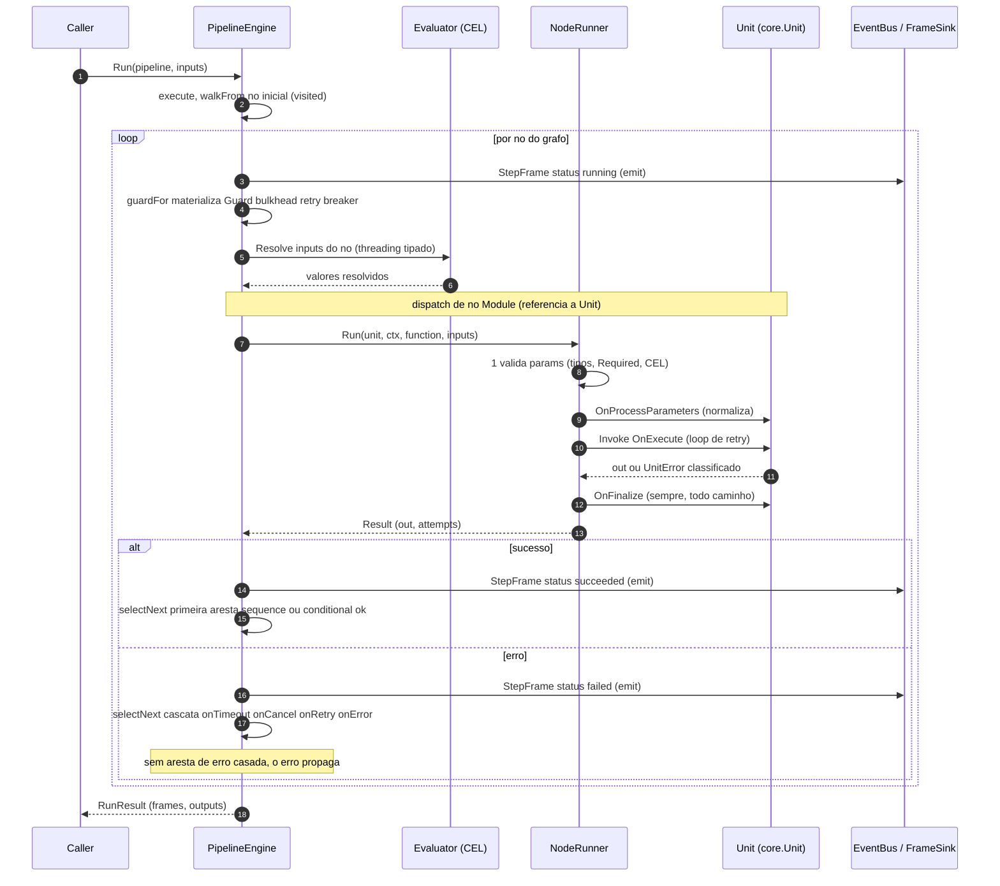
```mermaid
sequenceDiagram
  autonumber
  participant C as Caller
  participant PE as PipelineEngine
  participant EV as Evaluator (CEL)
  participant NR as NodeRunner
  participant U as Unit (core.Unit)
  participant FS as EventBus / FrameSink
  C->>PE: Run(pipeline, inputs)
  PE->>PE: execute, walkFrom no inicial (visited)
  loop por no do grafo
    PE->>FS: StepFrame status running (emit)
    PE->>PE: guardFor materializa Guard bulkhead retry breaker
    PE->>EV: Resolve inputs do no (threading tipado)
    EV-->>PE: valores resolvidos
    Note over PE,U: dispatch de no Module (referencia a Unit)
    PE->>NR: Run(unit, ctx, function, inputs)
    NR->>NR: 1 valida params (tipos, Required, CEL)
    NR->>U: OnProcessParameters (normaliza)
    NR->>U: Invoke OnExecute (loop de retry)
    U-->>NR: out ou UnitError classificado
    NR->>U: OnFinalize (sempre, todo caminho)
    NR-->>PE: Result (out, attempts)
    alt sucesso
      PE->>FS: StepFrame status succeeded (emit)
      PE->>PE: selectNext primeira aresta sequence ou conditional ok
    else erro
      PE->>FS: StepFrame status failed (emit)
      PE->>PE: selectNext cascata onTimeout onCancel onRetry onError
      Note over PE: sem aresta de erro casada, o erro propaga
    end
  end
  PE-->>C: RunResult (frames, outputs)
```

*Run -> execute/walkFrom (com visited contra ciclos) -> por no: emite StepFrame running, materializa o Guard (bulkhead->retry->breaker) e despacha. Um no Module e uma REFERENCIA a core.Unit: o UnitResolver materializa a Unit e o NodeRunner dirige o ciclo de vida (validate Params -> OnProcessParameters -> OnExecute/Invoke -> OnFinalize). StepFrame terminal e entao selectNext aplica a cascata de arestas onTimeout->onCancel->onRetry->onError; em sucesso vence a primeira aresta sequence ou conditional satisfeita. Confere com engine/engine.go (runNode/selectNext), engine/nodes.go (runModuleViaRunner), engine/resilience.go e runner/runner.go.*

### 6.3 Exemplos trabalhados

#### Exemplo 1 — Simples: tornar um trabalho plugável e executá-lo

**Dor:** "tenho uma lógica e quero torná-la um componente reutilizável e executável, sem amarrá-la ao resto."

Uma unidade mínima (transforma texto em maiúsculas) — embeda `DefaultLifecycle`/`DefaultUnit` e implementa só o essencial:

```go
type Upper struct{ core.DefaultUnit }

func (Upper) Describe() core.UnitDescriptor {
    return core.UnitDescriptor{
        ID: "com.acme.upper", Version: "1.0.0", Kind: core.KindModule,
        Methods: []core.MethodDef{{
            Name:   "run",
            Params: []core.ParamDef{{Name: "text", Type: core.ParamString, Required: true}},
        }},
    }
}

func (Upper) Invoke(_ core.UnitContext, _ string, in map[string]any) (map[string]any, error) {
    return map[string]any{"out": strings.ToUpper(in["text"].(string))}, nil
}
```

Um pipeline de duas etapas que encadeia duas unidades, com *threading* tipado de valores (`${ctx.A.out}`):

```json
{
  "id": "com.acme.hello", "version": "1.0.0", "kind": "automation",
  "nodes": [
    { "id": "A", "type": "Module",
      "config": { "unit": "com.acme.upper",   "function": "run" },
      "inputs": { "text": "${input.name}" } },
    { "id": "B", "type": "Module",
      "config": { "unit": "com.acme.exclaim", "function": "run" },
      "inputs": { "text": "${ctx.A.out}" } }
  ],
  "edges": [
    { "from": "", "to": "A", "kind": "sequence" },
    { "from": "A", "to": "B", "kind": "sequence" }
  ]
}
```

```bash
plugfy run hello.pipeline.v1.json --input name=ada
# → {"runID":"01J...","outputs":{"B":{"out":"ADA!"}}}
```

> **O que isto demonstra:** o contrato `Unit`, o registry e o engine de pipeline com encadeamento de valores — tudo sem o núcleo conhecer "upper" ou "exclaim".

#### Exemplo 2 — Médio: integração agendada e resiliente

**Dor:** "preciso chamar uma API externa instável a cada hora, com *retries* e *circuit breaker*, e reagir a falhas" — o caso clássico de *polling*/sincronização que orquestradores resolvem com *retry* e *backoff* ([workflow orchestration](https://github.com/resources/articles/what-is-workflow-orchestration)).

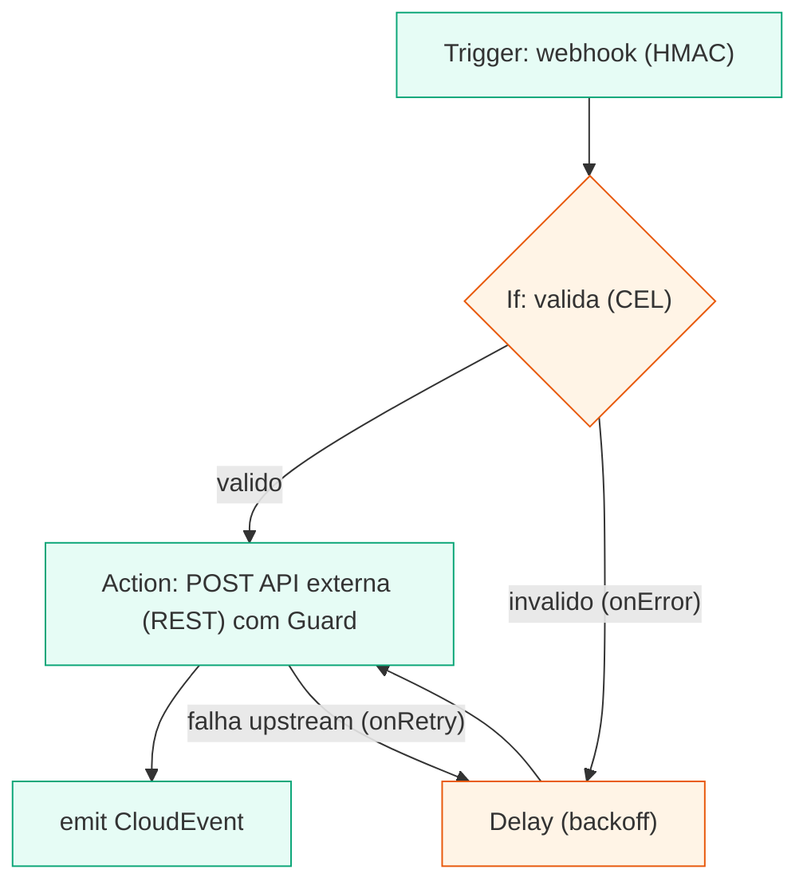
```mermaid
flowchart TB
  classDef node fill:#e6fcf5,stroke:#0ca678;
  classDef ctrl fill:#fff4e6,stroke:#e8590c;
  T["Trigger: webhook (HMAC)"]
  V{"If: valida (CEL)"}
  A["Action: POST API externa (REST) com Guard"]
  EV["emit CloudEvent"]
  D["Delay (backoff)"]
  T --> V
  V -->|"valido"| A
  V -->|"invalido (onError)"| D
  A --> EV
  A -->|"falha upstream (onRetry)"| D
  D --> A
  class T,A,EV node; class V,D ctrl;
```

*Exemplo simples (sem codigo): um webhook valida o payload por CEL, chama uma API externa via action com Guard (retry + circuit breaker), emite um CloudEvent; em erro/upstream segue a aresta tipada para um Delay e tenta de novo.*

Um **trigger cron** dispara o fluxo; um nó **action** chama a API com um **`Guard`** declarativo; uma aresta `onRetry`/`onError` desvia para um `Delay`:

```json
{ "type": "Trigger", "config": { "kind": "cron", "rrule": "FREQ=HOURLY", "ref": "com.acme.sync" } }
```

```yaml
# bloco de resiliência declarado no nó (sem código):
resilience:
  retry:    { maxAttempts: 4, base: 200ms, max: 5s }   # backoff exponencial + jitter
  breaker:  { failureThreshold: 5, resetTimeout: 30s } # abre após 5 falhas consecutivas
  bulkhead: { max: 8 }                                  # concorrência limitada
```

> **O que isto demonstra:** triggers (cron/RRULE), actions (REST/OpenAPI), resiliência declarativa por nó e roteamento de erro por arestas tipadas — uma integração robusta expressa como **dados**, não código.

#### Exemplo 3 — Médio: webhook idempotente

**Dor:** "um provedor externo reenvia webhooks; preciso validar a origem (HMAC) e processar **exatamente uma vez**, mesmo em reenvios."

- O **trigger webhook** valida o `X-Signature` por **HMAC-SHA256** em tempo constante (rejeita 401 em mismatch).
- O `idempotency.Store`, chaveado por `(subject, path, idempotency-key)`, garante *exactly-once* sob reenvio.
- Erros canônicos comunicam conflito de forma estável e mapeável a HTTP/gRPC:

```go
return errs.New(errs.ClassConflict, "order.duplicate", "pedido já processado").WithDetail("id", id)
// → HTTPStatus()==409 ; grpcstatus.CodeFor()==AlreadyExists ; código estável "order.duplicate"
```

> **O que isto demonstra:** entrada segura (HMAC), idempotência anti-replay e o modelo de erros canônico — uma só fonte de verdade entre transportes.

#### Exemplo 4 — Complexo: processo de negócio extensível com código de terceiros isolado

**Dor (real, difícil):** "orquestrar um processo de pedido que inclui uma **transformação fornecida pelo cliente (não-confiável)**, enriquecimento **paralelo** de dois sistemas, uma **aprovação humana** e chamadas externas **resilientes** — sem que o código de terceiros possa derrubar o host ou exfiltrar dados."

Este é o cenário que combina quase tudo. O código não-confiável roda no **Tier 3 (WASM)** com **allow-list deny-by-default** — a mesma estratégia que sistemas de plugin modernos adotam para executar código de terceiros com segurança (p.ex. o sistema de plugins do [Figma usa WebAssembly](https://medium.com/@hashbyt/https-www-hashbyt-com-blog-webassembly-security-saas-plugins-2025-187b2b4e53ba) justamente para *0% de vazamento de capacidade*). A orquestração — fan-out, *human checkpoint*, *retries* com backoff — é o padrão de orquestradores de workflow ([CI/CD com aprovações, RPA com checkpoints](https://www.bmc.com/blogs/workflow-orchestration/)).

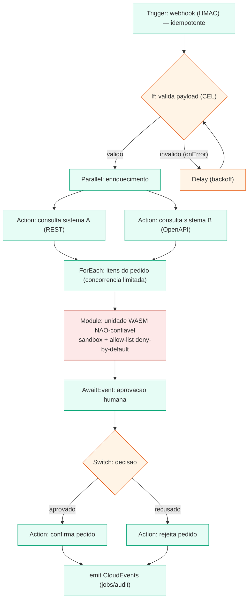
```mermaid
flowchart TB
  classDef node fill:#e6fcf5,stroke:#0ca678;
  classDef ctrl fill:#fff4e6,stroke:#e8590c;
  classDef sand fill:#fde8e8,stroke:#c0392b;
  T["Trigger: webhook (HMAC) — idempotente"]
  V{"If: valida payload (CEL)"}
  PAR["Parallel: enriquecimento"]
  A1["Action: consulta sistema A (REST)"]
  A2["Action: consulta sistema B (OpenAPI)"]
  FE["ForEach: itens do pedido (concorrencia limitada)"]
  WZ["Module: unidade WASM NAO-confiavel<br/>sandbox + allow-list deny-by-default"]
  AW["AwaitEvent: aprovacao humana"]
  SW{"Switch: decisao"}
  OK["Action: confirma pedido"]
  NO["Action: rejeita pedido"]
  EV["emit CloudEvents (jobs/audit)"]
  D["Delay (backoff)"]
  T --> V
  V -->|"valido"| PAR
  V -->|"invalido (onError)"| D
  D --> V
  PAR --> A1
  PAR --> A2
  A1 --> FE
  A2 --> FE
  FE --> WZ
  WZ --> AW
  AW --> SW
  SW -->|"aprovado"| OK
  SW -->|"recusado"| NO
  OK --> EV
  NO --> EV
  class T,PAR,A1,A2,FE,AW,OK,NO,EV node; class V,SW,D ctrl; class WZ sand;
```

*Exemplo complexo (sem codigo): um processo de pedido resiliente e extensivel. Quase todos os tipos de no: webhook -> valida -> enriquecimento em paralelo -> ForEach por item -> uma unidade WASM NAO-confiavel isolada (allow-list) -> espera aprovacao humana -> Switch -> confirma/rejeita -> emite eventos. Cada no com resiliencia; o no WASM nunca pode derrubar o host nem exfiltrar dados.*

Trecho do pipeline (mostrando o nó WASM não-confiável e o paralelo):

```json
{
  "id": "com.acme.order", "version": "1.0.0", "kind": "automation",
  "triggers": [ { "type": "Trigger", "config": { "kind": "webhook", "hmac": true } } ],
  "nodes": [
    { "id": "validate", "type": "If",      "config": { "condition": "input.total > 0" } },
    { "id": "enrich",   "type": "Parallel", "config": { "branches": ["lookupA", "lookupB"], "await": "all" } },
    { "id": "items",    "type": "ForEach",  "config": { "collection": "${ctx.enrich.results[0].items}",
                                                        "concurrency": 4 } },
    { "id": "transform","type": "Module",   "config": { "unit": "customer.transform", "function": "apply",
                                                        "runtime": "wasm",
                                                        "capabilities": { "filesystemRead": [], "networkOutbound": [] } } },
    { "id": "approval", "type": "AwaitEvent","config": { "topic": "order.approval.v1", "timeout": "24h" } },
    { "id": "decide",   "type": "Switch",   "config": { "expression": "ctx.approval.decision" } }
  ],
  "edges": [
    { "from": "decide", "to": "confirm", "kind": "conditional", "guard": "ctx.decide.value == 'approved'" },
    { "from": "decide", "to": "reject",  "kind": "conditional", "guard": "ctx.decide.value == 'rejected'" },
    { "from": "transform", "to": "retryDelay", "kind": "onError" }
  ]
}
```

> **O que isto demonstra:** quase todos os tipos de nó (`Trigger`, `If`, `Parallel`, `ForEach`, `Module`, `AwaitEvent`, `Switch`), o **sandbox WASM com allow-list vazia** (sem rede, sem fs), resiliência por nó, idempotência, e eventos — um processo de negócio **resiliente e extensível** onde o código de terceiros é estruturalmente incapaz de causar dano. Se a transformação travar ou estourar memória, o host **não cai**; o supervisor isola a falha.

#### Exemplo 5 — Operacional: rodar como serviço multiplataforma com auto-update e hot-swap

**Dor:** "entregar isto como um serviço cross-platform que se auto-atualiza, sobrevive a crashes e troca de versão de uma unidade sem downtime."

- **Instalar como serviço:** `svcmgr.New().Install(exePath)` registra via `sc.exe` (Windows), `launchd` (macOS) ou `systemd` (Linux).
- **Auto-update atômico:** o `updater` baixa, **verifica SHA-256**, faz backup `.bak`, troca por `rename` atômico e oferece `Rollback`.
- **Sobreviver a crashes:** o `supervisor` + `reconciler` reiniciam com backoff exponencial conforme a `RestartPolicy`.
- **Hot-swap por versão:** com versões *side-by-side* e **MVS**, instalar `v1.3` e redirecionar para ela é determinístico; o `lifecycle` faz a transição respeitando o lock de unidades *replaceable:false*.

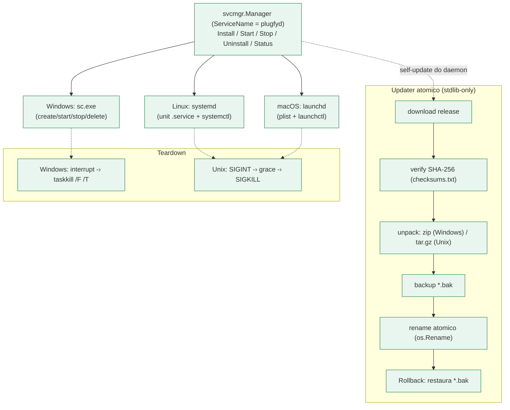
```mermaid
flowchart TB
  MGR["svcmgr.Manager (ServiceName = plugfyd)<br/>Install / Start / Stop / Uninstall / Status"]
  MGR --> WIN["Windows: sc.exe<br/>(create/start/stop/delete)"]
  MGR --> MAC["macOS: launchd<br/>(plist + launchctl)"]
  MGR --> LIN["Linux: systemd<br/>(unit .service + systemctl)"]
  subgraph sgUpd["Updater atomico (stdlib-only)"]
    U1["download release"] --> U2["verify SHA-256 (checksums.txt)"]
    U2 --> U3["unpack: zip (Windows) / tar.gz (Unix)"]
    U3 --> U4["backup *.bak"]
    U4 --> U5["rename atomico (os.Rename)"]
    U5 --> U6["Rollback: restaura *.bak"]
  end
  subgraph sgTear["Teardown"]
    TW["Windows: interrupt -› taskkill /F /T"]
    TU["Unix: SIGINT -› grace -› SIGKILL"]
  end
  MGR -.->|"self-update do daemon"| U1
  WIN -.-> TW
  LIN -.-> TU
  MAC -.-> TU
  classDef novo fill:#e8f6ef,stroke:#1e8449;
  class MGR,WIN,MAC,LIN,U1,U2,U3,U4,U5,U6,TW,TU novo;
```

*Uma unica interface Manager (servico plugfyd) com tres implementacoes de SO (sc.exe / launchd / systemd), updater atomico (download -> SHA-256 -> unpack -> backup .bak -> rename -> Rollback) e teardown taskkill no Windows versus SIGINT/SIGKILL no Unix.*

> **O que isto demonstra:** o framework como **cidadão do host** — instalação, atualização, supervisão e evolução de versões, em três sistemas operacionais, com `stdlib`-only no caminho crítico do update.

### 6.4 Resolução de uma capacidade e eventos

Como o host seleciona uma implementação por edição, e como unidades trocam eventos:

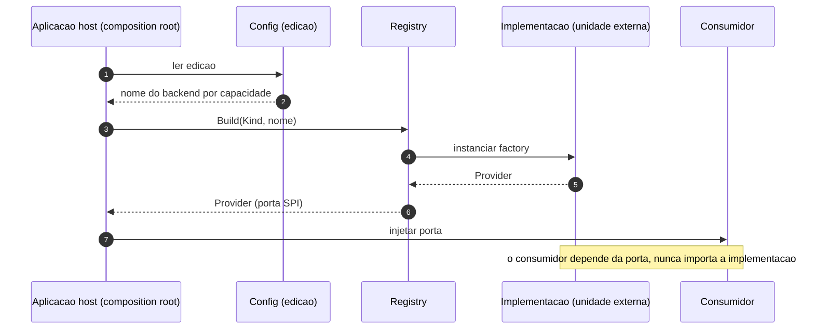
```mermaid
sequenceDiagram
  autonumber
  participant H as Aplicacao host (composition root)
  participant CF as Config (edicao)
  participant RG as Registry
  participant IMPL as Implementacao (unidade externa)
  participant CO as Consumidor
  H->>CF: ler edicao
  CF-->>H: nome do backend por capacidade
  H->>RG: Build(Kind, nome)
  RG->>IMPL: instanciar factory
  IMPL-->>RG: Provider
  RG-->>H: Provider (porta SPI)
  H->>CO: injetar porta
  Note over CO,IMPL: o consumidor depende da porta, nunca importa a implementacao
```

*Selecao de um provider por edicao: a aplicacao host le a edicao, usa registry.Build(Kind, nome) e injeta a porta SPI no consumidor. O consumidor depende da porta e nunca importa a implementacao.*

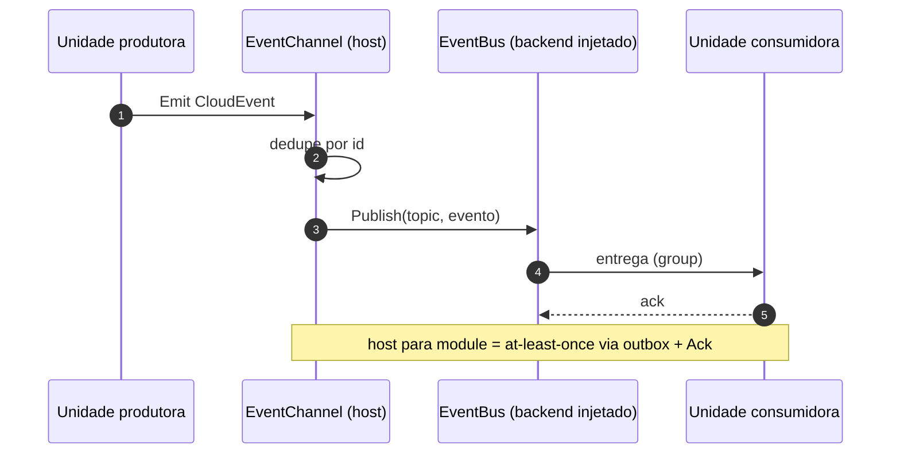
```mermaid
sequenceDiagram
  autonumber
  participant P as Unidade produtora
  participant EC as EventChannel (host)
  participant EB as EventBus (backend injetado)
  participant C as Unidade consumidora
  P->>EC: Emit CloudEvent
  EC->>EC: dedupe por id
  EC->>EB: Publish(topic, evento)
  EB->>C: entrega (group)
  C-->>EB: ack
  Note over EC,C: host para module = at-least-once via outbox + Ack
```

*Publicacao e assinatura de evento: uma unidade emite um CloudEvent pelo canal reverso do supervisor (dedupe por id), o EventBus publica no topico e entrega ao consumidor; host->module e at-least-once via outbox + Ack.*

---

## 7. Visão de Implantação (Deployment View)

### 7.1 Edições

A configuração *edition-aware* do `kernel` define, por edição, **quais unidades carregar** e o **comportamento de boot** (offline-first vs `StrictBoot`). O framework fornece o seletor; os backends concretos são unidades externas.

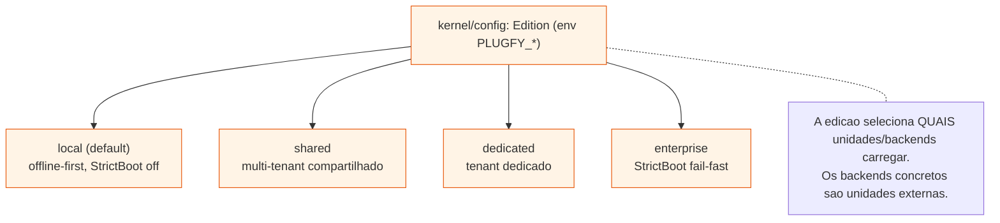
```mermaid
flowchart TB
  classDef k fill:#fff4e6,stroke:#e8590c;
  ED["kernel/config: Edition (env PLUGFY_*)"]
  L["local (default)<br/>offline-first, StrictBoot off"]
  S["shared<br/>multi-tenant compartilhado"]
  DD["dedicated<br/>tenant dedicado"]
  EN["enterprise<br/>StrictBoot fail-fast"]
  ED --> L
  ED --> S
  ED --> DD
  ED --> EN
  NT["A edicao seleciona QUAIS unidades/backends carregar.<br/>Os backends concretos sao unidades externas."]
  ED -.- NT
  class ED,L,S,DD,EN k;
```

*A configuracao edition-aware do kernel define, por edicao, quais unidades carregar e o comportamento de boot (offline-first vs StrictBoot). Os backends concretos sao unidades externas; o framework so fornece o seletor.*

### 7.2 Edição Local — binário único, offline-first

O caso mais simples: um único processo com `runtime`+`pipeline`+`kernel`, hospedando as unidades nos três tiers. Sem rede obrigatória.

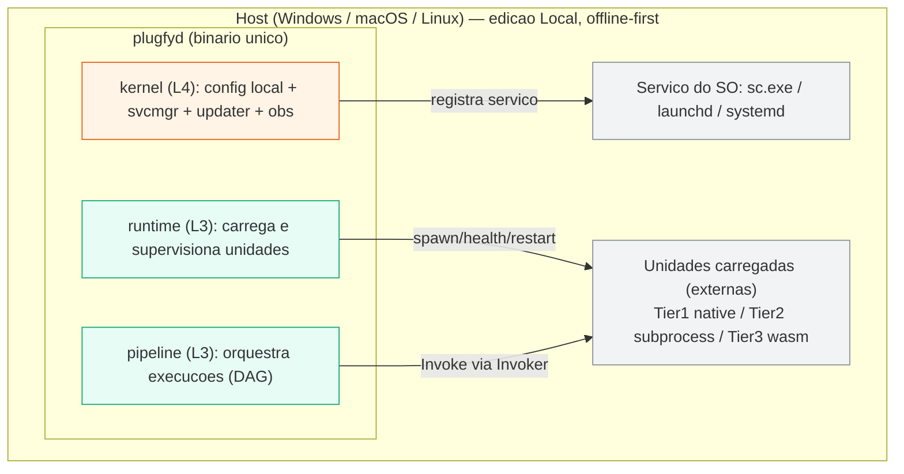
```mermaid
flowchart TB
  classDef l3 fill:#e6fcf5,stroke:#0ca678;
  classDef l4 fill:#fff4e6,stroke:#e8590c;
  classDef ext fill:#f1f3f5,stroke:#868e96;
  subgraph host["Host (Windows / macOS / Linux) — edicao Local, offline-first"]
    subgraph bin["plugfyd (binario unico)"]
      RUN["runtime (L3): carrega e supervisiona unidades"]
      PIPE["pipeline (L3): orquestra execucoes (DAG)"]
      KER["kernel (L4): config local + svcmgr + updater + obs"]
    end
    UNITS["Unidades carregadas (externas)<br/>Tier1 native / Tier2 subprocess / Tier3 wasm"]
    SVC["Servico do SO: sc.exe / launchd / systemd"]
  end
  KER -->|"registra servico"| SVC
  RUN -->|"spawn/health/restart"| UNITS
  PIPE -->|"Invoke via Invoker"| UNITS
  class RUN,PIPE l3; class KER l4; class UNITS,SVC ext;
```

*Implantacao na edicao Local: um binario unico com runtime+pipeline+kernel; o kernel registra o servico do SO; o runtime carrega e supervisiona as unidades nos 3 tiers. Os backends concretos sao unidades externas que o framework hospeda.*

### 7.3 Topologia de execução em três tiers

Dentro do host, as unidades executam em três tiers de confiança; o `supervisor` gerencia spawn/health/restart, e o engine invoca qualquer tier pelo mesmo `Invoker` agnóstico de transporte.

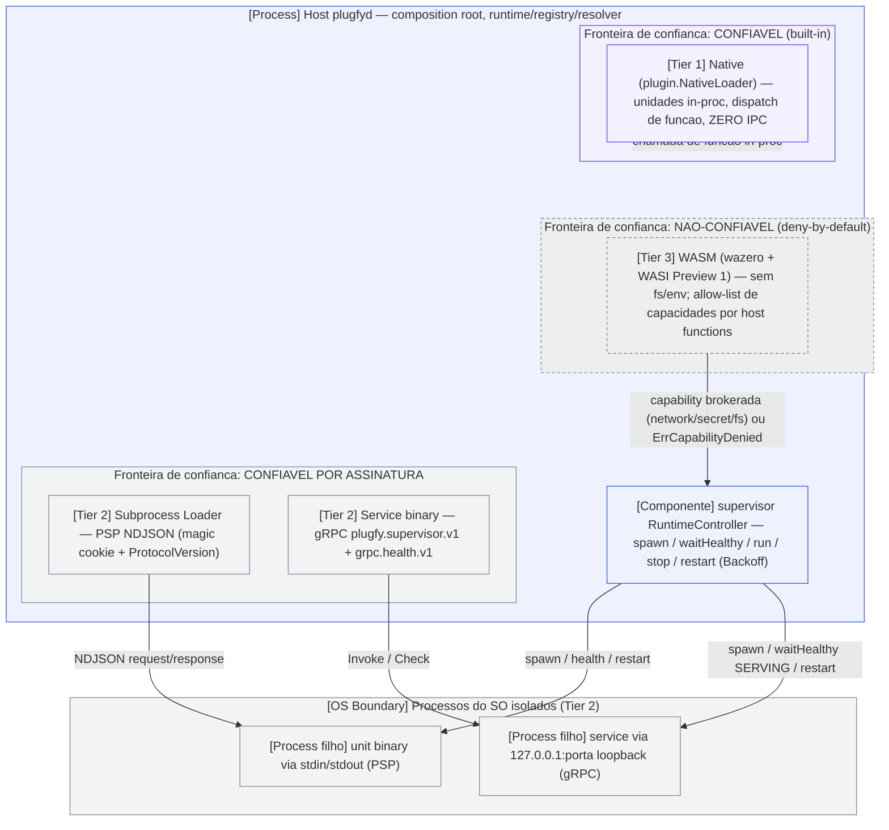
```mermaid
flowchart TB
  subgraph hostproc["[Process] Host plugfyd — composition root, runtime/registry/resolver"]
    SUP["[Componente] supervisor RuntimeController — spawn / waitHealthy / run / stop / restart (Backoff)"]
    subgraph trust1["Fronteira de confianca: CONFIAVEL (built-in)"]
      T1["[Tier 1] Native (plugin.NativeLoader) — unidades in-proc, dispatch de funcao, ZERO IPC"]
    end
    subgraph trust2["Fronteira de confianca: CONFIAVEL POR ASSINATURA"]
      T2A["[Tier 2] Subprocess Loader — PSP NDJSON (magic cookie + ProtocolVersion)"]
      T2B["[Tier 2] Service binary — gRPC plugfy.supervisor.v1 + grpc.health.v1"]
    end
    subgraph trust3["Fronteira de confianca: NAO-CONFIAVEL (deny-by-default)"]
      T3["[Tier 3] WASM (wazero + WASI Preview 1) — sem fs/env; allow-list de capacidades por host functions"]
    end
  end

  subgraph osproc["[OS Boundary] Processos do SO isolados (Tier 2)"]
    P2A["[Process filho] unit binary via stdin/stdout (PSP)"]
    P2B["[Process filho] service via 127.0.0.1:porta loopback (gRPC)"]
  end

  SUP -->|"spawn / health / restart"| P2A
  SUP -->|"spawn / waitHealthy SERVING / restart"| P2B
  T1 -->|"chamada de funcao in-proc"| hostproc
  T2A -->|"NDJSON request/response"| P2A
  T2B -->|"Invoke / Check"| P2B
  T3 -->|"capability brokerada (network/secret/fs) ou ErrCapabilityDenied"| SUP

  classDef l1 fill:#eef2ff,stroke:#3b5bdb;
  classDef found fill:#f3f0ff,stroke:#7048e8;
  classDef ext fill:#f1f3f5,stroke:#868e96;
  classDef escopo fill:#eeeeee,stroke:#888888,stroke-dasharray:4 3;
  class hostproc,SUP l1;
  class T1,trust1 found;
  class T2A,T2B,trust2,P2A,P2B,osproc ext;
  class T3,trust3 escopo;
```

*Dentro do mesmo host, as unidades executam em tres tiers com fronteiras de confianca crescentes. Tier 1 (Native) roda in-proc com dispatch de funcao e zero IPC, reservado a built-ins confiaveis. Tier 2 (Subprocess) isola unidades em processos do SO confiaveis por assinatura, falando PSP (NDJSON com magic cookie) ou gRPC plugfy.supervisor.v1 + grpc.health.v1. Tier 3 (WASM/wazero, WASI Preview 1) executa codigo nao-confiavel num sandbox sem fs/env, onde cada capacidade e brokerada por host functions contra uma allow-list deny-by-default. O supervisor (RuntimeController) gerencia spawn, health e restart com backoff.*

---

## 8. Conceitos Transversais (Crosscutting Concepts)

### 8.1 Capacidades e SPI

A unidade de extensibilidade é a **capacidade**, negociada por `Kind` + nome + versão. Um `Provider` se registra; o `resolver` casa requisitos; o host instancia. O núcleo nunca importa implementação — adicionar uma capacidade é importar um pacote que chama `registry.Register`.

### 8.2 Versionamento: MVS + admissibilidade de 9 eixos

Resolução determinística em duas camadas: **MVS** ("max dos mínimos") escolhe a menor versão que satisfaz todos os requerentes; a **matriz de admissibilidade de 9 eixos** (Platform, Engine, UISchema, ABI, HostOS, Edition, Infra, Requires, Channel) filtra candidatos, curto-circuitando no primeiro eixo violado. Ambos puros, sem I/O, em L1.

```mermaid
flowchart TB
  classDef step fill:#eef2ff,stroke:#3b5bdb;
  classDef axis fill:#fff4e6,stroke:#e8590c;
  classDef ok fill:#e6fcf5,stroke:#0ca678;
  classDef bad fill:#ffe3e3,stroke:#e03131;

  R0["requires (CapabilityRequirement de cada unidade)"]
  R1["resolver acumula ranges por capacidade"]
  R2["MVS: escolhe a MENOR versao que satisfaz todos os minimos (max-dos-minimos)"]
  R3["matriz de admissibilidade — avalia candidato nos 9 eixos"]

  R0 --> R1 --> R2 --> R3

  subgraph axes["9 eixos (curto-circuito no 1o violado)"]
    direction TB
    X1["1 Platform"] --> X2["2 Engine"] --> X3["3 UISchema"] --> X4["4 ABI"] --> X5["5 HostOS"] --> X6["6 Edition"] --> X7["7 Infra"] --> X8["8 Requires"] --> X9["9 Channel"]
  end

  R3 --> X1
  X9 -->|"todos os eixos passam"| OK["versao admissivel mais nova selecionada"]
  X1 -.->|"violado"| REJ["candidato rejeitado (curto-circuito)"]
  X4 -.->|"violado"| REJ
  X8 -.->|"violado"| REJ
  REJ -->|"tenta proximo candidato"| R3

  class R0,R1,R2,R3 step;
  class X1,X2,X3,X4,X5,X6,X7,X8,X9 axis;
  class OK ok;
  class REJ bad;
```

*Resolucao de capacidades em duas etapas. Primeiro o resolver acumula os ranges declarados em requires e aplica MVS (Minimal Version Selection — a menor versao que satisfaz todos os minimos, isto e, max-dos-minimos). Depois cada candidato passa pela matriz de admissibilidade nos 9 eixos em ordem (Platform, Engine, UISchema, ABI, HostOS, Edition, Infra, Requires, Channel) com curto-circuito no primeiro eixo violado; a versao admissivel mais nova e selecionada.*

### 8.3 Ciclo de vida e reconciliação

Estados derivados de OSGi (7 fases) com `Idle` para *scale-to-zero*. Um **reconciler level-triggered** (estilo Kubernetes) aplica `RestartPolicy`/backoff/rollback comparando estado desejado × atual.

```mermaid
stateDiagram-v2
  [*] --> Installed
  Installed --> Resolved: resolve (deps + admissibilidade)
  Installed --> Uninstalled
  Resolved --> Starting: start
  Resolved --> Uninstalled
  Starting --> Active: health SERVING
  Active --> Idle: scale-to-zero
  Idle --> Active: demanda
  Active --> Stopping: stop
  Idle --> Stopping: stop
  Stopping --> Resolved
  Uninstalled --> [*]
  note right of Idle
    Reconcile = BFS shortest-path
    (proximo hop ate o estado desejado)
  end note
```

*Maquina de estados OSGi de 7 fases: Installed->Resolved->Starting->Active, com Active<->Idle (scale-to-zero) e Active->Stopping->Resolved; Uninstalled e terminal e o Reconcile escolhe o proximo hop por menor caminho (BFS).*

### 8.4 Resiliência

Resiliência **declarativa por nó**: o bloco `resilience` materializa um `Guard` que compõe **bulkhead (admissão) → retry (backoff + jitter) → breaker (por tentativa)**. O breaker é compartilhado por `pipelineID:nodeID` entre execuções concorrentes — um upstream instável "abre" uma vez e protege todos.

```mermaid
flowchart LR
  classDef novo fill:#e8f6ef,stroke:#1e8449;

  entrada(["Chamada<br/>Guard.Do(ctx, fn)"])
  bh["Bulkhead (externo)<br/>admissao: concorrencia limitada"]
  retry["Retry<br/>backoff exponencial capado + jitter"]
  br["Breaker (por tentativa)<br/>Allow / Record"]
  fn(["funcao fn()"])

  entrada --> bh
  bh --> retry
  retry -->|"cada tentativa"| br
  br --> fn

  note["Ordem: bulkhead externo envolve o retry;<br/>cada tentativa do retry passa pelo breaker.<br/>Componente nil e PULADO (qualquer subconjunto e valido)."]
  fn -.-> note

  class entrada,bh,retry,br,fn novo;
```

*Guard.Do compoe bulkhead (admissao externa) -> retry (backoff exponencial capado + jitter) -> breaker (por tentativa) -> fn; qualquer componente nil e pulado.*

```mermaid
stateDiagram-v2
  [*] --> Closed
  Closed --> Open : failureThreshold falhas consecutivas (default 5)
  Open --> HalfOpen : apos resetTimeout (default 30s)
  HalfOpen --> Closed : successThreshold sucessos (default 1)
  HalfOpen --> Open : qualquer falha (re-trip imediato)
  note right of Closed : calls passam; falhas contadas
  note right of Open : rejeita com ErrOpen ate resetTimeout
  note right of HalfOpen : chamadas de teste limitadas
```

*Breaker: Closed abre apos 5 falhas consecutivas; Open vira HalfOpen apos 30s; HalfOpen fecha com 1 sucesso ou re-trip em qualquer falha; em Open as chamadas sao rejeitadas com ErrOpen.*

### 8.5 Modelo de erros canônico

Nove classes de erro mapeadas a famílias HTTP **e** a códigos gRPC, com códigos reverse-DNS estáveis e `Wrap` ciente de *unwrap* — **uma fonte de verdade entre transportes**.

```go
err := errs.New(errs.ClassNotFound, "unit.not_found", "unidade não encontrada").WithDetail("id", id)
_ = err.HTTPStatus()            // 404
_ = grpcstatus.CodeFor(err)     // NotFound  — mesmo erro, dois transportes
```

### 8.6 Eventos

Todo evento é um **CloudEvent 1.0** (envelope JSON). Unidades publicam via o **canal de eventos reverso** do supervisor (module→host), com entrega *at-least-once* por outbox; o backend de bus é uma SPI (implementação externa).

### 8.7 Identificadores e idempotência

- **ULID** (`ids`): 26 chars Crockford base32, ordenável; `Prefixed("unit")` para IDs tagueados.
- **Idempotência** (`idempotency`): `Store` chaveado em `(subject, path, idempotency-key)` para proteção contra *replay*.

### 8.8 Persistência (contrato neutro de dialeto)

O framework **define** um plano de dados *dialect-aware* sobre `database/sql` (`SQLDB`/`Tx`/`Rows`), com `Rebind` e *fragments* portáveis. Um hook `WithTenant(ctx, tenant)` permite à implementação aplicar isolamento por linha (a *enforcement* concreta vive na unidade que implementa o contrato — não no framework).

### 8.9 Expressões (CEL)

Guards de aresta, condições (`If`/`Switch`), filtros (`AwaitEvent`) e templates `${...}` usam **CEL** — não-Turing-completo, sem efeitos colaterais, com cache de compilação. `Resolve` faz *threading* de valores **nativos** (não stringificados).

```mermaid
flowchart LR
  classDef p fill:#e6fcf5,stroke:#0ca678;
  E["Expressao (string)"]
  PA["CEL: parse"]
  TC["type-check"]
  PR["program (cache LRU)"]
  EV["avalia: sandboxed, sem efeitos colaterais"]
  RS["Resolve: retorna valor NATIVO"]
  E --> PA --> TC --> PR --> EV
  EV --> RS
  U["Usos: guards de aresta, If/Switch, filtros de evento, templates"]
  EV -.- U
  class E,PA,TC,PR,EV,RS p;
```

*Avaliacao de expressoes com CEL: parse, type-check, programa cacheado (LRU) e avaliacao sandboxed, nao-Turing-completa e sem efeitos colaterais. Resolve devolve o valor nativo (sem stringificar). Usada em guards de aresta, If/Switch, filtros de evento e templates.*

### 8.10 Observabilidade

`StepFrame` por nó (status, *timings*, nº de tentativa, *snapshots* de I/O) → *sink* plugável; `slog` estruturado com nível ajustável em runtime; tracer OTel OTLP/HTTP; eventos CloudEvents + canal reverso.

```mermaid
flowchart TB
  classDef novo fill:#e8f6ef,stroke:#1e8449;

  subgraph sgNode["Por-no (engine)"]
    direction TB
    SF["StepFrame<br/>Status (enum: running/succeeded/failed/skipped/cancelled)<br/>Started+Ended (unix-nano), Attempt<br/>snapshots I/O (Inputs/Outputs)"]:::novo
    SINK["FrameSink (port plugavel)<br/>emit() sincrono no run goroutine"]:::novo
    SF --> SINK
  end

  EB["Event bus (publisher de frames)"]:::novo
  AUD["Audit recorder"]:::novo
  OTELSPAN["OTel span emitter"]:::novo
  LV["Live-view bridge (log explorer)"]:::novo
  SINK --> EB
  SINK --> AUD
  SINK --> OTELSPAN
  SINK --> LV

  subgraph sgPar["Em paralelo (kernel/obs)"]
    direction TB
    SLOG["slog estruturado<br/>nivel ajustavel em runtime + Bridge p/ log explorer"]:::novo
    OTEL["OTel: tracer OTLP/HTTP"]:::novo
    CE["CloudEvents 1.0 (18 tipos) no event bus"]:::novo
    REV["Reverse event channel module-›host<br/>(outbox at-least-once)"]:::novo
  end
  CE --> REV
```

*Observabilidade do motor: por-no o StepFrame (status enum, timings unix-nano, Attempt, snapshots I/O) flui pelo FrameSink plugavel para event bus / audit / OTel / live-view; em paralelo slog estruturado com nivel runtime + bridge, tracer OTel OTLP/HTTP, CloudEvents 1.0 (18 tipos) e canal reverso module->host (outbox at-least-once).*

### 8.11 Segurança e sandbox

Defense-in-depth: sandbox de 3 tiers com **allow-list deny-by-default** no WASM, **assinatura de unidade** (verify-before-install), **handshake por magic-cookie** no subprocess, modelo de erros que **não vaza internals**, e *caps* anti-runaway (linha de 1 MiB) com *binding* loopback.

```mermaid
flowchart TB
  classDef sec fill:#e6fcf5,stroke:#0ca678;
  S["Seguranca do Framework (defense-in-depth)"]
  T["Sandbox 3-tier: Native / Subprocess / WASM"]
  AL["WASM: allow-list deny-by-default (sem rede/fs sem permissao)"]
  HC["Subprocess: handshake por magic-cookie"]
  SG["Assinatura de unidade (verify-before-install)"]
  ER["Modelo de erros canonico (nao vaza internals)"]
  CP["Caps anti-runaway (linha 1 MiB) + binding loopback"]
  S --> T
  T --> AL
  T --> HC
  S --> SG
  S --> ER
  S --> CP
  class S,T,AL,SG,ER,CP,HC sec;
```

*Seguranca do framework, defense-in-depth: sandbox de 3 tiers com allow-list deny-by-default no WASM, assinatura de unidade (verify-before-install), handshake por magic-cookie no subprocess, modelo de erros canonico (sem vazar internals) e caps anti-runaway com binding loopback.*

### 8.12 Empacotamento e manifesto

Toda unidade declara um manifesto `unit.plugfy.com/v1` com um dos quatro perfis (module/plugin/extension/app), `provides`/`requires`/`capabilities`, `config`, `state` e `signing` (verify-before-install).

```mermaid
flowchart TB
  classDef l1 fill:#eef2ff,stroke:#3b5bdb;
  classDef prof fill:#e6fcf5,stroke:#0ca678;
  classDef sign fill:#fff4e6,stroke:#e8590c;

  U["Unit (unit.plugfy.com/v1)"]
  AV["apiVersion: unit.plugfy.com/v1"]
  K["kind"]
  META["metadata<br/>name (reverse-DNS) + version (SemVer)"]
  SPEC["spec"]

  U --> AV
  U --> K
  U --> META
  U --> SPEC

  SPEC --> SP_PROF["profile"]
  SPEC --> SP_PROV["provides (capabilities expostas)"]
  SPEC --> SP_REQ["requires (deps MVS)"]
  SPEC --> SP_CAP["capabilities (CapabilityRequirement)"]
  SPEC --> SP_CFG["config"]
  SPEC --> SP_STATE["state"]
  SPEC --> SP_CONTR["contributes"]
  SPEC --> SP_APP["app (AppSpec — so profile app)"]
  SPEC --> SP_SIGN["signing (Signing)"]

  SP_PROF --> PM["module"]
  SP_PROF --> PP["plugin"]
  SP_PROF --> PE["extension"]
  SP_PROF --> PA["app — exige spec.app.components no minimo 1"]
  PA -.->|"obrigatorio"| SP_APP

  SP_SIGN --> SG["mode keyless|key — verify-before-install"]
  SG -->|"verifica assinatura antes de instalar"| INST["Instalacao admitida"]

  class U,AV,K,META,SPEC l1;
  class SP_PROF,PM,PP,PE,PA prof;
  class SP_SIGN,SG,INST sign;
```

*Forma do manifesto Unit (unit.plugfy.com/v1): apiVersion, kind, metadata (name reverse-DNS + version SemVer) e spec. O spec carrega profile, provides, requires, capabilities, config, state, contributes, app e signing. Os 4 profiles sao module/plugin/extension/app — apenas o profile app exige spec.app com ao menos um component. signing (mode keyless ou key) aplica verify-before-install antes de admitir a instalacao.*

---

## 9. Decisões de Arquitetura (ADRs)

Formato **Nygard** (Status · Contexto · Decisão · Consequências). Uma decisão por ADR.

### ADR-001 — Micro-kernel em Go, organizado em polirepo
- **Status:** Aceito.
- **Contexto:** É preciso um framework portável, com fronteiras de camada verificáveis e versionamento independente por módulo.
- **Decisão:** Implementar em **Go 1.25**, como **micro-kernel em camadas (L1–L4)** num **polirepo**.
- **Consequências:** (+) Binário único, cross-compile, deps mínimas, release independente por módulo. (−) Disciplina de SemVer e gates de CI obrigatórios.

### ADR-002 — L1 stdlib-only com ABI congelada (golden test)
- **Status:** Aceito.
- **Contexto:** Toda unidade pina `^1.x` da baseplate; uma mudança acidental de assinatura quebraria o ecossistema silenciosamente.
- **Decisão:** `contracts` importa **apenas a stdlib**; um teste golden congela a superfície pública e falha o CI em qualquer *drift*.
- **Consequências:** (+) Estabilidade garantida; *breaks* exigem bump major deliberado. (−) Adicionar à ABI é um ato revisado.

### ADR-003 — Extensibilidade por SPI de capacidade + auto-registro
- **Status:** Aceito.
- **Decisão:** Providers se registram por `Kind`+nome via `registry.Register` em `init()`; o host instancia por `registry.Build`. Consumidores dependem de *ports*, nunca de implementações.
- **Consequências:** (+) Adicionar capacidade = importar um pacote; zero alteração no núcleo. (−) A ordem de registro é responsabilidade do host.

### ADR-004 — Resolução por MVS + admissibilidade de 9 eixos
- **Status:** Aceito.
- **Decisão:** **MVS** + matriz pura de **9 eixos**, ambos em L1, com versões *side-by-side*.
- **Consequências:** (+) Determinístico; compartilhado por resolver e loader; sem "DLL hell". (−) Curva de aprendizado.

### ADR-005 — Sandbox de três tiers (Native / Subprocess / WASM)
- **Status:** Aceito.
- **Contexto:** O framework executa desde built-ins confiáveis até código de terceiros não-confiável.
- **Decisão:** **Tier 1 Native** · **Tier 2 Subprocess** (OS-isolado, confiável por assinatura) · **Tier 3 WASM** (não-confiável, allow-list deny-by-default).
- **Consequências:** (+) Isolamento real e confiança graduada, multiplataforma (wazero pure-Go). (−) Overhead de IPC nos tiers 2–3; limites de recurso WASM além de memória ainda pendentes.

### ADR-006 — CEL para expressões (sem scripting de código embutido)
- **Status:** Aceito.
- **Decisão:** Usar **CEL** para guards/condições/filtros/templates.
- **Consequências:** (+) Não-Turing-completo, sandboxed, sem efeitos colaterais, cacheável. (−) Transforms complexas viram nós/unidades dedicadas.

### ADR-007 — Pipeline DAG como modelo de execução; um Pipeline é uma Unit
- **Status:** Aceito.
- **Decisão:** **DAG** com 14 tipos de nó e 7 arestas tipadas; recursão uniforme (`pipelineunit`).
- **Consequências:** (+) Paralelismo real, roteamento de erro tipado, observabilidade por `StepFrame`, recursão limitada por profundidade. (−) Hoje `Try`/`Parallel` resolvem inputs em vez de sub-grafos aninhados.

### ADR-008 — CloudEvents 1.0 + canal de eventos reverso
- **Status:** Aceito.
- **Decisão:** Padronizar eventos em **CloudEvents 1.0**; unidades publicam via canal reverso (module→host) com outbox *at-least-once*; backend de bus trocável atrás de SPI.
- **Consequências:** (+) Interoperável e durável. (−) Complexidade de outbox/redelivery no host.

### ADR-009 — Resiliência declarativa por nó
- **Status:** Aceito.
- **Decisão:** Cada nó pode declarar `retry`+`breaker`+`bulkhead`, materializados num `Guard`.
- **Consequências:** (+) Resiliência sem código; breaker compartilhado protege upstreams instáveis. (−) Autores precisam entender a configuração.

### ADR-010 — Configuração *edition-aware*
- **Status:** Aceito.
- **Decisão:** Uma `Edition` (env `PLUGFY_*`) seleciona quais unidades carregar e o comportamento de boot.
- **Consequências:** (+) Mesmo binário do desktop offline ao processo supervisionado. (−) Matriz de teste por edição.

### ADR-011 — Framework embutível (guest-in-host)
- **Status:** Aceito.
- **Contexto:** Acoplar o framework a um modelo de servidor/escala o tornaria menos portável.
- **Decisão:** O framework é uma **biblioteca embutível**; a composição (montar e injetar ports) é responsabilidade de uma aplicação host genérica, externa ao framework.
- **Consequências:** (+) Núcleo portável e testável. (−) Um sistema completo exige uma aplicação host.

### ADR-012 — Manifesto universal + assinatura (verify-before-install)
- **Status:** Aceito.
- **Decisão:** Manifesto `unit.plugfy.com/v1` com perfis e `signing`; validação por JSON Schema + validador Go.
- **Consequências:** (+) Descoberta uniforme, *supply-chain* verificável. (−) Autores mantêm o manifesto em dia.

---

## 10. Requisitos de Qualidade

### 10.1 Árvore de qualidade (ISO/IEC 25010:2023)

```mermaid
flowchart LR
  classDef root fill:#eef2ff,stroke:#3b5bdb;
  classDef car fill:#e6fcf5,stroke:#0ca678;
  Q["Qualidade (ISO/IEC 25010:2023)"]
  Q --> M["Maintainability / Flexibility"]
  M --> M1["micro-kernel + SPI por capacidade"]
  M --> M2["polirepo + golden ABI freeze"]
  Q --> S["Security"]
  S --> S1["sandbox 3-tier + allow-list deny-by-default"]
  S --> S2["assinatura de unidade + error model canonico"]
  Q --> P["Portability"]
  P --> P1["Go + wazero (pure-Go)"]
  P --> P2["svcmgr sc/launchd/systemd + updater atomico"]
  Q --> R["Reliability"]
  R --> R1["resilience Guard (bulkhead/retry/breaker)"]
  R --> R2["reconciler level-triggered + supervisor"]
  Q --> PE["Performance Efficiency"]
  PE --> PE1["MVS + cache CEL + paralelismo real"]
  Q --> C["Compatibility"]
  C --> C1["CloudEvents + gRPC supervisor.v1 + admissibilidade"]
  Q --> F["Functional Suitability"]
  F --> F1["14 nos + 7 arestas + manifesto + triggers/actions"]
  class Q root; class M,S,P,R,PE,C,F car;
```

*Arvore de qualidade do framework mapeada a ISO/IEC 25010:2023; as folhas sao mecanismos do proprio framework.*

### 10.2 Cenários de qualidade

Formato **estímulo → resposta → métrica**.

| # | ISO 25010 | Cenário | Resposta arquitetural | Métrica |
|---|---|---|---|---|
| QS-1 | Maintainability | Adicionar um novo backend de capacidade | `init()`+`Register`; importar no host | 0 linhas no núcleo; build verde |
| QS-2 | Security | Unidade não-confiável tenta acessar a rede sem permissão | WASM bloqueia via allow-list deny-by-default | `ErrCapabilityDenied`; nenhuma syscall |
| QS-3 | Reliability | Uma unidade em subprocess trava/estoura memória | Isolamento de processo; supervisor reinicia | Host não cai; restart com backoff |
| QS-4 | Portability | Operar o mesmo artefato em Windows e Linux | `svcmgr` (sc.exe/systemd); Go+wazero | Mesmo artefato; serviço nos dois |
| QS-5 | Reliability | Upstream começa a falhar intermitentemente | Breaker compartilhado abre; retry com jitter | Falhas isoladas; sem cascata |
| QS-6 | Compatibility | Autor publica `v1.3` de uma unidade | MVS escolhe versão mínima compatível; golden ABI barra *drift* | Resolução determinística; CI vermelho se ABI mudar sem bump |
| QS-7 | Performance | 10k itens em paralelo num `ForEach` | Semáforo ponderado; concorrência real | Throughput escala com `concurrency` |
| QS-8 | Functional Suitability | Modelar fluxo com branch, retry e *await* | 14 nós + 7 arestas + CEL | Fluxo 100% declarativo |
| QS-9 | Reliability | Atualizar o binário em produção | Updater: download→SHA-256→backup→rename→rollback | Sem binário meio-escrito; rollback em 1 passo |

---

## 11. Riscos e Dívida Técnica

| # | Item | Severidade | Direção |
|---|---|---|---|
| RT-1 | **Golden ABI desatualizado** (adições não regeneradas; CI vermelho). | Média | `GOWORK=off go test ./abi -run TestGoldenABI -update`. |
| RT-2 | **`framework/builtin` só com bricks demo.** | Média | Resolver de produção satisfaz o mesmo `UnitResolver`. |
| RT-3 | **`Try`/`Parallel` resolvem inputs**, não sub-grafos aninhados. | Média | Evoluir handlers para corpo aninhado. |
| RT-4 | **`StepFrame` apenas in-memory.** | Média | *Sink* persistente preservando a fronteira de zero-persistência. |
| RT-5 | **Action só REST/OpenAPI.** | Baixa | gRPC/GraphQL planejados. |
| RT-6 | **Limites de recurso WASM** além de memória (fuel/walltime). | Média | Backlog do `wasm`. |
| RT-7 | **Export de métricas OTel** pendente. | Baixa | Wiring de métricas. |
| RT-8 | **Cópia privada da admissibilidade** fora de L1. | Baixa | De-duplicar contra `installed.Admissible`. |

---

## 12. Glossário

| Termo | Definição |
|---|---|
| **Unit** | A unidade executável universal (`spi/core.Unit`): `Describe()` + `Invoke()`. |
| **Capability** | Capacidade nominal que uma unidade `provides`/`requires`. |
| **Provider** | Implementação concreta de uma SPI (`Name/Kind/Capabilities/HealthCheck`). |
| **SPI** | *Service Provider Interface* — a porta que um consumidor define e um adapter implementa. |
| **Kind** | Categoria de provider usada na negociação de capacidade. |
| **MVS** | *Minimal Version Selection* — escolhe a menor versão que satisfaz todos os requerentes. |
| **Admissibilidade** | Matriz pura de 9 eixos que decide se um candidato é instalável. |
| **Edition** | Modo de configuração (`local`/`shared`/`dedicated`/`enterprise`). |
| **Pipeline** | Grafo DAG de nós; o modelo de execução; é, ele mesmo, uma Unit. |
| **Node / Edge** | Os 14 tipos de nó e as 7 arestas tipadas do DAG. |
| **StepFrame** | Registro de observabilidade por execução de nó. |
| **CloudEvent** | Envelope de evento (CloudEvents 1.0). |
| **ULID** | Identificador ordenável (26 chars Crockford base32). |
| **Tier** | Nível de isolamento: Native (1), Subprocess (2), WASM (3). |
| **SxS** | *Side-by-side* — versões instaladas lado a lado, resolvidas em runtime. |
| **ABI** | Superfície pública congelada da baseplate L1 (golden test). |
| **Guard** | Composição de resiliência: bulkhead → retry → breaker. |
| **Aplicação host** | O programa genérico que embute o framework e injeta as ports. |

---

## Apêndices

### Apêndice A — Referências de padrões

- **arc42** — <https://arc42.org/overview>
- **C4 Model** (Simon Brown) — <https://c4model.com>
- **ADR** (Michael Nygard) — <https://adr.github.io>
- **ISO/IEC 25010:2023** — <https://www.iso.org/standard/78176.html>
- **CloudEvents 1.0** — <https://cloudevents.io>
- **Semantic Versioning** — <https://semver.org>
- **Minimal Version Selection** (Go modules) — <https://go.dev/ref/mod#minimal-version-selection>
- **WebAssembly como camada de sandbox de plugins** — <https://medium.com/@hashbyt/https-www-hashbyt-com-blog-webassembly-security-saas-plugins-2025-187b2b4e53ba>
- **Workflow orchestration (casos de uso)** — <https://www.bmc.com/blogs/workflow-orchestration/>

### Apêndice B — Stack tecnológico (framework)

| Domínio | Tecnologia |
|---|---|
| Linguagem | Go 1.25 |
| Expressões | CEL (`cel-go`) |
| Sandbox WASM | wazero (pure-Go) |
| Recorrência (triggers) | `rrule-go` |
| Watching de manifesto | `fsnotify` |
| Transporte de unidade | gRPC + go-plugin-compatible (subprocess) |
| Persistência (contrato) | `database/sql` (stdlib) — drivers ficam em unidades externas |
| Observabilidade | `slog`, OpenTelemetry OTLP/HTTP, CloudEvents |

### Apêndice C — Índice de módulos

`github.com/PlugfyOS/`:
- `plugfy.framework.contracts` (L1) · `plugfy.framework.runtime` (L3) · `plugfy.framework.pipeline` (L3) · `plugfy.framework.kernel` (L4)

### Apêndice D — Métricas (ordem de grandeza)

| Métrica | Valor |
|---|---|
| Módulos do framework | 4 |
| Arquivos Go (framework) | ~185 |
| Pacotes congelados na ABI (L1) | 11 |
| Tipos de nó de pipeline | 14 |
| Tipos de aresta | 7 |
| Tiers de isolamento | 3 |

---

*Documento de arquitetura do Plugfy Framework — arc42 + C4 + ADR (Nygard) + ISO/IEC 25010:2023. Gerado a partir de leitura direta do código-fonte; todos os diagramas validados por renderizador Mermaid.*


